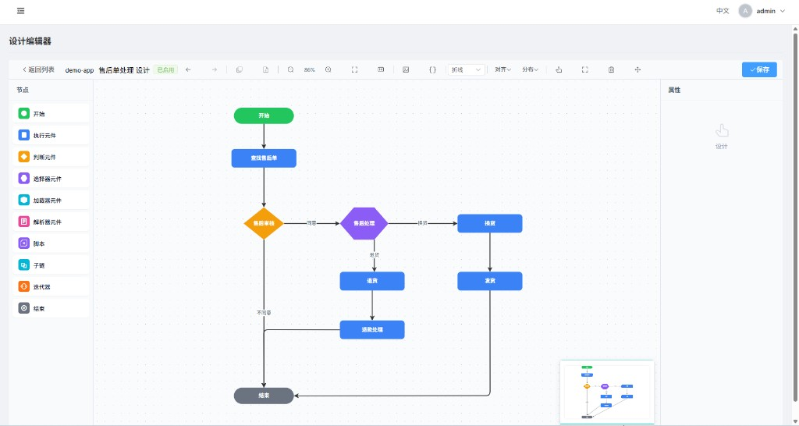

<p align="center">
  
</p>

<p align="center">
  <a href="README.en.md">English</a> ·
  <a href="https://gitee.com/zestcc/zestflow">Gitee</a> ·
  <a href="https://github.com/zestcc/zestflow">GitHub</a> ·
  <a href="https://www.zestflow.cn">官网</a>
</p>

<p align="center">
  <a href="https://github.com/zestcc/zestflow/actions/workflows/ci.yml"></a>
  
  
  
  
</p>

<p align="center">如果这个项目对你有用，欢迎点个 Star。</p>

---

## 概述

ZestFlow 是一个面向 Spring Boot 的业务流程编排引擎，把 Service 里的方法调用拆成可复用的执行节点，并自动记录每个节点的入参、出参、耗时和异常。

它和 LiteFlow 做规则编排、xxl-job 做任务调度不一样——ZestFlow 想解决的是：**编排 + 可视化 + 链路追踪 + Cron 调度** 放在一块，嵌入现有项目，不用学 BPMN。

这是个人维护的开源项目，目前 **v0.1.0**，已发 [Maven Central](https://central.sonatype.com/namespace/cn.zestflow.www)。

## 设计编辑器

<p align="center">
  
</p>

<p align="center"><sub>Admin 内置 AntV X6 编辑器：左侧元件面板拖拽建链，支持判断、选择器、脚本、子链等节点。</sub></p>

## 文档

**[📖 文档中心](docs/README.md)** — 完整索引（Tutorial / How-to / Reference）

| 场景 | 文档 |
|------|------|
| 本地 30 分钟跑通 | [快速入门](docs/GETTING_STARTED.md) |
| **全部 30 篇文档索引** | **[文档中心](docs/README.md)** · **[完整清单](docs/CATALOG.md)** |
| 架构与设计 | [ARCHITECTURE.md](docs/ARCHITECTURE.md) |
| 写元件 / 建链 | [元件开发](docs/guides/COMPONENT_DEVELOPMENT.md) · [链编排](docs/guides/CHAIN_ORCHESTRATION.md) |
| 配置查阅 | [配置参考](docs/reference/CONFIGURATION.md) · [术语表](docs/reference/GLOSSARY.md) |
| 公网部署 | [DEPLOY.md](docs/DEPLOY.md) |
| AI 集成 | [AI_COPILOT.md](docs/AI_COPILOT.md) · [MCP_SETUP.md](docs/MCP_SETUP.md) |
| 参与贡献 | [CONTRIBUTING.md](CONTRIBUTING.md) |
| 变更记录 | [CHANGELOG.md](CHANGELOG.md) |

## 特性

* **方法级元件：** `@ZestComponent` 类里，每个 `@ZestExecute` 方法是一个节点，比类级组件粒度更细。
* **可视化建链：** Admin 内置 AntV X6 编辑器，拖拽连线，不用硬编码 DAG。
* **链路追踪：** 每个节点自动上报事件，Admin 可以按 traceId 看执行过程和耗时。
* **异步采集：** Collector 异步落库，不阻塞业务线程；支持 JDBC / Kafka / RabbitMQ。
* **热更新：** 链定义改了，Executor 自动 reload，不用重启应用。
* **Cron 调度：** 支持多执行器注册、路由策略和 Failover。
* **轻量嵌入：** 业务项目加一个 `zestflow-starter` 依赖即可。
* **Playground：** 内置 32+ 演示场景，改完链可以马上跑。
* **AI Copilot：** Admin 内链编排助手（NL → 链草稿、表达式、诊断）；IDE 侧 **Dev MCP**（`zestflow-mcp`）辅助元件开发，支持 `--init-dev` 一键接入。

## 什么场景适用

适合：

- Service 越来越长，if-else 或硬编码流程不好维护
- 想要可视化编排，又想要节点级的执行记录
- 已有 Spring Boot 项目，不想上 Camunda 那套

不适合：

- 只要内存规则链、不要 UI 和调度 → LiteFlow 更合适
- 审批流、人工节点 → 用 Flowable / Camunda
- 纯定时任务、没有 DAG → xxl-job 更合适

## 架构

```
Admin (:8080)          注册 / 调度 / 日志查询
    │
    ▼
业务应用 (Spring Boot)
    ├── Executor (:20550)   执行 DAG
    └── Collector (:20650)  采集事件 → MySQL
```

Admin 不存你的业务链数据，只做治理和代理。链定义、设计图、事件日志在业务侧三个 MySQL 库里。详见 [架构文档](docs/ARCHITECTURE.md)。

## 快速开始

**依赖：**

```xml
<dependency>
    <groupId>cn.zestflow.www</groupId>
    <artifactId>zestflow-starter</artifactId>
    <version>0.1.0</version>
</dependency>
```

**写一个元件：**

```java
@ZestComponent("order")
public class OrderHandler {

    @ZestExecute(value = "createOrder", name = "创建订单")
    public OrderCreatedResult createOrder(
            @ZestParam("userId") String userId,
            @ZestParam("amount") double amount) {
        return new OrderCreatedResult("ORD-" + System.currentTimeMillis(), amount);
    }
}
```

**配置：**

```yaml
spring.application.name: my-shop
zestflow.executor.admin-addresses: http://localhost:8080
zestflow.executor.port: 20550
# 数据源见 application-local.example.yml
```

启动后 Executor 会向 Admin 注册，在管理界面可以看到扫描到的元件，拖拽建链后执行。

## 本地跑起来

```bash
# 1. 执行 db/init.sql + initData.sql
# 2. 复制 application-local.example.yml → application-local.yml
# 3. 启动
mvn install -pl zestflow-demo -am -DskipTests
mvn spring-boot:run -pl zestflow-admin
mvn spring-boot:run -pl zestflow-demo
```

- Admin：http://localhost:8080，账号 `admin` / `admin123`（仅本地）
- 改前端：`cd zestflow-admin-ui && pnpm dev`，改完须 `pnpm build`

## 和 LiteFlow / xxl-job 比

| | LiteFlow | xxl-job | ZestFlow |
|---|:---:|:---:|:---:|
| 核心能力 | 规则编排 | 任务调度 | 编排 + 追踪 + 调度 |
| 可视化 UI | 无 | 有（任务管理） | 有（DAG 设计器） |
| 节点级 Trace | 弱 | 无 | 有 |
| 嵌入方式 | jar | 独立调度中心 | Starter 嵌入 |

## 常见问题

**能用于生产吗？**  
v0.1.0，适合个人项目和小团队试用。有 prod 配置守卫和 E2E 测试，但社区还在早期，核心链路建议先灰度。

**Admin 挂了怎么办？**
Executor 本地已加载的链还能跑；**业务 Cron 由 Executor 读业务库自治**（不依赖 Admin 在线）。链发布、控制台改调度、查日志需 Admin 恢复。详见 [docs/adr/SCHEDULING.md](docs/adr/SCHEDULING.md)。

## 参与贡献

Issue 和 PR 都欢迎。Fork → 改 → `mvn test -pl zestflow-admin,zestflow-executor -am` → 提 PR。

[Gitee Issues](https://gitee.com/zestcc/zestflow/issues) · [GitHub Issues](https://github.com/zestcc/zestflow/issues)

## 许可证

[Apache License 2.0](LICENSE)
