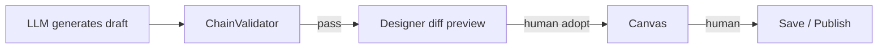
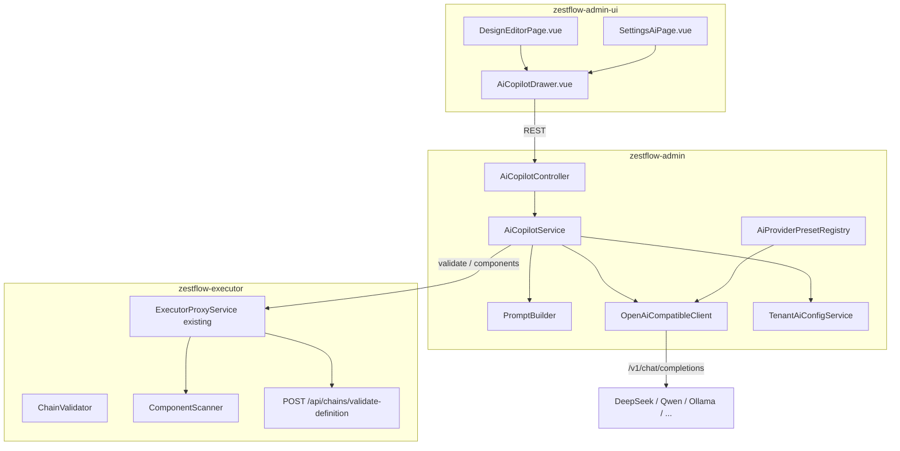

# ZestFlow AI Integration (Copilot)

> **Version** 1.5 · **Updated** 2026-06-08 · **Language** English · [简体中文](AI_COPILOT.md) · **Type** Explanation · [← Documentation hub](README.en.md)  
> **Status** Implemented (P0–P5 + Dev MCP Phase 1–3 + `--init-dev`)  
> **Positioning** Orchestration assistant for developers (Copilot), not autonomous production deployment (Autopilot)  
> **Operations** [AI_COPILOT_OPS.md](./AI_COPILOT_OPS.en.md)  
> **Dev Copilot (MCP)** [AI_DEV_COPILOT_FINAL_SOLUTION.md](./AI_DEV_COPILOT_FINAL_SOLUTION.en.md) · [MCP_SETUP.en.md](./MCP_SETUP.en.md) · [AI_IDE_SETUP.en.md](./AI_IDE_SETUP.en.md)

---

## Table of contents

- [1. Overview](#1-overview)
- [1.5 Dual Copilot model](#15-dual-copilot-model)
- [1.6 Dev project setup (platform JAR + init-dev)](#16-dev-project-setup-platform-jar--init-dev)
- [2. Product principles](#2-product-principles)
- [3. Multi-tenancy and data isolation](#3-multi-tenancy-and-data-isolation)
- [4. Feature scope and phases](#4-feature-scope-and-phases)
- [5. Interaction and entry design](#5-interaction-and-entry-design)
- [6. Technical architecture](#6-technical-architecture)
- [7. AI provider presets](#7-ai-provider-presets)
- [8. Backend design (zestflow-admin)](#8-backend-design-zestflow-admin)
- [9. Executor extensions](#9-executor-extensions)
- [10. Frontend design (zestflow-admin-ui)](#10-frontend-design-zestflow-admin-ui)
- [11. Component scaffolding assistance](#11-component-scaffolding-assistance)
- [12. Prompt and generation pipeline](#12-prompt-and-generation-pipeline)
- [13. Security and governance](#13-security-and-governance)
- [14. Database design](#14-database-design)
- [15. Implementation plan](#15-implementation-plan)
- [16. Acceptance criteria](#16-acceptance-criteria)
- [17. Explicitly out of scope (v1)](#17-explicitly-out-of-scope-v1)
- [18. Comparison with market solutions](#18-comparison-with-market-solutions)
- [Appendix A: ai-providers.yaml example](#appendix-a-ai-providersyaml-example)
- [Appendix B: API request/response examples](#appendix-b-api-requestresponse-examples)

---

## 1. Overview

### 1.1 Name and positioning

| Item | Content |
|------|---------|
| Product name | **ZestFlow Copilot** (development orchestration assistant) |
| One-liner | Within component constraints and chain validation, help developers complete chain orchestration, expressions, fault diagnosis, and component scaffolding faster |
| Target users | Developers / implementers (Java, designer, chain publish workflow) |
| Not doing | Auto publish, auto production changes, zero-code unattended deployment |

### 1.2 Relationship to ZestFlow core

ZestFlow's value is **orchestratable, validatable, observable**. AI is an acceleration layer and cannot bypass:

- `ComponentScanner` component whitelist
- `ChainValidator` chain definition validation
- Manual **save → publish → reload** workflow



---

## 1.5 Dual Copilot model

ZestFlow AI splits into **Orchestration Copilot** (this document; implemented in Admin) and **Dev Copilot** (`zestflow-mcp`; used in IDE).

| | Orchestration Copilot | Dev Copilot |
|--|----------------------|-------------|
| **Host** | Admin UI + backend | `zestflow-mcp.jar` + Cursor / Claude |
| **User** | Business / implementation / low-code orchestration | Developers writing `@ZestComponent` |
| **LLM** | Admin tenant config | IDE-side model |
| **Typical actions** | suggest chain, explain, expression | list components, read Java, validate chain |
| **Persistence** | Designer diff → manual publish | **Cursor/Claude Apply** (MCP does not write to disk) |
| **Docs** | This document | [AI_DEV_COPILOT_FINAL_SOLUTION.md](./AI_DEV_COPILOT_FINAL_SOLUTION.en.md) |

**Tagline**: Admin designs chains, MCP connects specs and code, Cursor writes components.

**Industry comparison**: Admin orchestration ≈ n8n AI Workflow / Temporal UI; Dev MCP ≈ [Stripe MCP](https://github.com/stripe/agent-toolkit), [Supabase MCP](https://github.com/supabase-community/supabase-mcp) — specs and Tools from official Server; IDE only changes config.

---

## 1.6 Dev project setup (platform JAR + init-dev)

> **2026-06 update**: Modeled after Stripe / Supabase MCP — **platform JAR installed once; business projects only configure project files**; `zestflow-dev-templates` + `--init-dev` one-click init.

### Layered model

| Layer | Path / artifact | Frequency |
|-------|-----------------|-----------|
| **Platform** | `~/.zestflow/tools/zestflow-mcp.jar` | Once per machine (`install-mcp.ps1`) |
| **Template JAR** | `zestflow-dev-templates` (on `zestflow-mcp` classpath) | Shipped with ZestFlow version |
| **Project** | `.cursor/mcp.json`, `.zestflow/rules/project.md`, `.zestflow/learning/` | Per business project (`--init-dev`) |

Maven projects using `zestflow-starter`: **runtime via starter; Dev files via `--init-dev` once** (MCP not hard-bound to Cursor). `zestflow-mcp` is in root `pom.xml` default modules.

### One-click initialization

```powershell
# 1. Install platform JAR (once per machine)
powershell -File scripts/dev/install-mcp.ps1

# 2. Initialize Dev files at business project root
powershell -File scripts/dev/init-dev-project.ps1 -ProjectRoot D:/work/my-app
```

Or:

```bash
java -jar ~/.zestflow/tools/zestflow-mcp.jar --init-dev --project /path/to/my-app
```

| Parameter | Description |
|-----------|-------------|
| `--init-dev` | Extract templates from `zestflow-dev-templates` to project root |
| `--ide` | `cursor` / `vscode` / `claude` / `all` (default `all`) |
| `--app-code` | Override appCode inferred from pom / `application.yml` |
| `--executor-url` | Default `http://127.0.0.1:20550` |
| `--base-package` | Override inferred base package |
| `--force` | Overwrite existing files |
| `--no-gitignore` | Do not append `.gitignore` snippet |

**Generated artifacts:**

```text
.cursor/mcp.json                          # Cursor MCP (${workspaceFolder} + platform JAR)
.vscode/mcp.json                          # VS Code (when --ide includes vscode)
.zestflow/mcp/claude-desktop.config.json.example
.zestflow/rules/project.md                # L2 project rules (Git-committable)
.zestflow/learning/                       # L3 learning events directory
```

`--init-dev` infers `appCode`, Executor port, and `basePackage` from `pom.xml` / `application.yml`.

### Dev MCP Tools (12, Phase 1–3)

| Phase | Tools |
|-------|-------|
| Phase 1 | `list_components`, `read_project_file`, `validate_chain` |
| Phase 2 | `search_sources`, `scaffold_component`, `export_task_package` |
| Phase 3 | `plan_chain`, `record_learning_event`, `search_patterns`, `distill_patterns`, `gen_playground_scene`, `share_pattern` |

**Chain-first learning** (P1–P3) see [AI_CHAIN_LEARNING.md](./AI_CHAIN_LEARNING.en.md):

```text
plan_chain → scaffold_component(gap) → validate_chain → gen_playground_scene
  → record_learning_event → distill_patterns → share_pattern
```

**97% accuracy**: Not LLM self-rating; requires `validate_chain` pass + `AccuracyGate` promotion before Pattern/RAG.

**Audit**: Tool calls append to `{project}/.zestflow/mcp-audit.jsonl` by default (`--no-audit-log` disables).

**Explicitly not provided**: MCP `write_project_file` — source writes via IDE diff + Apply.

### Documentation index

| Document | Content |
|----------|---------|
| [MCP_SETUP.en.md](./MCP_SETUP.en.md) | Install, params, Cursor/Claude config, troubleshooting |
| [AI_DEV_COPILOT_FINAL_SOLUTION.md](./AI_DEV_COPILOT_FINAL_SOLUTION.en.md) | Dev Copilot architecture ADR |
| [AI_CHAIN_LEARNING.md](./AI_CHAIN_LEARNING.en.md) | Intent workflow, pattern layers, promotion gates |
| [AI_COPILOT_OPS.md](./AI_COPILOT_OPS.en.md) | Admin Orchestration Copilot ops |
| [scripts/dev/mcp/README.md](../scripts/dev/mcp/README.md) | Templates and manual setup |

---

## 2. Product principles

| Principle | Description |
|-----------|-------------|
| Copilot ≠ Autopilot | Output is always draft; human review required |
| Designer as primary entry | No top-level "AI Center" mega menu |
| LLM orchestration in Admin only | **Orchestration** Copilot LLM unified in Admin (auth, masking, audit); **Dev** Copilot in IDE + MCP |
| Validation on Executor | AI output untrusted; must pass `ChainValidator` |
| Tenant-level AI config | Global presets read-only; keys and switches per tenant |
| Rich presets, BYOK | Built-in free/low-cost API **adapters**; platform does not host keys |

**Core gates:**

- AI **cannot** directly `PUT /reload` or modify DB
- AI **cannot** reference unregistered `componentId`
- AI **cannot** bypass Validator to write chain data

---

## 3. Multi-tenancy and data isolation

### 3.1 Isolation model

| Dimension | Mechanism |
|-----------|-----------|
| Mode | `zestflow.tenant.mode`: `single` (default) / `multi` |
| Fields | Business tables `tenant_id` + `app_code` |
| Context | JWT `currentTenantId` → `TenantContextHolder` |
| Query | In `multi`, MyBatis-Plus tenant plugin appends `tenant_id` |
| Write | `MyMetaObjectHandler` fills `tenant_id` on insert |
| Switch | `POST /api/auth/switch-tenant/{id}` |

### 3.2 What "full isolation" means

**Isolated (logical row-level):** Designs, chains, versions, schedules, dictionaries, Playground, log queries, **AI config and sessions** (must include `tenant_id`).

**Not physically isolated:**

- Shared database and schema
- Executor JVM `@ZestComponent` shared per **application**, not per tenant
- Executor instance config fixed `zestflow.executor.tenant-id`
- Super-admin cross-tenant; `executor_registry` and infra shared

**Conclusion:** New features (including AI) **must be designed for multi** (`tenant_id` on tables), even when deployed as `single`.

### 3.3 AI multi-tenant requirements

| Object | Requirement |
|--------|-------------|
| `zf_ai_tenant_config` | Per-tenant enabled / preset / key / model |
| Copilot sessions and audit | `tenant_id` + `user_id` + `app_code` |
| Prompt context | Only current tenant + app designs, chains, components |
| Log diagnosis | Only current `tenant_id` execution records |
| Global `zestflow.ai.*` | Platform params in `sys_config` (tenant 1); yaml cold-start fallback; tenant AI config takes priority |

### 3.4 Platform config and dictionaries (2026-06)

| Layer | Storage | Description |
|-------|---------|-------------|
| Deploy/secrets | yaml + env vars | JWT, `env-keys`, registry-token, etc. |
| Enums/cascade | Dict `ai_provider` / `ai_model` | Providers and models; `ai-providers.yaml` seeds empty DB only |
| Platform tunables | `sys_config` (tenant 1) | `ai.enabled`, RAG thresholds, timeouts; DB first, hot reload |
| Tenant AI runtime | `zf_ai_tenant_config` | Preset, key, quota, tenant RAG |

Runtime effective value: `sys_config` > `application.yml`. Ops: [AI_COPILOT_OPS.md](./AI_COPILOT_OPS.en.md).

Optional: tenant policy `allowedPresets: [ollama, custom]` to restrict presets (e.g. finance clients local-only).

---

## 4. Feature scope and phases

### Phase 0 — Infrastructure (2–3 weeks)

| Feature | Description |
|---------|-------------|
| Tenant AI config | `zf_ai_tenant_config` + settings page |
| Provider presets | Dict `ai_provider` / `ai_model` (`ai-providers.yaml` empty-DB seed) |
| OpenAI-compatible client | `OpenAiCompatibleClient` |
| Chain validate API | Executor `POST /api/chains/validate-definition` |
| Component context API | Whitelist + meta |
| Test connection | `POST /api/ai/test` |
| Audit tables | `zf_ai_copilot_session` / `message` |

### Phase 1 — Designer Copilot MVP (4–6 weeks)

| Feature | Description |
|---------|-------------|
| Copilot drawer | Designer toolbar "AI Assistant" |
| Explain current chain | Read graph / chainData, natural language summary |
| NL → chain draft | Generate `ChainDefinitionDTO` → Validator → diff |
| Adopt / undo | Frontend graph only; no auto save/reload |
| Aviator assistant | Selected edge/condition: generate/explain/fix expression |
| Validator linkage | Errors pinned on nodes; "fix by error" |
| Repair loop | Up to 2 auto-fix rounds on Validator failure |

### Phase 2 — Dev closed loop (3–4 weeks)

| Feature | Description |
|---------|-------------|
| Playground quick run | Copilot jump or embedded trigger |
| Log diagnosis | Trace detail "AI diagnose" → cause + chain fix suggestion |
| Jump to designer | Open Copilot with `designId` / `chainCode` |
| chain_key hints | `@ZestChain` scan vs Admin chain list comparison |

### Phase 3 — Components and templates (as needed)

| Feature | Description |
|---------|-------------|
| Component scaffold Copilot | NL → Java skeleton (copy to Executor project) |
| AI template library | Accepted prompts + chain snapshots (optional submenu) |
| RAG knowledge base | QUICK_REFERENCE, Demo, JavaDoc index |

---

## 5. Interaction and entry design

### 5.1 Sidebar and routes

```
Sidebar (mostly unchanged)
  Design → list /design
  Design editor /design/:id     ← Copilot primary entry (toolbar)
  Components /components
  Logs /logs                     ← Phase 2 diagnosis entry
  Settings → AI config           ← Phase 0

Phase 3 optional: Design → AI template library /design/ai-templates
```

**No new** Phase 1 top-level "AI Assistant" menu.

### 5.2 Designer layout

```
[ X6 Canvas ] | [ Property panel ] | [ Copilot drawer - collapsible ]
```

Copilot drawer modules:

1. Chat (multi-turn)
2. Proposal preview (node/edge diff summary)
3. Validation results (errors / warnings)
4. Actions: Apply to canvas | Test run | Clear session

### 5.3 Adoption flow

```
User prompt
  → POST /api/ai/design/suggest
  → Show proposedChainData + validation + diff
  → "Apply to canvas" (local graph)
  → User manual "Save graph" → existing save API
  → User manual "Publish / reload" → existing publish flow
```

---

## 6. Technical architecture



**Principles:**

- LLM calls **only in Admin**
- Validation on **Executor** (or Admin proxies Executor)
- save / publish / reload **still use existing APIs**

---

## 7. AI provider presets

### 7.1 Strategy

Presets maintained in **system dictionary** (`ai_provider` → `ai_model` cascade). `ai-providers.yaml` seeds **empty DB on first start** only; thereafter Admin dict management or API, no restart.

| Do | Don't |
|----|-------|
| Built-in documented **Provider Presets** | Platform-hosted free models, fill keys for users |
| Unified OpenAI-compatible HTTP client | Per-vendor SDK unless non-compatible |
| Tier A/B grouping + metadata tags | Unstable community gateways |
| User BYOK; Ollama may omit key | Promise any vendor "forever free" |

### 7.2 Preset metadata

Each preset includes: `id`, `displayName` / `displayNameEn`, `tier` (A/B), `region` (cn/global/local), `baseUrl`, `defaultModel`, `models[]`, `apiKeyRequired`, `apiKeyPlaceholder`, `docUrl`, `tags[]`, `recommendedFor[]`, `qualityTier`, `notes`, `deprecated` / `successor`.

### 7.3 Tier A — default display (8)

| ID | Name | defaultModel | Notes |
|----|------|--------------|-------|
| `deepseek` | DeepSeek | `deepseek-chat` | CN primary; JSON-friendly |
| `dashscope` | Qwen | `qwen-plus` | DashScope compatible mode |
| `siliconflow` | SiliconFlow | `deepseek-ai/DeepSeek-V3` | CN multi-model |
| `zhipu` | Zhipu AI | `glm-4-flash` | Verify compatible path via test connection |
| `moonshot` | Moonshot / Kimi | `moonshot-v1-8k` | Long context |
| `ollama` | Ollama local | `qwen2.5:7b` | Local free; `apiKeyRequired: false` |
| `groq` | Groq | `llama-3.3-70b-versatile` | Free tier; fast |
| `gemini` | Google Gemini | `gemini-2.0-flash` | AI Studio free tier |

### 7.4 Tier B — more providers (collapsed)

Includes: `openai`, `azure-openai`, `mistral`, `cohere`, `github-models`, `nvidia-nim`, `cloudflare-ai`, `baidu-qianfan`, `tencent-hunyuan`, `volcengine-ark`, `openrouter`, `together`, `fireworks`, `lmstudio`, `vllm`, `custom`.

### 7.5 Settings UI

Provider dropdown (Tier A default), model selector, masked API key, tags, test connection, save. "More providers" expands Tier B; filter by region. Unconfigured key: Copilot grayed + link to settings.

### 7.6 Multi-tenant

- Preset list: dict `ai_provider` / `ai_model` (global read-only, no keys)
- Platform switches/thresholds: `sys_config` tenant 1
- Effective config: `zf_ai_tenant_config` per tenant
- Optional: tenant `allowedPresets` whitelist

---

## 8. Backend design (zestflow-admin)

### 8.1 Module structure

```
zestflow-admin/src/main/java/com/zestflow/admin/ai/
  AiCopilotController.java
  AiCopilotService.java
  TenantAiConfigService.java
  OpenAiCompatibleClient.java
  AiProviderPresetRegistry.java
  PromptBuilder.java
  ...

zestflow-admin/src/main/resources/
  ai-providers.yaml               # Empty-DB seed only
```

### 8.2 Global config

**Runtime:** `sys_config` (tenant 1) first; `PlatformConfigReader` cached; invalidate on CRUD.

**yaml fallback (cold start):**

```yaml
zestflow:
  ai:
    enabled: true
    default-preset: deepseek
    timeout-ms: 60000
    max-tokens: 4096
    temperature: 0.2
    pii-mask: true
    repair-max-rounds: 2
  tenant:
    mode: multi
```

### 8.3 API summary

| Method | Path | Description |
|--------|------|-------------|
| GET | `/api/ai/config` | Tenant Copilot availability + effective preset/model |
| GET | `/api/ai/providers` | Preset list (Tier A/B, no keys) |
| POST | `/api/ai/test` | Test connection |
| GET/PUT | `/api/ai/tenant-config` | Tenant AI config (key masked on GET) |
| GET | `/api/ai/context/components` | Component whitelist for tenant + app |
| POST | `/api/ai/design/explain` | Explain chain |
| POST | `/api/ai/design/suggest` | NL → chain draft |
| POST | `/api/ai/design/validate` | Validate chainData |
| POST | `/api/ai/expression/suggest` | Aviator assistant |
| POST | `/api/ai/logs/diagnose` | Log diagnosis (Phase 2) |
| GET | `/api/ai/rag/search` | Hybrid RAG search |
| GET/POST/PUT/DELETE | `/api/ai/rag/documents` | Tenant RAG document CRUD |
| GET | `/api/ai/usage/overview?days=30` | Usage/audit dashboard |
| POST | `/api/ai/sessions/{id}/feedback` | Adoption/rejection audit |

### 8.4 AiCopilotService core logic

1. Read tenant AI config (preset → baseUrl / model / key)
2. `PromptBuilder` injects system prompt + component whitelist + schema + current chainData
3. `OpenAiCompatibleClient.chat()` with JSON output when supported
4. `ExecutorValidateClient` → `ChainValidator.validate()`
5. On invalid → repair loop (errors fed back to LLM, ≤ `repair-max-rounds`)
6. Write audit; return `proposedChainData` + `validation` + `summary`

### 8.5 Degraded mode (no LLM)

| Capability | Without AI config |
|------------|-------------------|
| ChainValidator, component list | Available |
| `AiComponentCodeGenerator` rule templates | Available (no LLM) |
| NL chain / explain / diagnose | Unavailable; UI grayed |

---

## 9. Executor extensions

| Item | Description |
|------|-------------|
| `POST /api/chains/validate-definition` | body = chainData; returns `{ valid, errors }` |
| `GET /api/components` | Existing or enhanced: id, type, name, param summary |
| Not added | AI-specific execute; test runs still via Playground / `/execute` |

Admin forwards via existing `ExecutorProxyService`.

---

## 10. Frontend design (zestflow-admin-ui)

### 10.1 New files

```
src/components/ai/
  AiCopilotDrawer.vue
  AiMessageList.vue
  AiProposalPreview.vue
  AiValidationPanel.vue
src/api/ai.ts
src/stores/aiCopilot.ts
src/views/settings/SettingsAiPage.vue
src/i18n: layout.aiAssistant, ai.*
```

### 10.2 Changes to existing files

**DesignEditorPage.vue**: toolbar "AI Assistant"; `showCopilot`; `getCurrentChainData()`; `applyAiProposal(chainData)`; reuse validation error display.

**Frontend prohibitions:**

- **No** browser direct calls to `api.deepseek.com` etc. (key leak)
- **No** Copilot auto save / publish / reload

---

## 11. Component scaffolding assistance

> **Dev Copilot primary path**: Configure MCP in **`zestflow-demo`** or business Executor project; Admin component page **no longer** provides AI scaffold (removed `POST /ai/component/scaffold`).

| | Chain Copilot | Component Copilot |
|--|---------------|-------------------|
| Output | `chainData` JSON | Java class/method scaffold |
| Constraint | Registered componentId only | `@ZestComponent` annotation rules |
| Application | Apply to canvas | **Copy to Executor project** |
| Phase | Phase 1 | Phase 3 |

**Prefer not generating Java when:**

| Need | Recommendation |
|------|----------------|
| Simple condition | Inline Aviator on edge |
| HTTP call | `builtin-http` |
| Map transform/filter | `BuiltinDataComponents` |
| Complex business / DB / internal service | New `@ZestExecute` |

---

## 12. Prompt and generation pipeline

### 12.1 System prompt essentials

- Only use `componentId` from `allowedComponents: [...]`
- Output must match `ChainDefinitionDTO` schema (nodes / edges / config)
- Conditions use Aviator; ctx: `chainCtx.get(ctx, 'key')`
- Do not invent publish instructions
- List items needing human confirmation when uncertain
- JSON only, no markdown wrapper (or agreed parse rules)

### 12.2 Chain generation pipeline

```
User input
  → Tenant AI config + component whitelist + current chainData
  → LLM → proposedChainData
  → ChainValidator (Executor)
  → Fail → repair (≤2 rounds)
  → Return UI: proposed + errors + summary
  → User "Apply to canvas"
  → User manual save / publish
```

---

## 13. Security and governance

| Item | Measure |
|------|---------|
| API Key | Env vars preferred; encrypted at rest; masked in UI; never in Git |
| Tenant isolation | Config, sessions, prompt context all scoped by `tenant_id` |
| Permission | Copilot requires login + design edit permission (existing RBAC) |
| Masking | Mask phone, ID, tokens in Trace/params before LLM |
| Audit | Full sessions; adopt/reject traceable |
| Production | Tenant can `ai.enabled=false`; or explain/diagnose only |
| Rate limit | Per tenant + userId RPM |
| Timeout | `timeout-ms: 60000` |
| Compliance | Settings page notes third-party API and data residency |

---

## 14. Database design

### 14.1 Tenant AI config (`zf_ai_tenant_config`)

Fields: `tenant_id`, `enabled`, `preset`, `base_url`, `api_key_enc`, `model`, `allowed_presets`, audit columns, `UNIQUE(tenant_id)`.

### 14.2 Copilot session audit

`zf_ai_copilot_session`: `tenant_id`, `user_id`, `app_code`, `design_id`, `chain_code`, `mode`, `adopted`, timestamps.

`zf_ai_copilot_message`: `session_id`, `role`, `content_summary`, `token_estimate`.

### 14.3 Tenant RAG documents (P5)

`zf_ai_rag_document`: `tenant_id`, `title`, `app_code`, `content`, `enabled`, `source_type`, audit columns.

P5 adds `latency_ms`, `success`, `error_message` on sessions for usage dashboard.

---

## 15. Implementation plan

| Phase | Duration | Deliverables |
|-------|----------|--------------|
| **P0** | 2–3 weeks | Dict presets, tenant config, OpenAiCompatibleClient, validate API, audit, settings, test connection |
| **P1** | 4–6 weeks | Designer Copilot (explain / suggest / expression / diff / repair) |
| **P2** | 3–4 weeks | Playground linkage, log diagnosis, chain_key hints |
| **P3** | As needed | Component scaffold, AI template library, RAG |
| **P4** | As needed | Vector RAG, canvas diff highlight, embedded test run, CI E2E |
| **P5** | As needed | Tenant RAG CRUD, hybrid retrieval, usage dashboard, ops docs |

**Recommended order:** validate API → tenant config + test → explain → suggest + drawer → expression + repair → Phase 2/3 as needed.

---

## 16. Acceptance criteria

> Production matrix: [AI_COPILOT_ACCEPTANCE.md](./AI_COPILOT_ACCEPTANCE.en.md)  
> Automation: `powershell -File scripts/blackbox/run-ai-copilot-acceptance.ps1 -UseMockLlm`

### MVP (P0 + P1)

1. Designer NL description → validatable chain draft within **60 seconds**
2. `componentId` **100%** from Scanner whitelist (Validator enforced)
3. Invalid proposals **cannot** one-click publish
4. "Apply to canvas" undoable; save/publish still manual
5. Under **multi**, tenant A AI config/sessions invisible to tenant B
6. Unconfigured tenant: Copilot grayed + settings guidance
7. Tier A presets selectable, test connection works, keys not logged in plaintext
8. Production can disable AI (tenant or global)

---

## 17. Explicitly out of scope (v1)

- AI direct `PUT /reload` or DB changes
- JSON write without Validator
- Platform-hosted / paid API keys
- Unstable community Free-LLM gateways as default
- Top-level sidebar "AI Center"
- Auto git commit / auto Executor deploy
- Site-wide single AI key (must be tenant-level)
- Bundled LLM weights in installer
- **Dev Copilot: MCP write-to-disk Tool (`write_project_file`)** — IDE diff + user Apply only

---

## 18. Comparison with market solutions

| Capability | Reference | ZestFlow |
|------------|-----------|----------|
| In-designer Copilot | Power Automate | `AiCopilotDrawer` |
| validate → fix | n8n MCP | validate API + repair loop |
| Dev components | Stripe/Supabase MCP | `zestflow-mcp` read + validate; **write in IDE** |
| Intermediate representation | n8n workflow JSON | `ChainDefinitionDTO` |
| Test run | n8n test / Playground | Playground button |
| No auto production | Temporal approach | Manual publish/reload |
| Multi-model | OpenAI SDK ecosystem | `OpenAiCompatibleClient` + dict presets |

---

## Appendix A: ai-providers.yaml example

> yaml **seeds empty DB only**; runtime and UI use dictionary `ai_provider` / `ai_model`.

See Chinese doc [AI_COPILOT.md Appendix A](./AI_COPILOT.md#附录-aai-providersyaml-示例) for full Tier A/B seed examples (`deepseek`, `ollama`, `custom`, etc.).

---

## Appendix B: API request/response examples

### B.1 Chain suggestion

**Request** `POST /api/ai/design/suggest`

```json
{
  "designId": "DES001",
  "chainCode": "CHN001",
  "appCode": "demo-app",
  "currentChainData": "{...}",
  "userMessage": "Order flow: validate user → deduct stock → pay → notify; retry payment once on failure",
  "mode": "generate"
}
```

`mode`: `generate` | `modify` | `fix-errors`

**Response**

```json
{
  "proposedChainData": "{...}",
  "summary": "Added 4-node linear chain with 1 payment retry on failure branch",
  "validation": { "valid": true, "errors": [] },
  "sessionId": "550e8400-e29b-41d4-a716-446655440000"
}
```

### B.2 Test connection

**Request** `POST /api/ai/test` → **Response** `{ "success": true, "latencyMs": 842, "model": "deepseek-chat", "message": "OK" }`

### B.3 Component scaffold (**removed**)

Use **Dev Copilot**: MCP `scaffold_component` in Cursor with [MCP_SETUP.en.md](./MCP_SETUP.en.md).

---

## Document maintenance

- Architecture changes: sync [ARCHITECTURE.en.md](./ARCHITECTURE.en.md) §14 roadmap
- Preset changes: maintain dict `ai_provider` / `ai_model`; sync yaml seed for empty DB
- Platform AI params: **Settings → System config** (`sys_config` tenant 1)
- E2E: add `run-ai-copilot-e2e.ps1` (mock LLM or test key)

---

*This document is the single design baseline for ZestFlow AI integration; implementation PRs should reference section numbers.*
