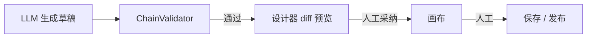
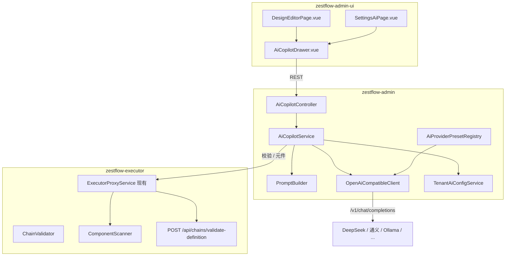

# ZestFlow AI 集成方案（Copilot）

> **版本** 1.2 · **更新** 2026-06-02 · **状态** 已实现（P0～P4 + P5 集成增强）  
> **定位** 面向开发人员的编排辅助（Copilot），非自动上线（Autopilot）  
> **运维** 见 [AI_COPILOT_OPS.md](./AI_COPILOT_OPS.md)

---

## 目录

- [1. 概述](#1-概述)
- [2. 产品原则](#2-产品原则)
- [3. 多租户与数据隔离](#3-多租户与数据隔离)
- [4. 功能范围与分期](#4-功能范围与分期)
- [5. 交互与入口设计](#5-交互与入口设计)
- [6. 技术架构](#6-技术架构)
- [7. AI 提供商预设](#7-ai-提供商预设)
- [8. 后端设计（zestflow-admin）](#8-后端设计zestflow-admin)
- [9. Executor 侧扩展](#9-executor-侧扩展)
- [10. 前端设计（zestflow-admin-ui）](#10-前端设计zestflow-admin-ui)
- [11. 元件辅助生成](#11-元件辅助生成)
- [12. Prompt 与生成流水线](#12-prompt-与生成流水线)
- [13. 安全与治理](#13-安全与治理)
- [14. 数据库设计](#14-数据库设计)
- [15. 实施计划](#15-实施计划)
- [16. 验收标准](#16-验收标准)
- [17. 明确不做（v1）](#17-明确不做v1)
- [18. 与市面方案对照](#18-与市面方案对照)
- [附录 A：ai-providers.yaml 示例](#附录-aai-providersyaml-示例)
- [附录 B：API 请求/响应示例](#附录-bapi-请求响应示例)

---

## 1. 概述

### 1.1 名称与定位

| 项 | 内容 |
|----|------|
| 产品名 | **ZestFlow Copilot**（开发编排助手） |
| 一句话 | 在元件约束与链校验之内，帮开发更快完成链编排、表达式、故障诊断与元件脚手架 |
| 目标用户 | 开发 / 实施（会 Java、会用设计器、会发布链） |
| 不做 | 自动发布、自动改生产、零代码无人值守上线 |

### 1.2 与 ZestFlow 核心的关系

ZestFlow 的价值在于 **可编排、可校验、可观测**。AI 是加速层，不能绕开：

- `ComponentScanner` 元件白名单
- `ChainValidator` 链定义校验
- 人工 **保存 → 发布 → reload** 流程



---

## 2. 产品原则

| 原则 | 说明 |
|------|------|
| Copilot ≠ Autopilot | 生成物永远是草稿，必须人 review |
| 设计器内主入口 | 不做顶级「AI 中心」大菜单 |
| LLM 仅在 Admin | 统一鉴权、脱敏、审计；前端与 Executor 不直连 LLM |
| 校验在 Executor | AI 输出不可信，必须过 `ChainValidator` |
| 租户级 AI 配置 | 预设全局只读；Key 与开关按租户隔离 |
| 预设丰富、Key 自备 | 内置多家免费/低成本 API **适配**，不托管平台 Key |

**核心门禁：**

- AI **不能** 直接 `PUT /reload` 或改 DB
- AI **不能** 引用未注册 `componentId`
- AI **不能** 绕过 Validator 直写链数据

---

## 3. 多租户与数据隔离

### 3.1 隔离模型

| 维度 | 机制 |
|------|------|
| 模式 | `zestflow.tenant.mode`：`single`（默认）/ `multi` |
| 字段 | 业务表 `tenant_id` + `app_code` |
| 上下文 | JWT `currentTenantId` → `TenantContextHolder` |
| 查询 | `multi` 时 MyBatis-Plus 租户插件自动拼接 `tenant_id` |
| 写入 | `MyMetaObjectHandler` 插入时填充 `tenant_id` |
| 切换 | `POST /api/auth/switch-tenant/{id}` |

### 3.2 「完全隔离」的准确含义

**已隔离（逻辑行级）：** 设计、链、版本、调度、字典、Playground、日志查询、**AI 配置与会话**（须带 `tenant_id`）。

**非物理隔离：**

- 共用同一数据库与表结构
- Executor JVM 内 `@ZestComponent` 按**应用**共享，不按租户拆分
- Executor 实例配置固定 `zestflow.executor.tenant-id`
- 超管可跨租户；`executor_registry` 等基础设施共享

**结论：** 新功能（含 AI）**一律按 multi 设计**（表含 `tenant_id`），即使当前部署为 `single`。

### 3.3 AI 多租户要求

| 对象 | 要求 |
|------|------|
| `zf_ai_tenant_config` | 每租户独立 enabled / preset / Key / model |
| Copilot 会话与审计 | `tenant_id` + `user_id` + `app_code` |
| Prompt 上下文 | 仅当前租户 + 当前 app 的设计、链、元件 |
| 日志诊断 | 仅查询当前 `tenant_id` 的执行记录 |
| 全局 `zestflow.ai.*` | 仅作默认值，租户配置优先 |

可选：**租户策略** `allowedPresets: [ollama, custom]`，限制可用预设（金融客户仅本地模型）。

---

## 4. 功能范围与分期

### Phase 0 — 基础设施（2～3 周）

| 功能 | 说明 |
|------|------|
| 租户 AI 配置 | `zf_ai_tenant_config` + 设置页 |
| 提供商预设 | `ai-providers.yaml`（Tier A/B + custom） |
| OpenAI 兼容客户端 | `OpenAiCompatibleClient` |
| 链校验 API | Executor `POST /api/chains/validate-definition` |
| 元件上下文 API | 白名单 + meta |
| 测试连接 | `POST /api/ai/test` |
| 审计表 | `zf_ai_copilot_session` / `message` |

### Phase 1 — 设计器 Copilot MVP（4～6 周）

| 功能 | 说明 |
|------|------|
| Copilot 抽屉 | 设计器工具栏「AI 助手」 |
| 解释当前链 | 读 graph / chainData，自然语言说明 |
| NL → 链草稿 | 生成 `ChainDefinitionDTO` → Validator → diff |
| 采纳 / 撤销 | 仅改前端 graph，不自动 save/reload |
| Aviator 助手 | 选中边/条件节点：生成/解释/修正表达式 |
| Validator 联动 | 错误钉在节点；「按错误修复」 |
| Repair Loop | Validator 失败时最多 2 轮自动修复 |

### Phase 2 — 开发闭环（3～4 周）

| 功能 | 说明 |
|------|------|
| Playground 快捷试跑 | Copilot 内跳转或内嵌触发 |
| 日志诊断 | Trace 详情「AI 诊断」→ 原因 + 改链建议 |
| 跳转设计器 | 带 `designId` / `chainCode` 打开 Copilot |
| chain_key 提示 | `@ZestChain` 扫描 vs Admin 链列表对比 |

### Phase 3 — 元件与模板（按需）

| 功能 | 说明 |
|------|------|
| 元件脚手架 Copilot | NL → Java 骨架（拷贝到 Executor 工程） |
| AI 模板库 | 已验收 prompt + 链快照（可选子菜单） |
| RAG 知识库 | QUICK_REFERENCE、Demo、JavaDoc 索引 |

---

## 5. 交互与入口设计

### 5.1 侧栏与路由

```
侧栏（基本不变）
  设计 → 设计列表 /design
  设计编辑器 /design/:id     ← Copilot 主入口（工具栏）
  元件 /components
  日志 /logs                   ← Phase 2 诊断入口
  设置 → AI 配置               ← Phase 0

Phase 3 可选：设计 → AI 模板库 /design/ai-templates
```

**不新增** Phase 1 顶级「AI 辅助」菜单。

### 5.2 设计器布局

```
[ 画布 X6 ] | [ 属性栏 ] | [ Copilot 抽屉 - 可收起 ]
```

Copilot 抽屉模块：

1. 对话区（多轮）
2. 提议预览（节点/边 diff 摘要）
3. 校验结果（errors / warnings）
4. 操作：应用到画布 | 试跑 | 清空会话

### 5.3 采纳流程

```
用户输入 prompt
  → POST /api/ai/design/suggest
  → 展示 proposedChainData + validation + diff
  → 「应用到画布」（本地 graph）
  → 用户手动「保存图」→ 现有 save API
  → 用户手动「发布 / reload」→ 现有 publish 流程
```

---

## 6. 技术架构



**原则摘要：**

- LLM 调用仅在 **Admin**
- 校验在 **Executor**（或 Admin 代理 Executor）
- save / publish / reload **仍走现有 API**

---

## 7. AI 提供商预设

### 7.1 策略

| 做 | 不做 |
|----|------|
| 内置官方可文档化的 **Provider Preset** | 平台托管免费模型、代填 Key |
| 统一 OpenAI 兼容 HTTP 客户端 | 为每家写独立 SDK（除非非兼容） |
| Tier A/B 分组 + 元数据标签 | 收录不稳定社区 Gateway |
| 用户自备 Key；Ollama 可无 Key | 承诺某家「永久免费」 |

### 7.2 预设元数据

每个 preset 包含：

| 字段 | 说明 |
|------|------|
| `id` | 预设标识，如 `deepseek` |
| `displayName` / `displayNameEn` | 展示名 |
| `tier` | `A`（默认展示）/ `B`（更多提供商） |
| `region` | `cn` / `global` / `local` |
| `baseUrl` | API 根地址 |
| `defaultModel` | 默认模型 |
| `models[]` | 可选模型列表 |
| `apiKeyRequired` | 是否必填 Key |
| `apiKeyPlaceholder` | 如 Ollama 填 `ollama` |
| `docUrl` | 申请 Key 链接 |
| `tags[]` | `free-tier` `json-friendly` `reasoning` `local` |
| `recommendedFor[]` | `chain-suggest` `explain` `expression` `diagnose` |
| `qualityTier` | `high` / `medium` / `dev-only` |
| `notes` | 限流、合规、数据出境提示 |
| `deprecated` / `successor` | 弃用与替代 |

### 7.3 Tier A — 默认展示（8 个）

| ID | 名称 | defaultModel | 备注 |
|----|------|--------------|------|
| `deepseek` | DeepSeek | `deepseek-chat` | 国内首选，JSON 友好 |
| `dashscope` | 通义千问 | `qwen-plus` | DashScope 兼容模式 |
| `siliconflow` | 硅基流动 | `deepseek-ai/DeepSeek-V3` | 国内多模型 |
| `zhipu` | 智谱 AI | `glm-4-flash` | 兼容路径需测试连接验证 |
| `moonshot` | Moonshot / Kimi | `moonshot-v1-8k` | 长文本 |
| `ollama` | Ollama 本地 | `qwen2.5:7b` | 本地免费，`apiKeyRequired: false` |
| `groq` | Groq | `llama-3.3-70b-versatile` | 免费 tier，速度快 |
| `gemini` | Google Gemini | `gemini-2.0-flash` | AI Studio 免费 tier |

### 7.4 Tier B — 更多提供商（折叠）

| ID | 名称 | 场景 |
|----|------|------|
| `openai` | OpenAI | 国际标准 |
| `azure-openai` | Azure OpenAI | 企业 deployment |
| `mistral` | Mistral | 欧洲 / 开源 |
| `cohere` | Cohere | 英文 |
| `github-models` | GitHub Models | 开发者免费额度 |
| `nvidia-nim` | NVIDIA NIM | 免费 tier |
| `cloudflare-ai` | Cloudflare Workers AI | 边缘 |
| `baidu-qianfan` | 百度千帆 | 国内 |
| `tencent-hunyuan` | 腾讯混元 | 国内 |
| `volcengine-ark` | 火山方舟 | 国内 |
| `openrouter` | OpenRouter | 聚合，用户自备 Key |
| `together` | Together AI | 开源托管 |
| `fireworks` | Fireworks AI | 推理托管 |
| `lmstudio` | LM Studio | 本地 GUI |
| `vllm` | vLLM / 自建 | 内网网关 |
| `custom` | 自定义 | 企业 OpenAI 兼容 URL |

### 7.5 设置页 UI

```
AI 提供商:  [ 推荐 ▼ ]  DeepSeek ★
模型:       [ deepseek-chat ▼ ]
API Key:    [ ******** ]  [如何获取 Key →]
标签:       免费额度 · JSON 友好 · 适合链编排
[ 测试连接 ]  [ 保存 ]
```

- 「更多提供商」展开 Tier B
- 按 `region` 筛选：国内 / 国际 / 本地
- 未配置 Key：Copilot 灰显 + 引导至设置页

### 7.6 与多租户

- **预设列表：** 全局 `ai-providers.yaml`，无 Key
- **生效配置：** `zf_ai_tenant_config` 按租户存储
- **可选策略：** 租户级 `allowedPresets` 白名单

---

## 8. 后端设计（zestflow-admin）

### 8.1 模块结构

```
zestflow-admin/src/main/java/com/zestflow/admin/ai/
  AiCopilotController.java
  AiCopilotService.java
  TenantAiConfigService.java
  OpenAiCompatibleClient.java
  AiProviderPresetRegistry.java
  PromptBuilder.java
  ExecutorValidateClient.java
  model/
    AiSuggestRequest.java
    AiSuggestResponse.java
    AiTenantConfigPO.java
    AiCopilotSessionPO.java
  repository/
    AiTenantConfigMapper.java
    AiCopilotSessionMapper.java

zestflow-admin/src/main/resources/
  ai-providers.yaml
```

### 8.2 全局配置

```yaml
zestflow:
  ai:
    enabled: true
    default-preset: deepseek
    timeout-ms: 60000
    max-tokens: 4096
    temperature: 0.2
    pii-mask: true
    repair-max-rounds: 2

  tenant:
    mode: multi   # SaaS；私有化可用 single
```

### 8.3 API 清单

| 方法 | 路径 | 说明 |
|------|------|------|
| GET | `/api/ai/config` | 当前租户 Copilot 是否可用 + 生效 preset/model |
| GET | `/api/ai/providers` | 预设列表（Tier A/B，无 Key） |
| POST | `/api/ai/test` | 测试连接 |
| GET | `/api/ai/tenant-config` | 租户 AI 配置（Key 脱敏） |
| PUT | `/api/ai/tenant-config` | 保存租户 AI 配置 |
| GET | `/api/ai/context/components` | 当前 tenant + app 元件白名单 |
| POST | `/api/ai/design/explain` | 解释链 |
| POST | `/api/ai/design/suggest` | NL → 链草稿 |
| POST | `/api/ai/design/validate` | 校验 chainData |
| POST | `/api/ai/expression/suggest` | Aviator 助手 |
| POST | `/api/ai/logs/diagnose` | 日志诊断（Phase 2） |
| POST | `/api/ai/component/scaffold` | Java 脚手架（Phase 3） |
| GET | `/api/ai/rag/search` | 混合 RAG 检索（platform + 租户） |
| GET | `/api/ai/rag/status` | RAG 索引状态（含 tenantDocuments、filesystemPath） |
| GET/POST/PUT/DELETE | `/api/ai/rag/documents` | 租户 RAG 文档 CRUD（租户管理员） |
| POST | `/api/ai/rag/documents/rebuild-index` | 重建租户 RAG 索引 |
| GET | `/api/ai/usage/overview?days=30` | Copilot 用量/审计看板（租户管理员） |
| POST | `/api/ai/sessions/{id}/feedback` | 采纳/拒绝审计 |

### 8.4 AiCopilotService 核心逻辑

1. 读取租户 AI 配置（preset → baseUrl / model / Key）
2. `PromptBuilder` 注入 system prompt + 元件白名单 + schema + 当前 chainData
3. `OpenAiCompatibleClient.chat()`，要求 JSON 输出（`response_format: json_object` 若支持）
4. `ExecutorValidateClient` → `ChainValidator.validate()`
5. invalid → repair loop（errors 喂回 LLM，≤ `repair-max-rounds`）
6. 写审计；返回 `proposedChainData` + `validation` + `summary`

### 8.5 降级模式（无 LLM）

| 能力 | 无 AI 配置时 |
|------|--------------|
| ChainValidator、元件列表 | 可用 |
| `AiComponentCodeGenerator` 规则模板 | 可用（无 LLM） |
| NL 生成链 / 解释 / 诊断 | 不可用，UI 灰显 |

---

## 9. Executor 侧扩展

| 项 | 说明 |
|----|------|
| `POST /api/chains/validate-definition` | body = chainData，返回 `{ valid, errors }` |
| `GET /api/components` | 已有或增强：id、type、name、参数摘要 |
| 不新增 | AI 专用 execute；试跑仍 Playground / `/execute` |

**校验伪代码：**

```java
ChainDefinition def = chainDefinitionBuilder.build(dto);
List<String> errors = chainValidator.validate(def);
return Result.success(Map.of("valid", errors.isEmpty(), "errors", errors));
```

Admin 通过现有 `ExecutorProxyService` 转发。

---

## 10. 前端设计（zestflow-admin-ui）

### 10.1 新文件

```
src/components/ai/
  AiCopilotDrawer.vue
  AiMessageList.vue
  AiProposalPreview.vue
  AiValidationPanel.vue
src/api/ai.ts
src/stores/aiCopilot.ts
src/views/settings/SettingsAiPage.vue
src/components/settings/SettingsAiRagPanel.vue   ← P5 租户知识库
src/components/settings/SettingsAiUsagePanel.vue ← P5 用量看板
src/i18n: layout.aiAssistant, ai.*
```

### 10.2 修改现有文件

**DesignEditorPage.vue**

- 工具栏「AI 助手」（`MagicStick`）
- `showCopilot` 控制抽屉
- `getCurrentChainData()` 供 Copilot 读取
- `applyAiProposal(chainData)` 合并 X6 graph（复用 load/import）
- 复用 `chainDataDialog.errors` 展示校验结果

**AppSidebar.vue**

- Phase 0：无改
- Phase 3 可选：「设计 → AI 模板库」

**router/index.ts**

- 设置页 AI 配置子路由
- Phase 3 可选：`/design/ai-templates`

### 10.3 前端禁止事项

- **禁止** 浏览器直连 `api.deepseek.com` 等（Key 泄露）
- **禁止** Copilot 自动调用 save / publish / reload

---

## 11. 元件辅助生成

### 11.1 与链 Copilot 的区别

| | 链 Copilot | 元件 Copilot |
|--|-----------|--------------|
| 产出 | `chainData` JSON | Java 类/方法脚手架 |
| 约束 | 仅已注册 componentId | `@ZestComponent` 等注解规范 |
| 应用 | 应用到画布 | **复制到 Executor 工程** |
| 阶段 | Phase 1 | Phase 3 |

### 11.2 流程

```
描述业务 + 元件类型 + componentId + 入参/出参 key
  → LLM 解析为 AiComponentDefinition（可选）
  → AiComponentCodeGenerator 套模板（项目已有）
  → 界面展示 Java + [复制] + 部署清单
  → 开发补 TODO → mvn package → 部署 → reload
  → 元件列表出现新 id → 设计器使用
```

### 11.3 优先不生成 Java 的场景

| 需求 | 推荐 |
|------|------|
| 简单条件 | 边内联 Aviator |
| HTTP 调用 | `builtin-http` |
| Map 转换/过滤 | `BuiltinDataComponents` |
| 复杂业务 / DB / 内部服务 | 新建 `@ZestExecute` |

### 11.4 已有代码复用

- `AiComponentDefinition.java`
- `AiComponentCodeGenerator.java`
- `AiComponentGenerate.java`（注解，可选 IDE 侧）

---

## 12. Prompt 与生成流水线

### 12.1 System Prompt 要点

- 只能使用 `allowedComponents: [...]` 中的 `componentId`
- 输出必须符合 `ChainDefinitionDTO` schema（nodes / edges / config）
- 条件用 Aviator；ctx 写法 `chainCtx.get(ctx, 'key')`（与现有 normalize 一致）
- 禁止编造 chainCode 发布指令
- 不确定时列出需人工确认项
- 仅输出 JSON，无 markdown 包裹（或约定解析规则）

### 12.2 链生成流水线

```
用户输入
  → 租户 AI 配置 + 元件白名单 + 当前 chainData
  → LLM → proposedChainData
  → ChainValidator（Executor）
  → 失败 → repair（≤2 轮）
  → 返回 UI：proposed + errors + summary
  → 用户「应用到画布」
  → 用户手动保存 / 发布
```

### 12.3 场景与模型推荐

Copilot 可根据 `recommendedFor` + `qualityTier` 提示：

- **chain-suggest：** `deepseek-chat`、`qwen-plus`、`gemini-2.0-flash`
- **explain / expression：** 可用 `medium` 或本地 7B（`dev-only` 标注）
- **ollama 7B：** 标 `dev-only`，不建议生产链生成

---

## 13. 安全与治理

| 项 | 措施 |
|----|------|
| API Key | 环境变量优先；落库加密；UI 脱敏；不进 Git |
| 租户隔离 | 配置、会话、Prompt 上下文均 `tenant_id` |
| 权限 | Copilot 需登录 + 设计编辑权限（与现有 RBAC 一致） |
| 脱敏 | Trace/params 进 LLM 前 mask 手机、身份证、token |
| 审计 | 全量 session；采纳/拒绝可追溯 |
| 生产 | 租户可 `ai.enabled=false`；或仅开 explain/diagnose |
| 限流 | 按 tenant + userId RPM |
| 超时 | `timeout-ms: 60000` |
| 合规 | 设置页注明第三方 API 与数据出境 |

---

## 14. 数据库设计

### 14.1 租户 AI 配置

```sql
CREATE TABLE zf_ai_tenant_config (
  id            BIGINT PRIMARY KEY AUTO_INCREMENT,
  tenant_id     BIGINT       NOT NULL,
  enabled       TINYINT      DEFAULT 0,
  preset        VARCHAR(50)  DEFAULT 'deepseek',
  base_url      VARCHAR(512) DEFAULT NULL,
  api_key_enc   VARCHAR(1024) DEFAULT NULL COMMENT '加密存储',
  model         VARCHAR(100) DEFAULT NULL,
  allowed_presets VARCHAR(512) DEFAULT NULL COMMENT 'JSON 数组，可选',
  created_by    VARCHAR(64),
  updated_by    VARCHAR(64),
  created_at    DATETIME,
  updated_at    DATETIME,
  is_deleted    TINYINT DEFAULT 0,
  UNIQUE KEY uk_tenant (tenant_id)
);
```

### 14.2 Copilot 会话审计

```sql
CREATE TABLE zf_ai_copilot_session (
  id            BIGINT PRIMARY KEY AUTO_INCREMENT,
  tenant_id     BIGINT       NOT NULL,
  user_id       BIGINT       NOT NULL,
  app_code      VARCHAR(50),
  design_id     VARCHAR(64),
  chain_code    VARCHAR(64),
  mode          VARCHAR(32)  COMMENT 'explain|suggest|fix-errors|expression|diagnose|scaffold',
  adopted       TINYINT      DEFAULT NULL COMMENT '1采纳 0拒绝 NULL未操作',
  created_at    DATETIME,
  KEY idx_tenant_user (tenant_id, user_id),
  KEY idx_design (tenant_id, design_id)
);

CREATE TABLE zf_ai_copilot_message (
  id            BIGINT PRIMARY KEY AUTO_INCREMENT,
  session_id    BIGINT       NOT NULL,
  tenant_id     BIGINT       NOT NULL,
  role          VARCHAR(16)  COMMENT 'user|assistant|system',
  content_summary VARCHAR(2000) COMMENT '摘要，非全量 prompt',
  token_estimate  INT,
  created_at    DATETIME,
  KEY idx_session (session_id)
);
```

### 14.3 租户 RAG 文档（P5）

```sql
CREATE TABLE zf_ai_rag_document (
  id            BIGINT PRIMARY KEY AUTO_INCREMENT,
  tenant_id     BIGINT       NOT NULL,
  title         VARCHAR(200) NOT NULL,
  app_code      VARCHAR(50)  DEFAULT NULL COMMENT '空=租户全局',
  content       MEDIUMTEXT   NOT NULL,
  enabled       TINYINT      DEFAULT 1,
  sort_order    INT          DEFAULT 0,
  source_type   VARCHAR(16)  DEFAULT 'upload' COMMENT 'upload|filesystem',
  created_by    VARCHAR(64),
  updated_by    VARCHAR(64),
  created_at    DATETIME,
  updated_at    DATETIME,
  is_deleted    TINYINT DEFAULT 0,
  KEY idx_ai_rag_doc_tenant (tenant_id, enabled, is_deleted),
  KEY idx_ai_rag_doc_app (tenant_id, app_code)
);
```

`zf_ai_copilot_session` 在 P5 增加 `latency_ms`、`success`、`error_message` 字段，供用量看板聚合。

---

## 15. 实施计划

| 阶段 | 周期 | 交付 |
|------|------|------|
| **P0** | 2～3 周 | `ai-providers.yaml`（Tier A 8 + Tier B 12 + custom）、租户配置表、OpenAiCompatibleClient、validate API、审计表、设置页、测试连接 |
| **P1** | 4～6 周 | 设计器 Copilot（explain / suggest / expression / diff / repair） |
| **P2** | 3～4 周 | Playground 联动、日志诊断、chain_key 提示 |
| **P3** | 按需 | 元件脚手架、AI 模板库、RAG（轻量 classpath 检索） |
| **P4** | 按需 | 向量 RAG（TF-IDF + 可选 LLM Embedding）、模板一键落画布、画布 diff 高亮、Copilot 内嵌试跑、CI E2E |
| **P5** | 按需 | 租户 RAG 文档管理（DB + 可选文件目录）、混合检索注入、Copilot 用量/审计看板、运维文档 |

**P5 详情：**

- **P5-A 租户 RAG**：设置 → AI 配置 →「知识库」Tab；支持 Markdown CRUD、按 `appCode` 作用域、平台 classpath 文档与租户文档合并检索。
- **P5-B 用量看板**：同页「用量统计」Tab；按会话聚合成功率、延迟、Token 估算、采纳率、按 mode/日趋势。
- **P5-C 运维**：`AI_COPILOT_OPS.md` 说明预设维护、目录挂载、环境变量与索引重建。

**人力建议：** 1 后端（Admin + Executor validate）+ 1 前端（设计器）+ 0.5 Prompt/测试

**推荐落地顺序：**

1. Executor `POST /api/chains/validate-definition` + Admin 代理
2. `ai-providers.yaml` + `TenantAiConfigService` + `/api/ai/test`
3. `/api/ai/design/explain`（只读，风险低）
4. `/api/ai/design/suggest` + `AiCopilotDrawer.vue`
5. 表达式助手 + repair loop
6. Phase 2 / 3 按需

---

## 16. 验收标准

### MVP（P0 + P1）

1. 设计器中文描述业务，**60 秒内**得到可校验链草稿
2. `componentId` **100%** 来自 Scanner 白名单（Validator 保证）
3. 非法提议**不能**一键发布
4. 「应用到画布」可撤销；保存/发布仍人工
5. **multi** 下租户 A 的 AI 配置与会话，租户 B 不可见
6. 未配置 AI 的租户 Copilot 灰显并引导设置
7. Tier A 预设可选、测试连接可用、Key 不落日志明文
8. 生产环境可关闭 AI（租户级或全局）

---

## 17. 明确不做（v1）

- AI 直接 `PUT /reload` 或改 DB
- 无 Validator 的 JSON 直写
- 平台托管 / 代付 API Key
- 不稳定社区 Free-LLM Gateway 作为默认
- 顶级侧栏「AI 中心」
- 自动 git commit / 自动部署 Executor
- 全站单一 AI Key（必须租户级）
- 安装包捆绑 LLM 权重

---

## 18. 与市面方案对照

| 能力 | 参考 | ZestFlow 实现 |
|------|------|---------------|
| 设计器内 Copilot | Power Automate | `AiCopilotDrawer` |
| validate → fix | n8n MCP | validate API + repair loop |
| 中间表示 | n8n workflow JSON | `ChainDefinitionDTO` |
| 试跑 | n8n test / Playground | Playground 按钮 |
| 不自动上线 | Temporal 思路 | 人工 publish/reload |
| 多模型接入 | OpenAI SDK 兼容生态 | `OpenAiCompatibleClient` + preset yaml |

---

## 附录 A：ai-providers.yaml 示例

```yaml
version: "2026-06"
presets:
  deepseek:
    tier: A
    displayName: DeepSeek
    displayNameEn: DeepSeek
    region: cn
    baseUrl: https://api.deepseek.com
    defaultModel: deepseek-chat
    models:
      - deepseek-chat
      - deepseek-reasoner
    apiKeyRequired: true
    docUrl: https://platform.deepseek.com/api_keys
    tags: [free-tier, json-friendly, cn]
    recommendedFor: [chain-suggest, explain, expression]
    qualityTier: high
    notes: 国内常用；请自行关注官方额度与限流政策。

  ollama:
    tier: A
    displayName: Ollama（本地免费）
    displayNameEn: Ollama (Local)
    region: local
    baseUrl: http://127.0.0.1:11434/v1
    defaultModel: qwen2.5:7b
    models:
      - qwen2.5:7b
      - qwen2.5:14b
      - deepseek-r1:8b
    apiKeyRequired: false
    apiKeyPlaceholder: ollama
    docUrl: https://ollama.com
    tags: [local, free, offline]
    recommendedFor: [explain, expression]
    qualityTier: dev-only
    notes: 适合本地开发；小模型生成复杂链 JSON 质量有限。

  custom:
    tier: B
    displayName: 自定义 OpenAI 兼容接口
    displayNameEn: Custom OpenAI-compatible
    region: global
    baseUrl: ""
    defaultModel: ""
    apiKeyRequired: true
    docUrl: ""
    tags: [enterprise]
    recommendedFor: [chain-suggest, explain, expression, diagnose]
    qualityTier: high
    notes: 填写企业内网 LLM 网关地址，如 vLLM / LocalAI。
```

完整 Tier B 列表见 [§7.4](#74-tier-b--更多提供商折叠)。

---

## 附录 B：API 请求/响应示例

### B.1 生成链建议

**请求** `POST /api/ai/design/suggest`

```json
{
  "designId": "DES001",
  "chainCode": "CHN001",
  "appCode": "demo-app",
  "currentChainData": "{...}",
  "userMessage": "下单：校验用户→扣库存→支付→通知，支付失败重试一次",
  "mode": "generate"
}
```

`mode` 枚举：`generate` | `modify` | `fix-errors`

**响应**

```json
{
  "proposedChainData": "{...}",
  "summary": "新增 4 节点线性链，支付失败分支重试 1 次",
  "validation": {
    "valid": true,
    "errors": []
  },
  "sessionId": "550e8400-e29b-41d4-a716-446655440000"
}
```

### B.2 测试连接

**请求** `POST /api/ai/test`

```json
{
  "preset": "deepseek",
  "baseUrl": "",
  "apiKey": "sk-***",
  "model": "deepseek-chat"
}
```

**响应**

```json
{
  "success": true,
  "latencyMs": 842,
  "model": "deepseek-chat",
  "message": "OK"
}
```

### B.3 元件脚手架（Phase 3）

**请求** `POST /api/ai/component/scaffold`

```json
{
  "appCode": "demo-app",
  "componentId": "deductStock",
  "componentType": "EXECUTOR",
  "groupName": "order",
  "description": "从 ctx 取 orderId、skuId、qty，扣减库存，结果写入 stockResult",
  "inputParams": [
    { "name": "orderId", "type": "String", "required": true },
    { "name": "skuId", "type": "String", "required": true },
    { "name": "qty", "type": "Integer", "required": true }
  ],
  "outputParams": [
    { "name": "stockResult", "type": "Object", "required": false }
  ]
}
```

**响应**

```json
{
  "fullJavaCode": "package com.zestflow.component.generated;\n\n...",
  "summary": "已生成 @ZestComponent(order) + @ZestExecute(deductStock) 骨架",
  "checklist": [
    "复制到 Executor 工程对应包路径",
    "补全 TODO 业务逻辑",
    "mvn package 并部署",
    "Admin 发布/reload 后在元件列表确认 deductStock 出现"
  ],
  "sessionId": "..."
}
```

---

## 文档维护

- 架构变更请同步 [ARCHITECTURE.md](./ARCHITECTURE.md) §14 演进路线
- 预设变更更新 `ai-providers.yaml` 的 `version` 字段
- E2E 可增加 `run-ai-copilot-e2e.ps1`（mock LLM 或 test Key）

---

*本文档为 ZestFlow AI 集成唯一设计基线；实现 PR 应引用本文档章节号。*
