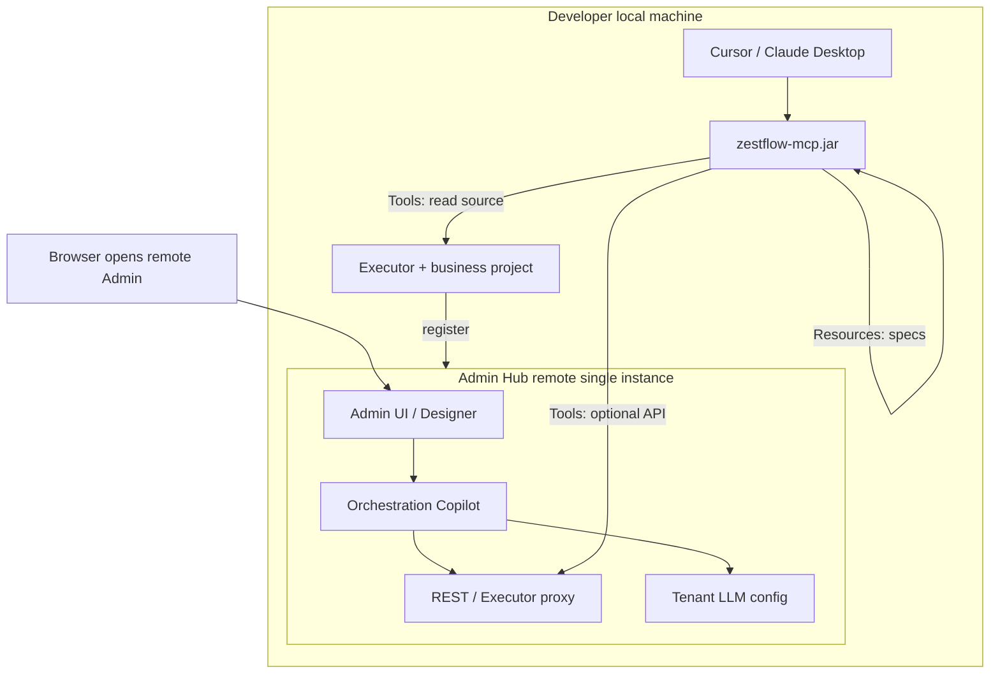

# ZestFlow Development AI Assistant: Final Solution

> **Document type** Architecture decision / Final Solution  
> **Version** 0.1.0 · **Updated** 2026-06-08 · **Language** English · [简体中文](AI_DEV_COPILOT_FINAL_SOLUTION.md)  
> **Status** **Adopted · Phase 1–3 complete (including Chain-first learning + `--init-dev`)**  
> **Prerequisite reading** [AI_DEV_COPILOT_ACADEMIC_SUMMARY.en.md](./AI_DEV_COPILOT_ACADEMIC_SUMMARY.en.md)  
> **Related** [AI_COPILOT.en.md](./AI_COPILOT.en.md) (Orchestration Copilot, implemented) · [MCP_SETUP.en.md](./MCP_SETUP.en.md) (installation guide)

---

## 1. Decision Summary

| Item | Decision |
|------|----------|
| **Core requirement** | ZestFlow **customized AI** for component/chain development; **not** building an IDE-grade chat system inside Admin |
| **Final approach** | New **`zestflow-mcp`** module (JAR) implementing **Model Context Protocol** Server |
| **Spec carrier** | Chain/component development specs, JSON Schema, sample code → packaged in JAR, exposed via MCP **Resources** |
| **Dynamic context** | Component whitelist, local source, chain validation → MCP **Tools** + optional Admin/Executor HTTP API |
| **IDE integration** | **One MCP Server**; Cursor / Claude Desktop / other MCP clients differ **only in configuration**, no per-IDE plugins |
| **Admin role** | Remains **Hub (Nacos analogy)**: Orchestration Copilot, tenant LLM, designer; **does not** handle Dev disk reads or long sessions |
| **Explicitly out of scope** | Admin Netty Dev full-chain Copilot (main path); Admin one-click Cursor chat injection; AI auto publish/reload; **MCP Tool disk writes (`write_project_file`)** |

---

## 2. Goals and Non-Goals

### 2.1 Goals

1. When developers describe requirements in **Cursor / Claude**, AI **automatically receives** ZestFlow official specs and project context.  
2. When generating `@ZestComponent` code, **do not fabricate** `componentId`; can call **validate** and **list_components**.  
3. Specs **bound to ZestFlow version** (shipped with JAR); team-wide consistency.  
4. Consistent with existing deployment: **remote Admin + local Executor**; development may run without local Admin.  
5. Orchestration **zero-code** capabilities continue evolving in **Admin Orchestration Copilot**.

### 2.2 Non-Goals

- Replicate Cursor multi-turn code editing inside Admin  
- Write native plugins for Cursor, Claude, Windsurf separately  
- Default tenant LLM Keys to every Executor replica  
- MCP auto git commit / auto production publish  
- Replace chain Copilot already in `AI_COPILOT.md` (complementary instead)  
- **MCP Tool disk writes** (see [§2.3](#23-dev-copilot-explicitly-out-of-scope-v1))

### 2.3 Dev Copilot Explicitly Out of Scope (v1)

| Out of scope | Rationale | Handled by |
|--------------|-----------|------------|
| **`write_project_file` and similar MCP write Tools** | Conflicts with "MCP connects specs and context; IDE writes code"; extra write channel increases mis-edit risk | **Cursor / Claude** native edit + diff + user Apply/Reject |
| MCP auto git commit | Same gate as `AI_COPILOT.md` | Developer |
| MCP auto publish / reload | Copilot ≠ Autopilot | Developer manually in Admin |
| **Note:** Some industry MCP Servers offer write-file Tools, but ZestFlow's primary users are **Cursor / Claude Desktop**, whose UI already has confirmation flows; MCP stays **read-only disk + validate**; `scaffold_component` (if present) **returns Java text only**, no disk write |

---

## 3. Overall Architecture



### 3.1 Dual Copilot Responsibility Table

| | Orchestration Copilot | Dev Copilot (this solution) |
|--|----------------------|----------------------------|
| **Carrier** | Admin UI + Admin backend | `zestflow-mcp` + IDE |
| **Users** | Business / implementation / zero-code orchestration | Developers writing Java components |
| **LLM** | Admin tenant config | IDE-side model (DeepSeek / Claude / Ollama, etc.) |
| **Sessions** | Admin DB (audit/usage) | IDE sessions |
| **Typical actions** | suggest chain, explain, expression | list components, read Java, scaffold, validate |
| **Artifact application** | Designer diff → manual publish | **IDE diff/Apply to edit files** (MCP does not write disk) |

---

## 4. Module Design: `zestflow-mcp`

### 4.1 Module Positioning

| Attribute | Description |
|-----------|-------------|
| Maven module name | `zestflow-mcp` (sibling to `zestflow-admin`) |
| Artifact | Executable JAR (`java -jar zestflow-mcp.jar`) |
| Dependencies | Lightweight MCP SDK, HTTP client (Admin/Executor API), local file IO |
| Production Executor | **Not** required; release reactor **may omit** packaging |
| vs dev-bridge | This solution **replaces** standalone Dev Bridge main path; Netty Dev RPC **not implemented** (unless future non-MCP clients) |

### 4.2 Directory Structure (Recommended)

```text
zestflow-mcp/
  pom.xml
  src/main/java/com/zestflow/mcp/
    ZestFlowMcpApplication.java      # Entry, stdio or HTTP
    config/McpServerConfig.java
    resources/                       # MCP Resources providers
      ClasspathRulesProvider.java
    tools/                           # MCP Tools
      ListComponentsTool.java
      ReadProjectFileTool.java
      ValidateChainTool.java
      SearchSourcesTool.java         # P2
      ScaffoldComponentTool.java     # P2
  src/main/resources/zestflow/
    rules/
      component-development.md       # @ZestComponent spec
      chain-definition.md            # ChainDefinitionDTO / nodes & edges
      aviator-expressions.md
      anti-patterns.md               # e.g. forbid fabricating id
    schemas/
      chain-definition.schema.json
    examples/
      SampleExecuteComponent.java
```

### 4.3 Startup Parameters

| Parameter | Required | Description |
|-----------|----------|-------------|
| `--project` | Yes | Executor/business project root (contains `pom.xml`) |
| `--admin-url` | No | Remote Admin base URL for list/design/validate proxy |
| `--token` | No | Bearer for Admin API |
| `--app-code` | No | Default app; overridable in Tool args |
| `--transport` | No | `stdio` (default, for IDE) or `http` (team gateway, P2) |
| `--init-dev` | No | Initialize business project Dev files (see [§4.4](#44-one-click-dev-project-init-init-dev)) |
| `--ide` | No | With `--init-dev`: `cursor` / `vscode` / `claude` / `all` |
| `--base-package` | No | Override package inferred from pom |
| `--force` | No | With `--init-dev`, overwrite existing files |
| `--no-gitignore` | No | With `--init-dev`, do not append `.gitignore` snippet |

Example:

```bash
java -jar zestflow-mcp.jar \
  --project D:/work/my-demo \
  --admin-url https://admin.company.com \
  --token "${ZESTFLOW_TOKEN}" \
  --app-code demo
```

### 4.4 One-Click Dev Project Init (`--init-dev`)

**Module `zestflow-dev-templates`:** Packages Dev templates (`project.md`, IDE MCP JSON, etc.), distributed on `zestflow-mcp` classpath; **does not** require copying JAR per project.

| Template (classpath) | Written to project path |
|----------------------|-------------------------|
| `rules/project.md.template` | `.zestflow/rules/project.md` |
| `mcp/cursor.mcp.json.template` | `.cursor/mcp.json` |
| `mcp/vscode.mcp.json.template` | `.vscode/mcp.json` |
| `mcp/claude-desktop.config.json.template` | `.zestflow/mcp/claude-desktop.config.json.example` |
| `gitignore.zestflow.snippet` | Append to `.gitignore` (optional) |

**Implementation:** `DevProjectInitializer` + `ProjectMetadataResolver` (infers metadata from `pom.xml` / `application.yml`).

```powershell
powershell -File scripts/dev/install-mcp.ps1
powershell -File scripts/dev/init-dev-project.ps1 -ProjectRoot D:/work/my-app
```

```bash
java -jar ~/.zestflow/tools/zestflow-mcp.jar --init-dev --project /path/to/my-app --ide all
```

**Layering (benchmark: Stripe / Supabase MCP):**

```text
Platform   ~/.zestflow/tools/zestflow-mcp.jar     ← install-mcp, shared across projects
Project    .cursor/mcp.json + .zestflow/rules/     ← --init-dev, one copy per project
```

See [MCP_SETUP.en.md](./MCP_SETUP.en.md) §2, [scripts/dev/mcp/README.md](../scripts/dev/mcp/README.md).

---

## 5. MCP Interface Contract

### 5.1 Resources (Static, from JAR)

Auto-discovered when client connects; model reads via URI.

| URI | Description |
|-----|-------------|
| `zestflow://rules/component` | Component annotations, naming, package path, error strategy |
| `zestflow://rules/chain` | Chain definition, node types, edges, Aviator conventions |
| `zestflow://rules/anti-patterns` | Forbidden items list |
| `zestflow://schema/chain-definition` | JSON Schema |
| `zestflow://examples/component/execute` | Standard `@ZestExecute` example |
| `zestflow://rules/project` | **L1 official summary + L2 project `.zestflow/rules/project.md`** |

**Maintenance:** Keep in sync with `AI_COPILOT.md` and annotation system; update with JAR releases.

### 5.1.1 Layered Rules (L0–L3)

| Layer | Source | Overridable | Description |
|-------|--------|-------------|-------------|
| **L0** | Platform hard constraints | No | Forbid fabricating componentId; must validate; forbid auto publish/reload |
| **L1** | JAR Resources | No | Official chain/component specs, Schema, examples |
| **L2** | `{project}/.zestflow/rules/project.md` | Append/refine | Package path, naming, team conventions; MVP supported |
| **L3** | IDE chat temporary instructions | Session-level | Not persisted |

**Industry comparison:** Similar to Cursor Rules + MCP Resources ([Cursor MCP docs](https://docs.cursor.com/context/mcp)); project rules file like `.cursor/rules` but **ZestFlow-domain specific**, stably bound to JAR spec URIs.

**MVP implementation:** On startup, `zestflow-mcp` reads `--project` `.zestflow/rules/project.md`, exposes merged view via `zestflow://rules/project`.

### 5.2 Tools (Dynamic)

| Tool | Priority | Input | Output | Data source |
|------|----------|-------|--------|-------------|
| `list_components` | P1 | `appCode` | `componentId` list + types | Admin API or Executor Scanner proxy |
| `read_project_file` | P1 | Relative path | File content | Local IO under `--project` |
| `validate_chain` | P1 | `chainDefinitionJson` | valid / errors[] | Executor validate API |
| `search_sources` | P2 | `keyword`, `glob?` | Matching paths + snippets | Local grep |
| `scaffold_component` | P2 | `componentId`, `type`, `description` | **Java source text** + suggested path (**no disk write**) | JAR template |
| `plan_chain` | P3 | `userMessage`, `appCode` | feature, steps, gap, workflow | Platform template + Pattern retrieval |
| `record_learning_event` | P3 | intent/feature/validate, etc. | eventId, promotionEligible | `.zestflow/learning/events.jsonl` |
| `search_patterns` | P3 | `query`, `feature?` | Platform + project Pattern hits | JAR + `.zestflow/patterns/` |
| `distill_patterns` | P3 | `minScore?` | Create/update Pattern files | High-confidence events |
| `gen_playground_scene` | P3 | chain/feature, etc. | Playground JSON | Template |
| `share_pattern` | P3 | `patternId` | RAG import package JSON | Project Pattern |
| ~~`write_project_file`~~ | — | — | — | **Not implemented** (see §2.3) |

**Learning layering** (platform vs project vs tenant) in [AI_CHAIN_LEARNING.en.md](./AI_CHAIN_LEARNING.en.md):

| Layer | Storage | Maintainer |
|-------|---------|------------|
| L0 Platform Pattern | MCP JAR `zestflow/patterns/platform/` | Release |
| L2 Project Pattern | `.zestflow/patterns/` | Git / `distill_patterns` |
| L3 Raw signals | `.zestflow/learning/events.jsonl` | `record_learning_event` |
| L1 Team RAG | Admin documents | `promote-rag` / `share_pattern` import |

**97% business accuracy:** Structured plan + Validator hard gate + `AccuracyGate` promotion curation (not LLM self-rating).

Tool descriptions must state call order, e.g.:

> "Before generating a new component, **must** call `list_components`; after generating chain JSON, **must** call `validate_chain`."

### 5.3 Typical IDE Workflow

```text
1. User: "Help me develop a registration chain"
2. Model: search_patterns / plan_chain (platform + project experience)
3. Model: list_components → scaffold_component (fill gap)
4. Model: validate_chain → gen_playground_scene
5. Model: record_learning_event → distill_patterns (high confidence)
6. Team: share_pattern or Admin promote-rag
7. Developer: mvn compile, Admin publish/reload (manual)
```

---

## 6. IDE Integration (One Server, Multiple Clients)

### 6.1 Cursor

File: `~/.cursor/mcp.json` or project `.cursor/mcp.json`

```json
{
  "mcpServers": {
    "zestflow": {
      "command": "java",
      "args": [
        "-jar", "${userHome}/.zestflow/tools/zestflow-mcp.jar",
        "--project", "${workspaceFolder}",
        "--app-code", "my-app",
        "--executor-url", "http://127.0.0.1:20550"
      ]
    }
  }
}
```

Recommended: generate via `--init-dev`; manual copy see `scripts/dev/mcp/project.cursor.mcp.json.example`.

### 6.2 Claude Desktop

File: `claude_desktop_config.json` (OS path per Anthropic docs)

```json
{
  "mcpServers": {
    "zestflow": {
      "command": "java",
      "args": ["-jar", "/path/zestflow-mcp.jar", "--project", "/path/my-demo"]
    }
  }
}
```

**Same JAR, same args**; only config file location differs.

### 6.3 Clients Without MCP

**Fallback:** Admin or CLI provides **"Export Cursor task package"** (`zestflow-task.md` + whitelist + code snippets), manually `@` into chat. **Same source** as MCP spec content.

### 6.4 Need Cursor Rules?

**Optional enhancement:** One line in `.cursor/rules` pointing to "use zestflow MCP for component development". **Cannot replace** MCP Tools dynamic capabilities.

---

## 7. Admin-Side Changes (Minimal)

| Change | Description |
|--------|-------------|
| Orchestration Copilot | **Keep**, continue `AI_COPILOT.md` path |
| Dev Copilot entry | **`zestflow-demo/.cursor/mcp.json` + [MCP_SETUP.en.md](./MCP_SETUP.en.md)** (no Dev Tab in Admin) |
| `AiComponentScaffoldDialog` | **Removed**; component dev via MCP + `zestflow-demo/.cursor/mcp.json` |
| New Dev chat page | **Not built** |
| Netty Dev RPC | **Not built** (main path) |
| API | Ensure MCP can call: component list, validate-definition (document if already present) |

---

## 8. Security and Governance

| Item | Policy |
|------|--------|
| MCP listen | Default **stdio** (no network port); HTTP transport only on `127.0.0.1` if used |
| File IO | MCP **read-only**: `read_project_file` (and P2 `search_sources`); **no write Tool** |
| Source to disk | Cursor / Claude edit and Apply; `scaffold_component` if present returns text only |
| Token | Personal/service token for Admin API; **not stored in JAR** |
| Audit | Orchestration Copilot continues Admin audit; MCP Tool calls may log locally (P2) |
| Production | Production Executor image **excludes** zestflow-mcp; production Admin **does not** host Dev Keys |
| Gates | validate failure ≠ publishable; **forbid** Tool direct publish/reload |

---

## 9. Implementation Roadmap

### Phase 0 — Documentation and Spec Extraction (1 week)

- [x] Review this document and academic summary  
- [x] Extract Resources draft from `AI_COPILOT.md`, annotations, DTOs  
- [x] Confirm Admin/Executor API list callable by MCP  

### Phase 1 — MCP MVP (2–3 weeks)

- [x] New `zestflow-mcp` module, stdio transport  
- [x] Implement Resources (including `zestflow://rules/project`)  
- [x] Implement Tools: `list_components`, `read_project_file`, `validate_chain`  
- [x] Cursor / Claude config templates + `docs/MCP_SETUP.md` + `zestflow-demo/.cursor/mcp.json`  

**Acceptance:** In Cursor, complete "list components → read spec → generate Java class name matching package → validate one chain JSON".

### Phase 2 — Enhancement (2 weeks)

- [x] `search_sources`, `scaffold_component` (**text only, no disk write**)  
- [x] Task package export (CLI `--export-task-package` + MCP Tool `export_task_package`)  
- [x] Local MCP call audit log (`.zestflow/mcp-audit.jsonl`)  

> **Status** Phase 2 complete (2026-06-07). **`write_project_file` not implemented**, see §2.3, ADR-006.

### Phase 3 — Chain-first Learning (Complete)

- [x] `plan_chain`, `record_learning_event`, `search_patterns`, `distill_patterns`  
- [x] `gen_playground_scene`, `share_pattern`  
- [x] Platform Patterns (L0) `zestflow/patterns/platform/`  
- [x] `AccuracyGate` promotion threshold (≥97% first-pass validate rate)  
- [x] `--init-dev` + `zestflow-dev-templates` project onboarding  

See [AI_CHAIN_LEARNING.en.md](./AI_CHAIN_LEARNING.en.md).

### Phase 4 — Optional (As Needed)

- [ ] HTTP transport (team unified gateway)  
- [ ] Enterprise mode: Executor read-only context to Admin LLM (**not default**)  

> **Removed from roadmap:** `write_project_file` — disk writes handled by IDE, see §2.3, ADR-006.

---

## 10. Integration with Existing Implementation

| Existing | Final solution |
|----------|----------------|
| `AiComponentScaffoldDialog` + Admin scaffold API | **Removed**; replaced by MCP `scaffold_component` + IDE Apply |
| `AiComponentCodeGenerator` (Executor) | **Shared** with MCP scaffold template or MCP calls API |
| `AI_COPILOT.md` §11 component assist | Mark as Dev Copilot, point to this document |
| `LLM only in Admin` | Revised to **orchestration LLM in Admin** |
| Flyway V2 / dictionary pages, etc. | Unrelated, maintained in parallel |

---

## 11. Risks and Mitigation

| Risk | Mitigation |
|------|------------|
| Developers unwilling to configure MCP | Admin one-click copy config + task package fallback |
| Spec drift from code | Resources ship with ZestFlow version; CI validates MD vs schema |
| MCP protocol evolution | Pin SDK version; stdio first |
| Multiple Executor instances | MCP queries online instances via Admin API; Tools do not replace instance routing |
| static Git conflicts | Merge discipline: single `npm run build` |

---

## 12. Decision Record (ADR Summary)

| ID | Decision | Rationale |
|----|----------|-----------|
| ADR-001 | Dev Copilot via MCP, not Admin Netty Dev Chat | Aligns with Cursor; lowers Admin complexity |
| ADR-002 | Specs packaged as JAR Resources | Version unity; cross-IDE reuse |
| ADR-003 | Single MCP Server, multi-client config | MCP standard; avoid N plugins |
| ADR-004 | Admin keeps Orchestration Copilot | Hub model and zero-code users |
| ADR-005 | No Admin local disk reads | Browser + Hub deployment infeasible |
| ADR-006 | **No MCP `write_project_file`** | Disk writes via Cursor/Claude diff+Apply; MCP read-only+validate, avoid dual write channels |

---

## 13. Documentation and Deliverables

| Document / artifact | Description |
|---------------------|-------------|
| [AI_DEV_COPILOT_ACADEMIC_SUMMARY.en.md](./AI_DEV_COPILOT_ACADEMIC_SUMMARY.en.md) | Academic workshop summary |
| **This document** | Final solution (adopted) |
| [MCP_SETUP.en.md](./MCP_SETUP.en.md) | Installation and configuration guide |
| `~/.zestflow/tools/zestflow-mcp.jar` | Platform MCP entry (`install-mcp`) |
| `zestflow-dev-templates` | Dev project templates (`--init-dev`) |
| `scripts/dev/init-dev-project.ps1` | Init wrapper script |
| [AI_CHAIN_LEARNING.en.md](./AI_CHAIN_LEARNING.en.md) | Chain-first learning and retention |
| `AI_COPILOT.md` v1.5 | Dual Copilot + §1.6 onboarding |

---

## 14. One-Line Implementation Motto

> **Admin designs chains; MCP connects specs and code; Cursor writes components.**

---

*This document is the adopted final solution baseline; `zestflow-mcp` Phase 1–3 and `--init-dev` are implemented (Admin has no Dev Tab).*
