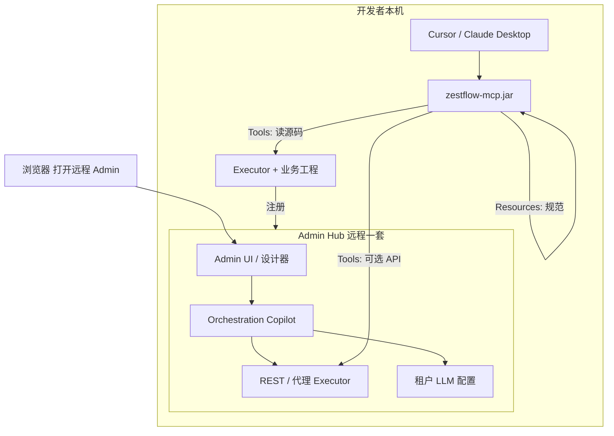

# ZestFlow 开发态 AI 辅助：最终方案

> **文档类型** 架构决策 / 最终方案（Final Solution）  
> **版本** 1.3 · **状态** **已采纳 · Phase 1～3 已完成（含 Chain-first 学习）**  
> **前置阅读** [AI_DEV_COPILOT_ACADEMIC_SUMMARY.md](./AI_DEV_COPILOT_ACADEMIC_SUMMARY.md)  
> **关联** [AI_COPILOT.md](./AI_COPILOT.md)（编排 Copilot，已实现）· [MCP_SETUP.md](./MCP_SETUP.md)（安装手册）

---

## 1. 决策摘要

| 项 | 决策 |
|----|------|
| **核心诉求** | ZestFlow **定制化 AI** 辅助元件/链条开发，**不**自建 Admin 内 IDE 级聊天系统 |
| **最终路线** | 新增 **`zestflow-mcp`** 模块（JAR），实现 **Model Context Protocol** Server |
| **规范载体** | 链条/元件开发规范、JSON Schema、示例代码 → 打入 JAR，经 MCP **Resources** 暴露 |
| **动态上下文** | 元件白名单、本地源码、链校验 → MCP **Tools** + 可选 Admin/Executor HTTP API |
| **IDE 集成** | **一套 MCP Server**，Cursor / Claude Desktop / 其它 MCP 客户端 **仅配置差异**，无需 per-IDE 插件 |
| **Admin 角色** | 保持 **Hub（Nacos 类比）**：编排 Copilot、租户 LLM、设计器；**不**承担 Dev 读盘与长会话 |
| **明确不做** | Admin 内 Netty Dev 全链路 Copilot（主路径）；Admin 一键注入 Cursor 聊天；AI 自动 publish/reload；**MCP Tool 写盘（`write_project_file`）** |

---

## 2. 目标与非目标

### 2.1 目标

1. 开发者在 **Cursor / Claude** 中描述需求时，AI **自动获得** ZestFlow 官方规范与项目上下文。  
2. 生成 `@ZestComponent` 代码时 **不编造** `componentId`，可调用 **validate** 与 **list_components**。  
3. 规范与 ZestFlow **版本绑定**（随 JAR 发版），团队统一。  
4. 与现有部署一致：**远程 Admin + 本地 Executor**，开发可不启本地 Admin。  
5. 编排类 **0 代码** 能力继续在 **Admin Orchestration Copilot** 演进。

### 2.2 非目标

- 在 Admin 内复刻 Cursor 多轮改码体验  
- 为 Cursor、Claude、Windsurf 各写一套原生插件  
- 将租户 LLM Key 默认下沉到每个 Executor 副本  
- MCP 自动 git commit / 自动生产发布  
- 替代 `AI_COPILOT.md` 已实现的链 Copilot（而是互补）  
- **MCP Tool 写盘**（见 [§2.3](#23-dev-copilot-明确不做v1)）

### 2.3 Dev Copilot 明确不做（v1）

| 不做 | 理由 | 由谁承担 |
|------|------|----------|
| **`write_project_file` 等 MCP 写盘 Tool** | 与「MCP 连规范与上下文、IDE 写代码」分工冲突；多一条写盘通道只会增加误改风险 | **Cursor / Claude** 原生编辑 + diff + 用户 Apply/Reject |
| MCP 自动 git commit | 同 `AI_COPILOT.md` 门禁 | 开发者 |
| MCP 自动 publish / reload | Copilot ≠ Autopilot | 开发者在 Admin 人工操作 |

**说明**：业界部分 MCP Server 提供写文件 Tool，但 ZestFlow 主路径用户是 **Cursor / Claude Desktop**，其 UI 已内置确认流程；MCP 保持 **只读读盘 + validate**，`scaffold_component`（若做）也 **只返回 Java 文本**，不落盘。

---

## 3. 总体架构



### 3.1 双 Copilot 职责表

| | Orchestration Copilot | Dev Copilot（本方案） |
|--|----------------------|------------------------|
| **载体** | Admin UI + Admin 后端 | `zestflow-mcp` + IDE |
| **用户** | 业务 / 实施 / 0 代码编排 | 写 Java 元件的开发者 |
| **LLM** | Admin 租户配置 | IDE 侧模型（DeepSeek / Claude / Ollama 等） |
| **会话** | Admin DB（审计/用量） | IDE 会话 |
| **典型动作** | suggest 链、explain、expression | list 元件、读 Java、scaffold、validate |
| **产物应用** | 设计器 diff → 人工发布 | **IDE diff/Apply 改文件**（MCP 不写盘） |

---

## 4. 模块设计：`zestflow-mcp`

### 4.1 模块定位

| 属性 | 说明 |
|------|------|
| Maven 模块名 | `zestflow-mcp`（建议与 `zestflow-admin` 并列） |
| 产物 | 可执行 JAR（`java -jar zestflow-mcp.jar`） |
| 依赖 | 轻量 MCP SDK、HTTP 客户端（调 Admin/Executor API）、本地文件 IO |
| 生产 Executor | **不**强制依赖；release 反应堆 **可不打包** |
| 与 dev-bridge 关系 | 本方案 **取代** 独立 Dev Bridge 主路径；Netty Dev RPC **不实施**（除非未来无 MCP 客户） |

### 4.2 目录结构（建议）

```text
zestflow-mcp/
  pom.xml
  src/main/java/com/zestflow/mcp/
    ZestFlowMcpApplication.java      # 入口，stdio 或 HTTP
    config/McpServerConfig.java
    resources/                       # MCP Resources 提供器
      ClasspathRulesProvider.java
    tools/                           # MCP Tools
      ListComponentsTool.java
      ReadProjectFileTool.java
      ValidateChainTool.java
      SearchSourcesTool.java         # P2
      ScaffoldComponentTool.java     # P2
  src/main/resources/zestflow/
    rules/
      component-development.md       # @ZestComponent 规范
      chain-definition.md            # ChainDefinitionDTO / 节点边
      aviator-expressions.md
      anti-patterns.md               # 禁止编造 id 等
    schemas/
      chain-definition.schema.json
    examples/
      SampleExecuteComponent.java
```

### 4.3 启动参数

| 参数 | 必填 | 说明 |
|------|------|------|
| `--project` | 是 | Executor/业务工程根目录（含 `pom.xml`） |
| `--admin-url` | 否 | 远程 Admin 基址，用于 list/design/validate 代理 |
| `--token` | 否 | Bearer，调 Admin API |
| `--app-code` | 否 | 默认 app，可 Tool 参数覆盖 |
| `--transport` | 否 | `stdio`（默认，IDE 用）或 `http`（团队网关，P2） |

示例：

```bash
java -jar zestflow-mcp.jar \
  --project D:/work/my-demo \
  --admin-url https://admin.company.com \
  --token "${ZESTFLOW_TOKEN}" \
  --app-code demo
```

---

## 5. MCP 接口契约

### 5.1 Resources（静态，来自 JAR）

客户端连接后自动发现；模型可通过 URI 读取。

| URI | 描述 |
|-----|------|
| `zestflow://rules/component` | 元件注解、命名、包路径、错误策略 |
| `zestflow://rules/chain` | 链定义、节点类型、边、Aviator 约定 |
| `zestflow://rules/anti-patterns` | 禁止项清单 |
| `zestflow://schema/chain-definition` | JSON Schema |
| `zestflow://examples/component/execute` | 标准 `@ZestExecute` 示例 |
| `zestflow://rules/project` | **L1 官方摘要 + L2 项目 `.zestflow/rules/project.md`** |

**维护策略**：内容与 `AI_COPILOT.md`、代码注解体系 **同源维护**；发版时随 JAR 更新。

### 5.1.1 分层规则（L0～L3）

| 层级 | 来源 | 可覆盖 | 说明 |
|------|------|--------|------|
| **L0** | 平台硬约束 | 否 | 禁止编造 componentId；必须 validate；禁止自动 publish/reload |
| **L1** | JAR Resources | 否 | 官方链条/元件规范、Schema、示例 |
| **L2** | `{project}/.zestflow/rules/project.md` | 追加/细化 | 包路径、命名、团队约定；MVP 已支持 |
| **L3** | IDE 聊天临时说明 | 会话级 | 不持久化 |

**业界对照**：类似 Cursor Rules + MCP Resources 组合（[Cursor MCP 文档](https://docs.cursor.com/context/mcp)）；项目规则文件对标 `.cursor/rules` 但 **专用于 ZestFlow 域**，且与 JAR 规范 URI 稳定绑定。

**MVP 实现**：`zestflow-mcp` 启动时读取 `--project` 下 `.zestflow/rules/project.md`，经 `zestflow://rules/project` 暴露合并视图。

### 5.2 Tools（动态）

| Tool | 优先级 | 输入 | 输出 | 数据来源 |
|------|--------|------|------|----------|
| `list_components` | P1 | `appCode` | `componentId` 列表 + 类型 | Admin API 或 Executor Scanner 代理 |
| `read_project_file` | P1 | 相对路径 | 文件内容 | `--project` 下本地 IO |
| `validate_chain` | P1 | `chainDefinitionJson` | valid / errors[] | Executor validate API |
| `search_sources` | P2 | `keyword`, `glob?` | 匹配路径 + 片段 | 本地 grep |
| `scaffold_component` | P2 | `componentId`, `type`, `description` | **Java 源码文本** + 建议路径（**不写盘**） | JAR 模板 |
| `plan_chain` | P3 | `userMessage`, `appCode` | feature、steps、gap、workflow | 平台模板 + Pattern 检索 |
| `record_learning_event` | P3 | intent/feature/validate 等 | eventId、promotionEligible | `.zestflow/learning/events.jsonl` |
| `search_patterns` | P3 | `query`, `feature?` | 平台 + 项目 Pattern 命中 | JAR + `.zestflow/patterns/` |
| `distill_patterns` | P3 | `minScore?` | 新建/更新 Pattern 文件 | 高置信 events |
| `gen_playground_scene` | P3 | chain/feature 等 | Playground JSON | 模板 |
| `share_pattern` | P3 | `patternId` | RAG import 包 JSON | 项目 Pattern |
| ~~`write_project_file`~~ | — | — | — | **不实施**（见 §2.3） |

**学习分层**（平台 vs 项目 vs 租户）见 [AI_CHAIN_LEARNING.md](./AI_CHAIN_LEARNING.md)：

| 层级 | 存储 | 谁维护 |
|------|------|--------|
| L0 平台 Pattern | MCP JAR `zestflow/patterns/platform/` | 发版 |
| L2 项目 Pattern | `.zestflow/patterns/` | Git / `distill_patterns` |
| L3 原始信号 | `.zestflow/learning/events.jsonl` | `record_learning_event` |
| L1 团队 RAG | Admin 文档 | `promote-rag` / `share_pattern` import |

**97% 业务准确率**：结构化 plan + Validator 硬门禁 + `AccuracyGate` 晋升策展（非 LLM 自评）。

Tool 描述（description）须写清调用顺序，例如：

> 「生成新元件前 **必须** 调用 `list_components`；生成链 JSON 后 **必须** 调用 `validate_chain`。」

### 5.3 典型 IDE 内工作流

```text
1. 用户：「帮我开发注册链路」
2. 模型：search_patterns / plan_chain（平台+项目经验）
3. 模型：list_components → scaffold_component（补 gap）
4. 模型：validate_chain → gen_playground_scene
5. 模型：record_learning_event → distill_patterns（高置信）
6. 团队：share_pattern 或 Admin promote-rag
7. 开发者：mvn compile、Admin 发布/reload（人工）
```

---

## 6. IDE 集成（一套 Server，多客户端）

### 6.1 Cursor

文件：`~/.cursor/mcp.json` 或项目 `.cursor/mcp.json`

```json
{
  "mcpServers": {
    "zestflow": {
      "command": "java",
      "args": [
        "-jar", "D:/tools/zestflow-mcp.jar",
        "--project", "D:/work/my-demo",
        "--admin-url", "https://admin.company.com",
        "--token", "YOUR_TOKEN"
      ]
    }
  }
}
```

### 6.2 Claude Desktop

文件：`claude_desktop_config.json`（OS 路径见 Anthropic 文档）

```json
{
  "mcpServers": {
    "zestflow": {
      "command": "java",
      "args": ["-jar", "/path/zestflow-mcp.jar", "--project", "/path/my-demo"]
    }
  }
}
```

**同一 JAR、同一套 args**；仅配置文件位置不同。

### 6.3 不支持 MCP 的客户端

**兜底**：Admin 或 CLI 提供 **「导出 Cursor 任务包」**（`zestflow-task.md` + 白名单 + 代码片段），手动 `@` 进聊天。与 MCP 规范内容 **同源生成**。

### 6.4 是否需要 Cursor Rules？

**可选增强**：`.cursor/rules` 中一行指向「元件开发请使用 zestflow MCP」。**不能替代** MCP Tools 的动态能力。

---

## 7. Admin 侧改动（最小）

| 改动 | 说明 |
|------|------|
| Orchestration Copilot | **保持**，继续 `AI_COPILOT.md` 路线 |
| Dev Copilot 入口 | **`zestflow-demo/.cursor/mcp.json` + [MCP_SETUP.md](./MCP_SETUP.md)**（Admin 无 Dev Tab） |
| `AiComponentScaffoldDialog` | **已移除**；元件开发见 MCP + `zestflow-demo/.cursor/mcp.json` |
| 新 Dev 聊天页 | **不做** |
| Netty Dev RPC | **不做**（主路径） |
| API | 确保 MCP 可调用：元件列表、validate-definition（已有则文档化） |

---

## 8. 安全与治理

| 项 | 策略 |
|----|------|
| MCP 监听 | 默认 **stdio**（无网络端口）；若 HTTP transport 仅 `127.0.0.1` |
| 文件 IO | MCP **只读**：`read_project_file`（及 P2 `search_sources`）；**不提供写盘 Tool** |
| 源码落盘 | Cursor / Claude 编辑与 Apply；`scaffold_component` 若有，仅返回文本 |
| Token | 调 Admin API 用个人/服务 token；**不入库到 JAR** |
| 审计 | 编排 Copilot 继续 Admin 审计；MCP Tool 调用可写本地日志（P2） |
| 生产 | 生产 Executor 镜像 **不含** zestflow-mcp；生产 Admin **不**托管 Dev Key |
| 门禁 | validate 失败不得视为可发布；**禁止** Tool 直接 publish/reload |

---

## 9. 实施路线图

### Phase 0 — 文档与规范抽取（1 周）

- [x] 评审本文档与学术总结  
- [x] 从 `AI_COPILOT.md`、注解、DTO 抽取 Resources 初稿  
- [x] 确认 Admin/Executor 可供 MCP 调用的 API 列表  

### Phase 1 — MCP MVP（2～3 周）

- [x] 新建 `zestflow-mcp` 模块，stdio transport  
- [x] 实现 Resources（含 `zestflow://rules/project`）  
- [x] 实现 Tools：`list_components`、`read_project_file`、`validate_chain`  
- [x] Cursor / Claude 配置模板 + `docs/MCP_SETUP.md` + `zestflow-demo/.cursor/mcp.json`  

**验收**：Cursor 内完成「列出元件 → 读规范 → 生成符合包名的 Java 类名草案 → validate 一条链 JSON」。

### Phase 2 — 增强（2 周）

- [x] `search_sources`、`scaffold_component`（**只返回文本，不写盘**）  
- [x] 任务包导出（CLI `--export-task-package` + MCP Tool `export_task_package`）  
- [x] 本地 MCP 调用 audit 日志（`.zestflow/mcp-audit.jsonl`）  

> **状态** Phase 2 已完成（2026-06-07）。**不实施** `write_project_file`，见 §2.3、ADR-006。

### Phase 3 — 可选（按需）

- [ ] HTTP transport（团队统一网关）  
- [ ] 企业模式：Executor 只读 context 回传 Admin LLM（**非默认**）  

> **已从路线图移除**：`write_project_file` — 写盘由 IDE 承担，见 §2.3、ADR-006。

---

## 10. 与现有实现的衔接

| 现有 | 最终方案 |
|------|----------|
| `AiComponentScaffoldDialog` + Admin scaffold API | **已移除**；由 MCP `scaffold_component` + IDE Apply 替代 |
| `AiComponentCodeGenerator`（Executor） | 与 MCP scaffold 模板 **共用** 或 MCP 调 API |
| `AI_COPILOT.md` §11 元件辅助 | 标记为 Dev Copilot，指向本文档 |
| `LLM 仅在 Admin` | 修订为 **编排 LLM 在 Admin** |
| Flyway V2 / 字典页等 | 无关，并行维护 |

---

## 11. 风险与缓解

| 风险 | 缓解 |
|------|------|
| 开发者不愿配 MCP | Admin 提供一键复制配置 + 任务包兜底 |
| 规范与代码漂移 | Resources 随 ZestFlow 版本发布；CI 校验 MD 与 schema |
| MCP 协议演进 |  pin SDK 版本；stdio 优先 |
| 多 Executor 实例 | MCP 通过 Admin API 查在线实例；Tools 不替代实例路由 |
| static Git 冲突 | 合并纪律：单次 `npm run build` |

---

## 12. 决策记录（ADR 摘要）

| ID | 决策 | 理由 |
|----|------|------|
| ADR-001 | Dev Copilot 采用 MCP，非 Admin Netty Dev Chat | 对齐 Cursor 诉求；降低 Admin 复杂度 |
| ADR-002 | 规范打包 JAR Resources | 版本统一；跨 IDE 复用 |
| ADR-003 | 单 MCP Server，多客户端配置 | MCP 标准；避免 N 套插件 |
| ADR-004 | Admin 保留 Orchestration Copilot | Hub 模型与 0 代码用户 |
| ADR-005 | 不实施 Admin 读本地盘 | 浏览器与 Hub 部署不可行 |
| ADR-006 | **不实施 MCP `write_project_file`** | 写盘由 Cursor/Claude diff+Apply；MCP 只读+validate，避免双通道写盘 |

---

## 13. 文档与交付物清单

| 文档/产物 | 说明 |
|-----------|------|
| [AI_DEV_COPILOT_ACADEMIC_SUMMARY.md](./AI_DEV_COPILOT_ACADEMIC_SUMMARY.md) | 研讨学术总结 |
| **本文档** | 最终方案（已采纳） |
| [MCP_SETUP.md](./MCP_SETUP.md) | 安装与配置手册 |
| `zestflow-mcp/target/zestflow-mcp-0.1.0-all.jar` | MCP Server 产物 |
| `AI_COPILOT.md` v1.4 | 双 Copilot 章节 |

---

## 14. 一句话实施口号

> **Admin 设计链，MCP 连接规范与代码，Cursor 写元件。**

---

*本文档为已采纳的最终方案基线；`zestflow-mcp` 与 demo `.cursor/mcp.json` 已按 Phase 1～2 落地（Admin 无 Dev Tab）。*
