# ZestFlow Architecture Design Document

> **Version** 0.1.0 · **Updated** 2026-06-08 · **Language** English · [简体中文](ARCHITECTURE.md)  
> **Positioning** Observable business process orchestration engine for the AI era · **Doc index** [README.en.md](README.en.md)

---

## Table of contents

- [1. Overview](#1-overview)
- [2. System context (C4 Level 1)](#2-system-context-c4-level-1)
- [3. Container architecture (C4 Level 2)](#3-container-architecture-c4-level-2)
- [4. Maven modules and subsystem landscape](#4-maven-modules-and-subsystem-landscape)
- [5. Subsystem detailed design](#5-subsystem-detailed-design)
  - [5.1 zestflow-common](#51-zestflow-common)
  - [5.2 zestflow-executor](#52-zestflow-executor)
  - [5.3 zestflow-collector](#53-zestflow-collector)
  - [5.4 zestflow-starter](#54-zestflow-starter)
  - [5.5 zestflow-admin](#55-zestflow-admin)
  - [5.6 zestflow-admin-ui](#56-zestflow-admin-ui)
  - [5.7 zestflow-demo](#57-zestflow-demo)
- [6. Core business flows](#6-core-business-flows)
- [7. Data architecture](#7-data-architecture)
- [8. Communication protocols and API matrix](#8-communication-protocols-and-api-matrix)
- [9. Security architecture](#9-security-architecture)
- [10. Deployment architecture](#10-deployment-architecture)
- [11. Configuration reference](#11-configuration-reference)
- [12. Extension points and SPI](#12-extension-points-and-spi)
- [13. Non-functional requirements and capacity](#13-non-functional-requirements-and-capacity)
- [14. Evolution roadmap](#14-evolution-roadmap)
- [Appendix A: Port reference](#appendix-a-port-reference)
- [Appendix B: Package naming conventions](#appendix-b-package-naming-conventions)
- [Appendix C: Local development quick reference](#appendix-c-local-development-quick-reference)

---

## 1. Overview

### 1.1 Product vision

ZestFlow orchestrates complex method invocations in business systems into **reusable, observable, hot-swappable** execution nodes, providing a "code governance layer" — every logic unit has clear boundaries with automatic capture of inputs, outputs, duration, and exceptions.

### 1.2 Competitive positioning

| Competitor | Borrowed capabilities | ZestFlow differentiation |
|------------|------------------------|--------------------------|
| **xxl-job** | Executor register/heartbeat, schedule polling, routing | + DAG orchestration + method-level components + visualization |
| **LiteFlow** | Componentized rule orchestration, context passing | Method-level annotations, Admin UI, full-chain events |
| **Flowable/Camunda** | BPMN process modeling | Lightweight integration, no BPMN learning curve |
| **Hand-written if-else** | — | Observable, hot deploy, unified governance |

### 1.3 Design principles

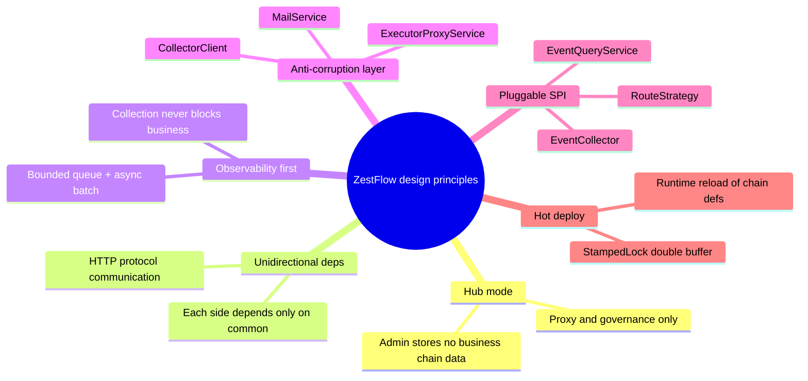

### 1.4 Technology stack overview

| Layer | Choice | Version |
|-------|--------|---------|
| Language | Java | 17 |
| Backend | Spring Boot | 3.2.5 |
| ORM | MyBatis-Plus | 3.5.15 |
| Embedded HTTP | Netty | — |
| Frontend | Vue 3 + TS + Element Plus + Vite | 3.4 / 5.x |
| Flow editor | AntV X6 | 2.19 |
| Database | MySQL | 8.x |
| Build | Maven multi-module | — |

---

## 2. System context (C4 Level 1)

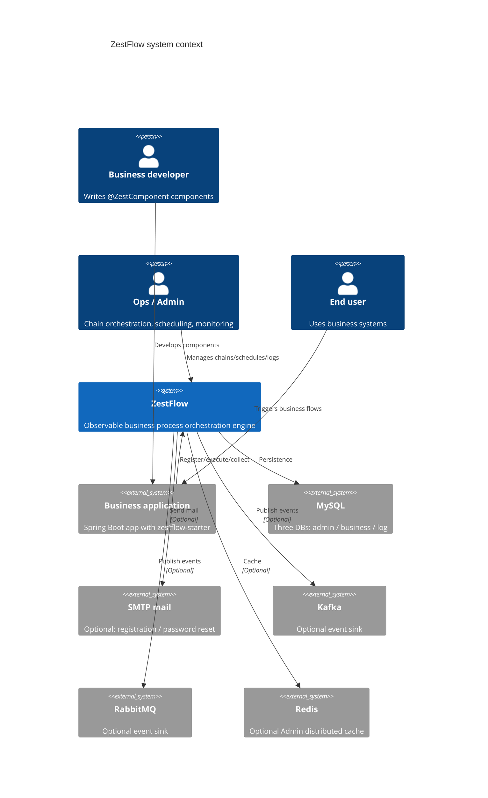

---

## 3. Container architecture (C4 Level 2)

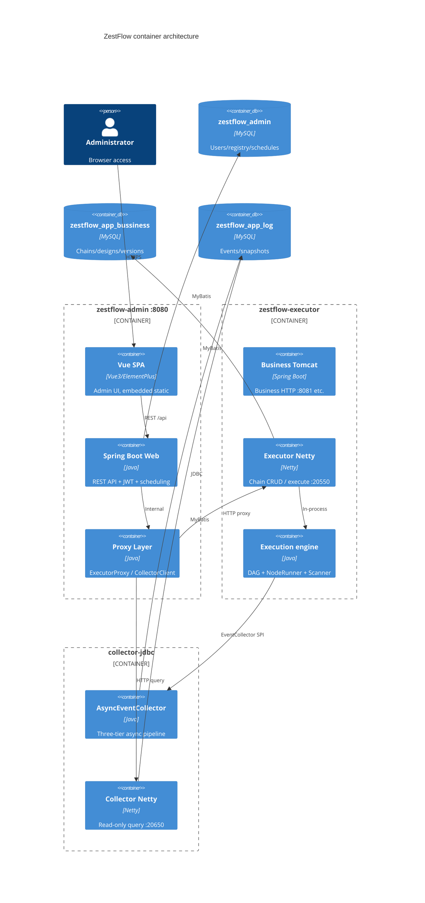

### 3.1 Logical layering

```
┌─────────────────────────────────────────────────────────────────────────┐
│                        Presentation layer                                │
│   zestflow-admin-ui (Vue SPA)  │  Admin REST Controllers                │
├─────────────────────────────────────────────────────────────────────────┤
│                        Gateway / proxy layer                             │
│   ExecutorProxyService  │  CollectorClient  │  JwtAuthFilter           │
├─────────────────────────────────────────────────────────────────────────┤
│                        Application layer                                 │
│   RegistryService  │  ScheduleService  │  UserService  │  LogService   │
├─────────────────────────────────────────────────────────────────────────┤
│                        Domain / engine layer                             │
│   ChainExecutionEngine  │  ChainManager  │  ComponentScanner           │
│   DagSorter  │  NodeRunner  │  LifecycleExecutor  │  AsyncEventCollector│
├─────────────────────────────────────────────────────────────────────────┤
│                        Infrastructure layer                              │
│   Netty Server  │  MyBatis Mapper  │  RestTemplate  │  MailService     │
├─────────────────────────────────────────────────────────────────────────┤
│                        Data layer                                        │
│   zestflow_admin  │  zestflow_app_bussiness  │  zestflow_app_log       │
└─────────────────────────────────────────────────────────────────────────┘
```

---

## 4. Maven modules and subsystem landscape

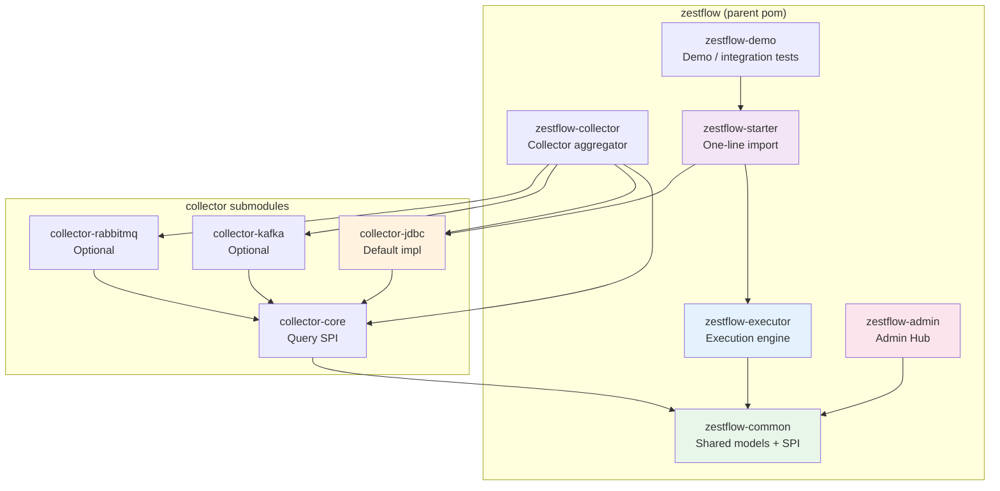

### 4.1 Module responsibility quick reference

| Module | artifactId | Deployment | Core responsibility |
|--------|-----------|------------|---------------------|
| Shared | `zestflow-common` | jar (not deployed) | DTOs, protocol, SPI, constants, CodeGenerator |
| Executor | `zestflow-executor` | Embedded in business app | DAG engine, Netty endpoints, register client |
| Collector core | `collector-core` | jar | EventQueryService SPI |
| JDBC collector | `collector-jdbc` | Embedded or standalone | Async persist + Netty query API |
| Kafka collector | `collector-kafka` | Optional | Kafka event delivery |
| RabbitMQ collector | `collector-rabbitmq` | Optional | RabbitMQ event delivery |
| Starter | `zestflow-starter` | jar | Aggregates executor + collector-jdbc |
| Admin | `zestflow-admin` | Standalone jar | Hub + SPA + scheduling + registry |
| Demo | `zestflow-demo` | Standalone jar | End-to-end demo and tests |

### 4.2 Dependency constraints (mandatory)

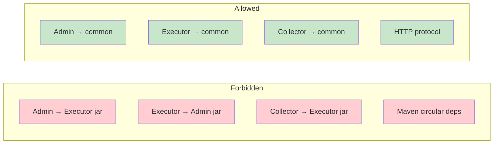

---

## 5. Subsystem detailed design

### 5.1 zestflow-common

> **Role**: Zero-framework shared kernel — the "protocol layer" for all modules.

#### 5.1.1 Package structure

```
com.zestflow.common/
├── model/
│   ├── dto/          ChainEvent, RegisterDTO, HeartbeatDTO, ChainExecuteRequestDTO ...
│   ├── event/        ChainEventType, PublishEventDTO
│   └── ComponentType   Component type enum
├── protocol/         EventQuery, ExecutionTrace, PageResult
├── spi/              EventCollector
├── constant/         RegistryConstants, ChainConstants
├── exception/        BaseException, UnauthorizedException ...
└── util/             CodeGenerator
```

#### 5.1.2 ChainEvent model

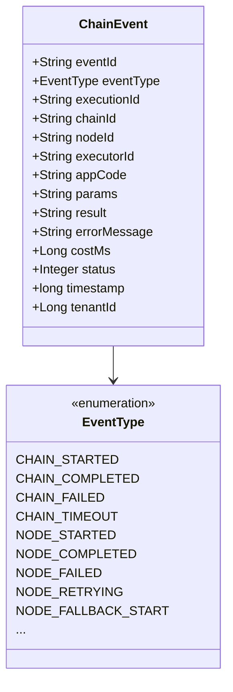

#### 5.1.3 CodeGenerator rules

| Entity | Prefix | Format | Example |
|--------|--------|--------|---------|
| Design | `DSN` | `{PREFIX}{yyyyMMdd}{6-digit seq}` | `DSN20260602000001` |
| Chain | `CHN` | Same | `CHN20260602000001` |

- In-memory `ConcurrentHashMap` + `AtomicInteger`, thread-safe
- Independent sequence per prefix, daily reset
- JVM start random offset (0–899) prevents restart collision

---

### 5.2 zestflow-executor

> **Role**: Orchestration execution engine embedded in business Spring Boot apps; benchmarked against LiteFlow + xxl-job executor.

#### 5.2.1 Subsystem component diagram

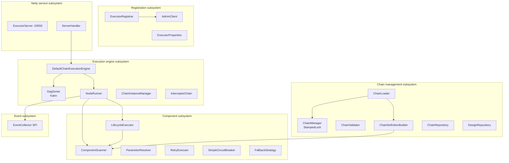

#### 5.2.2 Component annotation system

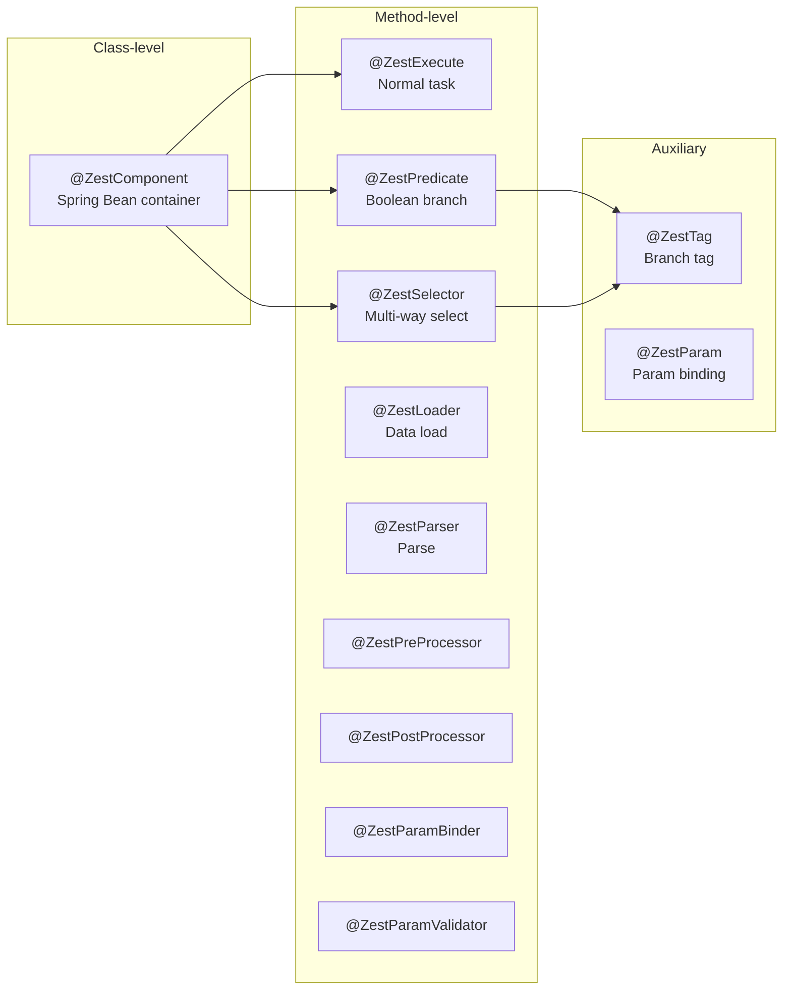

**Registration rules** (ComponentScanner):

1. Non-empty annotation `value()` → component ID (executeId)
2. Empty → default `SimpleClassName.methodName`
3. Duplicate ID → later scan overwrites with WARN

#### 5.2.3 ChainManager hot reload model

Modeled after **Nacos config center double buffer**:

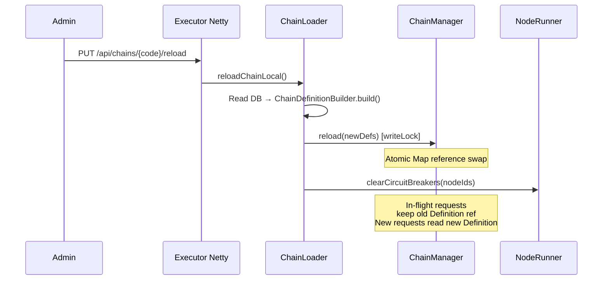

**Read path**: `tryOptimisticRead()` → validate stamp → fallback `readLock()`  
**Write path**: `writeLock()` → replace `volatile Map` reference

#### 5.2.4 Chain execution state machine

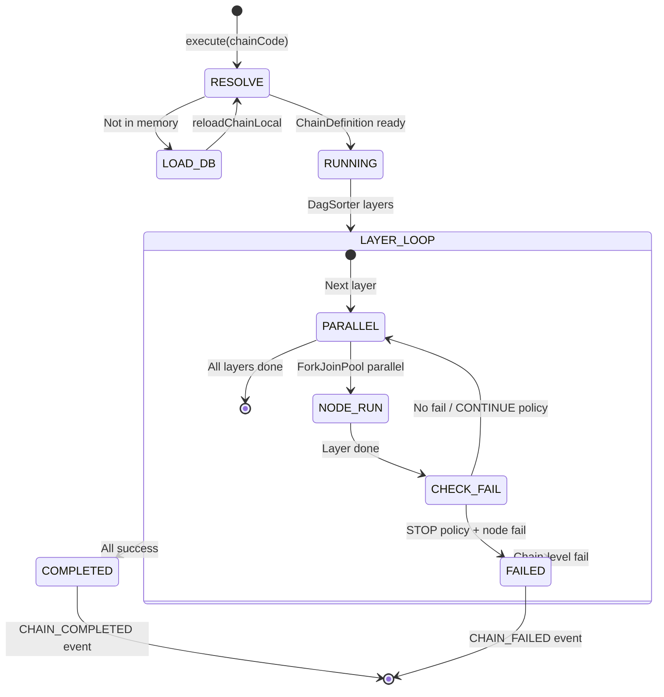

#### 5.2.5 Single-node execution pipeline

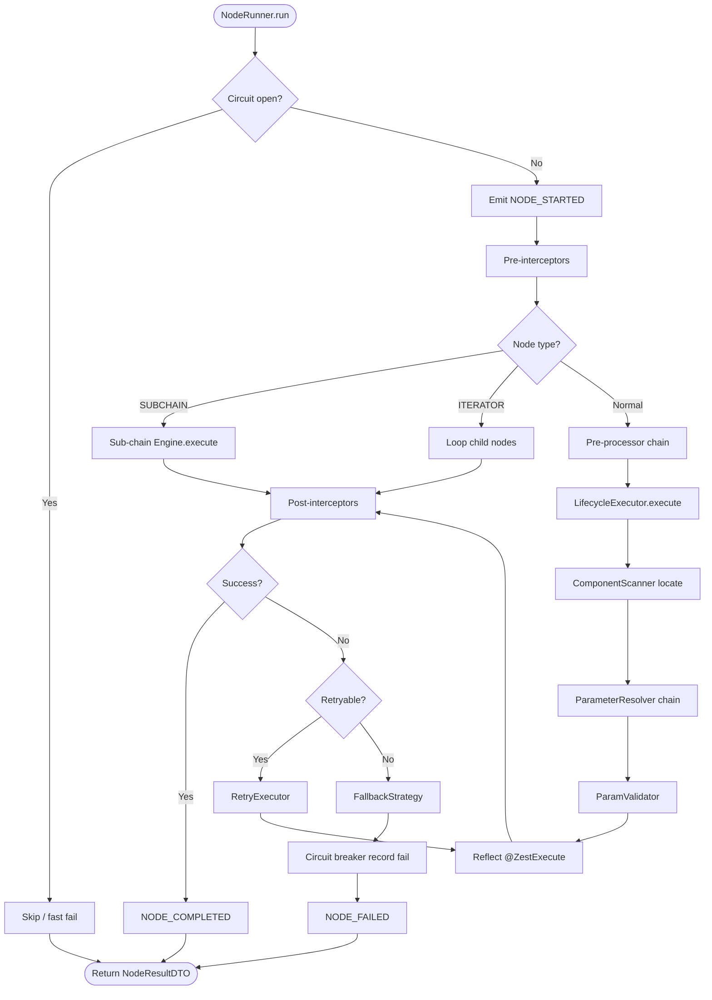

#### 5.2.6 DAG sorting (DagSorter)

- **Algorithm**: Kahn BFS; nodes with in-degree 0 form each layer
- **Parallelism**: Same layer via `ForkJoinPool(min(CPU×2, 16))`
- **Conditional edges**: `ChainEdge.condition` evaluated via ScriptEngine (e.g. `params.approved == 'true'`)
- **Cycle detection**: WARN when no in-degree-0 nodes remain

#### 5.2.7 Executor Netty API

| Method | Path | Description |
|:------:|------|-------------|
| GET | `/health` | Health check |
| POST | `/execute` | Chain execution entry |
| GET/POST/PUT/DELETE | `/api/chains/**` | Chain CRUD, publish, reload |
| GET/POST/PUT/DELETE | `/api/designs/**` | Design CRUD, graph save |
| GET | `/api/components/**` | Component list/stats |
| POST | `/api/chains/sync` | Chain sync (no JWT) |

Optional auth: header `X-Access-Token` (except `/health`).

#### 5.2.8 Registration subsystem (xxl-job style)

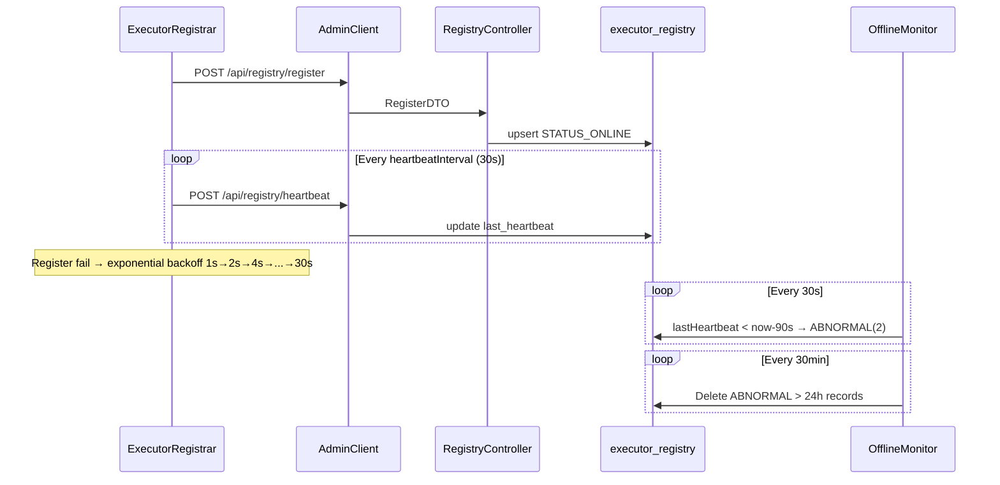

**Three-state model**:

| Value | Constant | Meaning |
|:-----:|----------|---------|
| 1 | `STATUS_ONLINE` | Online |
| 0 | `STATUS_OFFLINE` | Graceful offline |
| 2 | `STATUS_ABNORMAL` | Heartbeat timeout |

**executorId format**: `{appCode}@{host}:{port}`

#### 5.2.9 Chain status lifecycle

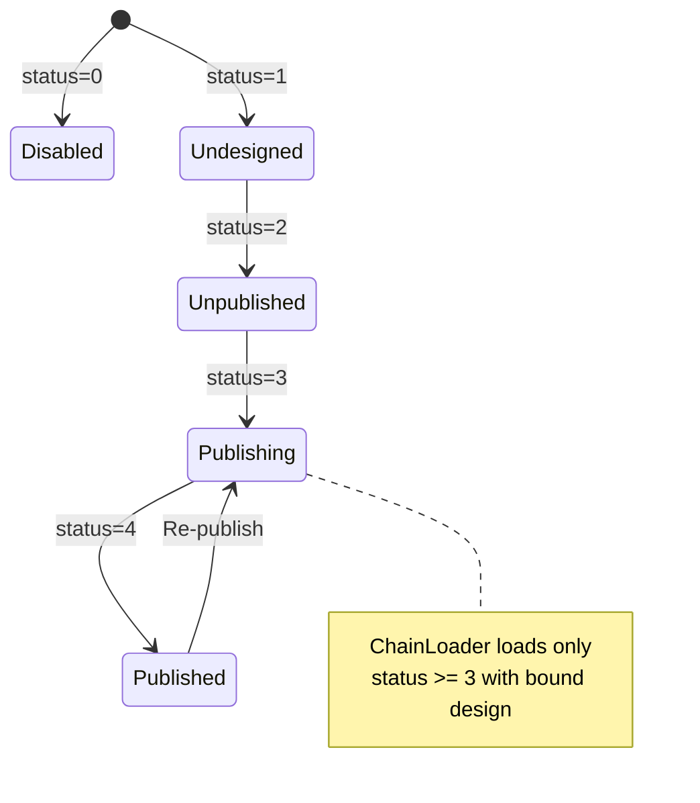

#### 5.2.10 Auto-config beans (ExecutorAutoConfig)

| Bean | Responsibility |
|------|----------------|
| `ExecutorServer` | Netty lifecycle initMethod=start |
| `ExecutorRegistrar` | Register + heartbeat |
| `AdminClient` | Admin HTTP client |
| `ComponentScanner` | Component scan |
| `ChainManager` | In-memory chain registry |
| `ChainLoader` | Startup load + hot reload |
| `DefaultChainExecutionEngine` | Execution engine |
| `NodeRunner` | Single-node pipeline |
| `DagSorter` | Topological sort |
| `LifecycleExecutor` | Reflect invoke + param injection |
| `RetryExecutor` | Retry |
| `InterceptorChain` | Interceptor chain |
| `ExecutionController` | Optional Tomcat /execute |

---

### 5.3 zestflow-collector

> **Role**: Event collection and query — **must never block business** (highest priority).

#### 5.3.1 Submodule relationships

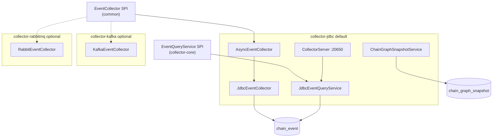

#### 5.3.2 Three-tier async pipeline

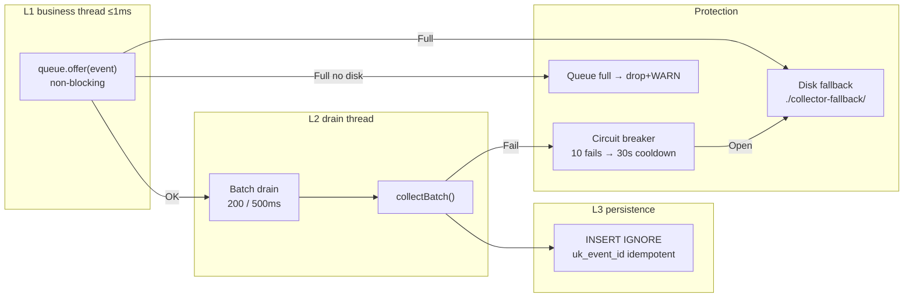

**Default parameters**:

| Parameter | Default |
|-----------|---------|
| `queue-capacity` | 8192 |
| `batch-size` | 200 |
| `batch-max-wait-ms` | 500 |
| `circuit-breaker-threshold` | 10 |
| `circuit-breaker-cooldown-ms` | 30000 |

#### 5.3.3 Collector Netty query API

| Method | Path | Description |
|:------:|------|-------------|
| GET | `/collector/health` | Health check |
| POST | `/collector/events/query` | Event paginated query |
| GET | `/collector/events/{eventId}` | Single event detail |
| POST | `/collector/events/stats` | Stats aggregation |
| POST | `/collector/events/executions` | Execution trace list |
| GET | `/collector/events/executions/{executionId}` | Trace detail |
| POST | `/collector/snapshots` | Save chain graph snapshot |
| GET | `/collector/snapshots` | Query snapshots |

Auth: header `X-Collector-Token` (skipped if not configured).

#### 5.3.4 Collector registration

Symmetric with Executor: `CollectorRegistrar` → `POST /api/registry/collector/register` → `collector_registry` table.

---

### 5.4 zestflow-starter

> **Role**: One dependency for business teams — zero-code integration.

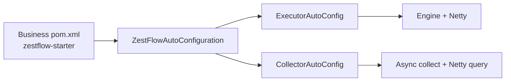

```xml
<dependency>
    <groupId>cn.zestflow.www</groupId>
    <artifactId>zestflow-starter</artifactId>
</dependency>
```

---

### 5.5 zestflow-admin

> **Role**: Management Hub connecting Executor / Collector / frontend — **does not store business chain data**.

#### 5.5.1 Admin subsystem landscape

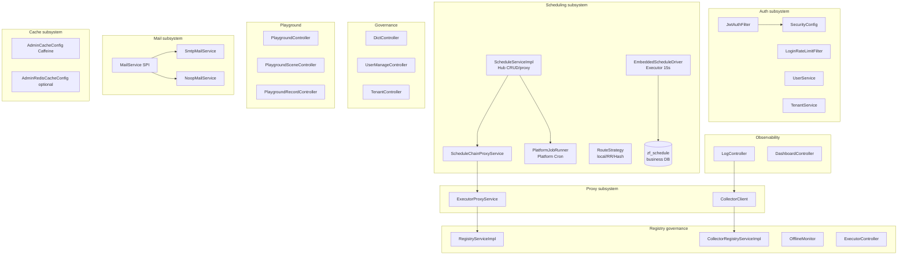

#### 5.5.2 Admin data vs proxied data

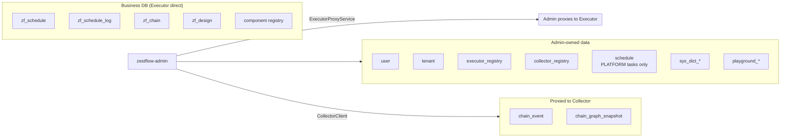

#### 5.5.3 ExecutorProxyService routing

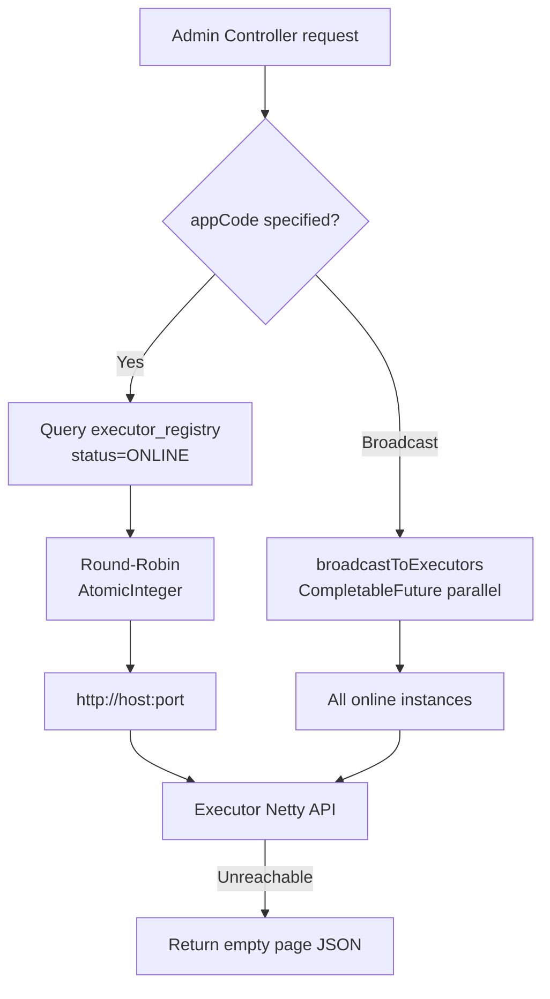

#### 5.5.4 Scheduling subsystem

> Full ADR: [docs/adr/SCHEDULING.md](./adr/SCHEDULING.en.md)

**Responsibility split**:

| Type | Config storage | Trigger | Admin role |
|------|---------------|---------|------------|
| **CHAIN** (business Cron) | Business DB `zf_schedule` | Executor `EmbeddedScheduleDriver` | CRUD/query/manual trigger **HTTP proxy** |
| **PLATFORM** (platform tasks) | Admin DB `schedule` | Admin `PlatformJobRunner` + ShedLock | Local management |

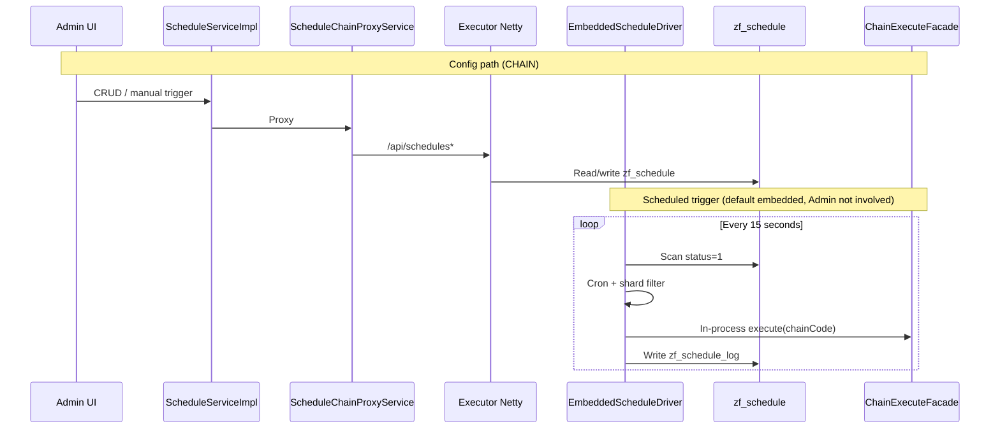

**Route strategies** (manual trigger / non-local Cron):

| Strategy | Implementation | Notes |
|----------|----------------|-------|
| `local` | This instance | **Default**; Cron via Embedded locally |
| `round_robin` | `RoundRobinStrategy` | AtomicInteger round-robin |
| `hash` | `HashRouteStrategy` | Hash by chainCode |
| `random` | `RandomRouteStrategy` | Random selection |

**Sharding**: `zf_schedule.shard_total` + Executor `shard-index` / `shard-total` config.

#### 5.5.5 Admin REST Controller matrix

| Controller | Path prefix | Responsibility |
|------------|------------|----------------|
| `AuthController` | `/api/auth` | Login/register/password/email verify |
| `UserManageController` | `/api/users` | User CRUD, reset password |
| `TenantController` | `/api/tenants` | Tenant CRUD, switch |
| `RoleController` | `/api/roles` | Role list |
| `RegistryController` | `/api/registry` | Executor register/heartbeat |
| `CollectorRegistryController` | `/api/registry/collector` | Collector register |
| `ExecutorController` | `/api/executors` | Executor/collector list |
| `ChainController` | `/api/chains` | Chain CRUD/publish (proxy) |
| `DesignController` | `/api/designs` | Design CRUD/graph (proxy) |
| `ComponentController` | `/api/components` | Component list (proxy) |
| `ScheduleController` | `/api/schedules` | Schedule CRUD/manual trigger |
| `LogController` | `/api/logs` | Events/trace/snapshots (proxy Collector) |
| `DashboardController` | `/api/dashboard` | Dashboard stats |
| `DictTypeController` | `/api/dict-types` | Dictionary management |
| `PlaygroundController` | `/api/playground` | Demo execution |
| `PlaygroundSceneController` | `/api/playground/scenes` | Scene CRUD |
| `SystemController` | `/api/system` | Feature flags |
| `SpaController` | `/`, `/login` ... | SPA history fallback |

#### 5.5.6 Mail subsystem

```mermaid
graph LR
    BIZ[UserService / UserManageService] --> MS[MailService interface]
    MS --> COND{zestflow.mail.enabled?}
    COND -->|true| SMTP[SmtpMailService<br/>JavaMail + Thymeleaf]
    COND -->|false| NOOP[NoopMailService<br/>Log only]
```

| Feature | Trigger | Template |
|---------|---------|----------|
| Email verification | `UserServiceImpl.register()` | verification |
| Forgot password | `UserServiceImpl.forgot()` | reset-password |
| User creation notice | `UserManageServiceImpl.createUser()` | welcome |

---

### 5.6 zestflow-admin-ui

> **Role**: Vue 3 SPA; build output embedded in Admin jar.

#### 5.6.1 Frontend architecture

```mermaid
graph TB
    subgraph Entry
        MAIN[main.ts]
        APP[App.vue<br/>el-config-provider]
    end

    subgraph Core
        ROUTER[router/index.ts<br/>nav guards]
        PINIA[stores/<br/>user / tenant / app]
        I18N[i18n/<br/>zh-CN + en]
        API[api/<br/>18 module Axios]
    end

    subgraph Layout
        AL[AppLayout.vue]
        AS[AppSidebar.vue]
        AH[AppHeader.vue]
    end

    subgraph Views
        DASH[Dashboard]
        CHAIN[Chains ×3]
        DESIGN[DesignList + Editor]
        LOG[Logs + X6 execution graph]
        SCHED[Schedules]
        EXEC[Executors / Collectors]
        SET[Settings ×4]
        PG[Playground ×3]
        AUTH[Login/Register/Forgot]
    end

    MAIN --> APP
    APP --> ROUTER
    ROUTER --> AL
    AL --> Views
    Views --> API
    API --> BACKEND[Admin :8080 /api]
```

#### 5.6.2 Route map

```mermaid
graph TD
    subgraph Public["Public routes"]
        L["/login"]
        R["/register"]
        F["/forgot"]
        RP["/reset-password"]
        VE["/verify-email"]
    end

    subgraph Auth["Requires login"]
        FP["/force-password"]
        subgraph Layout["AppLayout"]
            D["/dashboard"]
            CH["/chains"]
            CHC["/chains/create"]
            CHD["/chains/:id"]
            DL["/design"]
            DE["/design/:id  X6 editor"]
            SC["/schedules"]
            LG["/logs  X6 graph"]
            EX["/executors"]
            CO["/collectors"]
            ST["/settings/*"]
            PG1["/playground"]
            PG2["/playground/scenes"]
            PG3["/playground/records"]
        end
    end

    Public --> Auth
```

**Route meta flags**:

| Flag | Meaning |
|------|---------|
| `requiresAuth: false` | Public page |
| `requiresExecutor: true` | Show NoAppEmpty when no online Executor |
| `hideTitle: true` | Fullscreen (design editor, Playground) |

#### 5.6.3 Design editor (AntV X6)

```mermaid
graph LR
    subgraph Node types
        START["flow-start<br/>Start green"]
        END["flow-end<br/>End gray"]
        TASK["flow-task<br/>Executor blue"]
        COND["flow-condition<br/>Condition orange diamond"]
        MULTI["flow-multicondition<br/>Multi purple hex"]
        LOAD["flow-loader cyan"]
        PARSE["flow-parser pink"]
        SCRIPT["flow-script purple"]
        SUB["flow-subchain cyan"]
        ITER["flow-iterator orange dashed"]
    end

    subgraph Plugins
        HIST[History undo/redo]
        CLIP[Clipboard copy/paste]
        SNAP[Snapline align]
        MINI[MiniMap thumbnail]
        KEY[Keyboard shortcuts]
        EXP[Export PNG]
    end

    subgraph Persistence
        JSON["graph.toJSON()"]
        SAVE["designApi.saveGraph()"]
        CHDATA["chain_data derived"]
    end

    Node types --> JSON
    JSON --> SAVE
    SAVE --> CHDATA
```

**File**: `src/views/design/DesignEditorPage.vue` (~2200 lines single-file)

#### 5.6.4 Build and deployment integration

```mermaid
flowchart LR
    DEV["pnpm dev :8001"] -->|proxy /api| ADMIN_DEV["Admin :8080"]
    BUILD["pnpm build"] --> STATIC["zestflow-admin/src/main/resources/static/"]
    STATIC --> JAR["Admin single jar"]
    JAR --> SPA["SpaController → index.html"]
```

#### 5.6.5 HTTP client conventions

| Concern | Implementation |
|---------|----------------|
| Base URL | `/api` |
| Auth | `Authorization: Bearer {token}` |
| Tenant | `X-Tenant-Id` |
| Language | `Accept-Language` |
| Response | Unwrap `{ code: 200, data }` |
| 401 | Clear token → redirect `/login` |

---

### 5.7 zestflow-demo

> **Role**: End-to-end demo simulating business integration.

```mermaid
graph TB
    TA[DemoApplication :8081]
    TA --> STARTER[zestflow-starter]
    TA --> DEMO["@ZestComponent demos<br/>OrderHandler / PaymentHandler ..."]
    TA --> CTRL["Demo Controllers<br/>OrderController / WorkflowController"]
    TA --> E2E["ZestFlowE2ETest<br/>10 scenarios"]
    TA --> STRESS["ConcurrentStressTest"]
```

**Verification path**:

```
POST /api/orders/handleApplyAfterSale
  → chain_event: app_code non-null, params/result populated, cost_ms > 0
```

---

## 6. Core business flows

### 6.1 Chain from design to execution (end-to-end)

```mermaid
sequenceDiagram
    autonumber
    participant UI as Admin UI
    participant AD as Admin
    participant EX as Executor
    participant CO as Collector
    participant DB as MySQL

    rect rgb(240, 248, 255)
        Note over UI,DB: Design phase
        UI->>AD: Save design graph_data
        AD->>EX: POST /api/designs (proxy)
        EX->>DB: INSERT zf_design
        UI->>AD: Create chain + bind design
        AD->>EX: POST /api/chains (proxy)
        EX->>DB: INSERT zf_chain + binding
    end

    rect rgb(255, 248, 240)
        Note over UI,DB: Publish phase
        UI->>AD: Publish chain
        AD->>EX: broadcast PUT /reload (all instances)
        EX->>EX: ChainLoader → ChainManager
        EX->>DB: INSERT zf_chain_version snapshot
        EX->>CO: POST /collector/snapshots
    end

    rect rgb(240, 255, 240)
        Note over UI,DB: Execution phase
        UI->>AD: Manual trigger / scheduled
        AD->>EX: POST /execute
        EX->>EX: Engine → NodeRunner → @ZestExecute
        EX->>CO: ChainEvent (SPI async)
        CO->>DB: INSERT chain_event
        UI->>AD: Query logs
        AD->>CO: POST /collector/events/query
        CO-->>UI: Trace + execution graph coloring
    end
```

### 6.2 Event trace aggregation

```mermaid
graph TD
    EXEC["One execute()"] --> EID["executionId = UUID"]
    EID --> E1["CHAIN_STARTED"]
    EID --> E2["NODE_STARTED ×N"]
    EID --> E3["NODE_COMPLETED ×N"]
    EID --> E4["CHAIN_COMPLETED"]

    E1 & E2 & E3 & E4 --> QUERY["JdbcEventQueryService<br/>aggregate by executionId"]
    QUERY --> TRACE["ExecutionTrace"]
    TRACE --> UI["LogsPage table + X6 graph"]
    SNAP["chain_graph_snapshot"] --> UI
```

### 6.3 Multi-instance deployment data flow

```mermaid
graph TB
    subgraph Admin
        A[zestflow-admin]
    end

    subgraph App1["App A (appCode=order-service)"]
        E1A[Executor instance 1]
        E2A[Executor instance 2]
    end

    subgraph App2["App B (appCode=payment-service)"]
        E1B[Executor instance 1]
    end

    subgraph Shared
        MYSQL[(Shared MySQL)]
        COLL[Collector]
    end

    A -->|round-robin| E1A
    A -->|round-robin| E2A
    A -->|broadcast reload| E1A
    A -->|broadcast reload| E2A
    A --> E1B

    E1A & E2A & E1B --> MYSQL
    E1A & E2A & E1B -->|EventCollector| COLL
    A --> COLL
```

---

## 7. Data architecture

### 7.1 Three-database ER overview

```mermaid
erDiagram
    tenant ||--o{ user_tenant : has
    user ||--o{ user_tenant : belongs
    user ||--o{ user_app_role : has

    executor_registry }o--|| module : "optional module_id"
    collector_registry ||--|| collector : registers

    schedule ||--o{ schedule_log : triggers

    zf_design ||--o{ zf_design_binding : binds
    zf_chain ||--o{ zf_design_binding : binds
    zf_chain ||--o{ zf_chain_version : versions

    chain_event {
        varchar event_id UK
        varchar event_type
        varchar chain_id
        varchar node_id
        varchar executor_id
        varchar app_code
        text params
        text result
        bigint cost_ms
        bigint timestamp
    }

    chain_graph_snapshot {
        varchar chain_code
        mediumtext graph_data
        varchar created_at
    }
```

### 7.2 Table inventory

#### zestflow_admin

| Table | Purpose |
|-------|---------|
| `tenant` | Tenants |
| `user` / `user_tenant` | Users and tenant association |
| `role` / `user_app_role` | App-level RBAC |
| `executor_registry` | Executor registry |
| `collector_registry` | Collector registry |
| `schedule` / `schedule_log` | Scheduled jobs |
| `sys_dict_type` / `sys_dict_data` | Dictionaries |
| `playground_scene` / `playground_record` | Playground system |
| `tenant_ip_mapping` | Demo IP→tenant mapping |

#### zestflow_app_bussiness

| Table | Purpose |
|-------|---------|
| `zf_chain` | Chain metadata (code PK) |
| `zf_design` | Design (graph_data + chain_data) |
| `zf_design_binding` | Design↔chain binding |
| `zf_chain_version` | Published version snapshots |

#### zestflow_app_log

| Table | Purpose |
|-------|---------|
| `chain_event` | Chain execution events (uk_event_id idempotent) |
| `chain_graph_snapshot` | Chain graph snapshots (log page execution graph) |

### 7.3 Audit and multi-tenant fields (all business tables)

```sql
-- Audit
created_by, updated_by, created_at, updated_at, is_deleted

-- Isolation
tenant_id BIGINT DEFAULT 1
app_code  VARCHAR(50)
```

### 7.4 Chain status enum

| status | Meaning | Runtime load |
|:------:|---------|:------------:|
| 0 | Disabled | ✗ |
| 1 | Undesigned | ✗ |
| 2 | Unpublished | ✗ |
| 3 | Publishing | ✓ |
| 4 | Published | ✓ |

---

## 8. Communication protocols and API matrix

### 8.1 Communication topology

```mermaid
graph LR
    subgraph Protocols
        H1["HTTP REST<br/>Admin ↔ browser"]
        H2["HTTP REST<br/>Admin ↔ Executor Netty"]
        H3["HTTP REST<br/>Admin ↔ Collector Netty"]
        H4["HTTP REST<br/>Executor ↔ Admin register"]
        SPI["Java SPI<br/>Engine ↔ EventCollector"]
    end
```

### 8.2 Admin → Executor proxy API

| Business | Admin path | Executor path |
|----------|-----------|---------------|
| Chain list | `GET /api/chains` | `GET /api/chains` |
| Chain publish | `POST /api/chains/{code}/publish` | `PUT /api/chains/{code}/reload` |
| Design save | `PUT /api/designs/{code}/graph` | `PUT /api/designs/{code}/graph` |
| Component list | `GET /api/components` | `GET /api/components` |
| Chain execute | Internal schedule | `POST /execute` |

### 8.3 Admin → Collector query API

| Admin path | Collector path |
|-----------|---------------|
| `POST /api/logs/events/query` | `POST /collector/events/query` |
| `GET /api/logs/events/{id}` | `GET /collector/events/{id}` |
| `POST /api/logs/executions/query` | `POST /collector/events/executions` |
| `GET /api/logs/snapshots` | `GET /collector/snapshots` |

### 8.4 Registration protocol DTOs

```mermaid
classDiagram
    class RegisterDTO {
        +String executorId
        +String host
        +int port
        +String moduleCode
        +String moduleName
        +List~ComponentDTO~ components
    }

    class HeartbeatDTO {
        +String executorId
    }

    class ChainExecuteRequestDTO {
        +String chainCode
        +Map params
        +String updatedBy
    }

    class ChainExecuteResultDTO {
        +boolean success
        +String chainCode
        +String executionId
        +Map result
        +List~NodeResultDTO~ nodeResults
        +long costMs
        +String errorMessage
    }
```

---

## 9. Security architecture

### 9.1 Authentication flow

```mermaid
sequenceDiagram
    participant B as Browser
    participant F as Vue SPA
    participant A as Admin API
    participant DB as user table

    B->>F: Enter username/password
    F->>A: POST /api/auth/login
    A->>DB: Verify BCrypt
    A-->>F: JWT + userInfo + tenants
    F->>F: localStorage.token + Pinia

    loop Subsequent requests
        F->>A: Authorization: Bearer + X-Tenant-Id
        A->>A: JwtAuthFilter parse
    end

    A-->>F: 401 → clear token → /login
```

### 9.2 Authorization matrix

| Path pattern | Auth |
|-------------|------|
| `/api/auth/**` | Public |
| `POST/DELETE /api/registry/**` | Public (machine register) |
| `/api/playground/**` | JWT + app RBAC (same as chains/design) |
| `POST /api/chains/sync` | Public |
| Other `/api/**` | JWT required |
| Static + SPA | Public (frontend guards) |

### 9.3 Security mechanisms

| Mechanism | Implementation |
|-----------|------------------|
| Password storage | BCrypt |
| Session | Stateless JWT |
| Force password change | `must_change_password=1` → `/force-password` |
| Login rate limit | `LoginRateLimitFilter` |
| Executor internal auth | Optional `X-Access-Token` |
| Collector auth | Optional `X-Collector-Token` |
| Operation audit | `updatedBy` forwarded to Executor |

### 9.4 Multi-tenancy

```mermaid
flowchart LR
    LOGIN[Login response tenants] --> STORE[Pinia tenant store]
    STORE --> HEADER["X-Tenant-Id Header"]
    HEADER --> ADMIN[Admin Service]
    ADMIN --> CTX[TenantAppContext]
    CTX --> FILL["MetaObjectHandler<br/>auto-fill tenant_id"]
```

---

## 10. Deployment architecture

### 10.1 Recommended topology

```
                    ┌─────────────────┐
                    │   Nginx (opt.)   │
                    │  :443 → :8080   │
                    └────────┬────────┘
                             │
              ┌──────────────┴──────────────┐
              │   zestflow-admin.jar        │
              │   :8080 (Tomcat + SPA)      │
              └──────────────┬──────────────┘
                             │
         ┌───────────────────┼───────────────────┐
         │                   │                   │
         ▼                   ▼                   ▼
┌─────────────────┐ ┌─────────────────┐ ┌─────────────────┐
│ Business app A   │ │ Business app B   │ │ MySQL           │
│ Tomcat :8081    │ │ Tomcat :9090    │ │ :3306           │
│ Netty  :20550   │ │ Netty  :20550   │ │ Three DBs       │
│ + starter       │ │ + starter       │ │                 │
│ (Executor+Coll) │ │ (Executor+Coll) │ │                 │
└─────────────────┘ └─────────────────┘ └─────────────────┘
```

### 10.2 Deployment modes

| Mode | Description | Use case |
|------|-------------|----------|
| **Embedded** | starter inside business jar | Default; simple ops |
| **Admin standalone** | Single jar with SPA | Control center |
| **Collector standalone** | collector-jdbc only | High log volume, independent scaling |

### 10.3 Processes and ports

| Process | Default port | Config |
|---------|:------------:|--------|
| Admin Tomcat | 8080 | `server.port` |
| Vite dev | 8001 | vite.config.ts |
| Business Tomcat (test) | 8081 | `server.port` |
| Executor Netty | 20550 | `zestflow.executor.port` |
| Collector Netty | 20650 | `zestflow.collector.registry.port` |

### 10.4 Startup order

```mermaid
flowchart TD
    S1["1. MySQL init<br/>init.sql + initData.sql"] --> S2["2. Start Admin :8080"]
    S2 --> S3["3. Start business app<br/>(with starter)"]
    S3 --> S4["4. Executor auto-register"]
    S3 --> S5["5. Collector auto-register"]
    S4 --> S6["6. ChainLoader loads published chains"]
    S6 --> READY["System ready"]
```

---

## 11. Configuration reference

### 11.1 Executor `zestflow.executor.*`

| Property | Default | Description |
|----------|---------|-------------|
| `app-code` | spring.application.name | Application code |
| `admin-addresses` | http://localhost:8080 | Comma-separated Admin URLs |
| `port` | 20550 | Netty port |
| `host` | Auto-detect internal IPv4 | |
| `heartbeat-interval` | 30 | Seconds |
| `access-token` | empty | Optional Netty auth |
| `execute-endpoint-enabled` | false | Tomcat /execute |
| `event.queue-capacity` | 8192 | |
| `event.batch-size` | 200 | |
| `event.circuit-breaker-threshold` | 10 | |

### 11.2 Collector `zestflow.collector.*`

| Property | Default | Description |
|----------|---------|-------------|
| `registry.port` | 20650 | Netty query port |
| `jdbc.async.queue-capacity` | 8192 | |
| `jdbc.async.batch-size` | 200 | |
| `access-token` | empty | Query API auth |

### 11.3 Admin `zestflow.admin.*` / `zestflow.*`

| Property | Default | Description |
|----------|---------|-------------|
| `jwt.secret` | Dev default | **Must override in prod** |
| `jwt.expiration` | 86400000 | Milliseconds |
| `admin.protocol` | http | Executor access |
| `admin.deploy-mode` | standalone | Runtime state: standalone=memory / cluster=Redis |
| `admin.cache.type` | caffeine | Permission cache: simple / caffeine / redis |
| `collector.api-url` | http://localhost:20650 | Collector fallback |
| `mail.enabled` | false | Mail switch |

### 11.4 Config sync policy

When modifying `zestflow.executor.*`, sync:

- `zestflow-executor/src/main/resources/application.yml`
- `zestflow-demo/src/main/resources/application.yml`
- `zestflow-demo/src/main/resources/application-prod.example.yml`
- `zestflow-demo/src/test/resources/application-test.yml`

When modifying `zestflow.admin.*`, sync:

- `zestflow-admin/src/main/resources/application.yml`
- `zestflow-admin/src/main/resources/application-prod.example.yml`

---

## 12. Extension points and SPI

```mermaid
graph TB
    subgraph Write SPI
        EC["EventCollector"]
        EC --> JDBC["JdbcEventCollector"]
        EC --> KAFKA["KafkaEventCollector"]
        EC --> RMQ["RabbitEventCollector"]
        EC --> CUSTOM_W["Custom impl"]
    end

    subgraph Read SPI
        EQ["EventQueryService"]
        EQ --> JQS["JdbcEventQueryService"]
        EQ --> CUSTOM_R["Custom impl"]
    end

    subgraph Execution extensions
        PR["ParameterResolver"]
        PV["@ZestParamValidator"]
        FB["FallbackStrategy"]
        IC["Interceptor"]
        RS["RouteStrategy"]
    end

    subgraph Infrastructure extensions
        MS["MailService"]
        CACHE["CacheManager<br/>Caffeine / Redis"]
    end
```

| Extension | Interface | Default | Activation |
|-----------|-----------|---------|------------|
| Event collect | `EventCollector` | Jdbc + Async decorator | starter import |
| Event query | `EventQueryService` | JdbcEventQueryService | collector-jdbc |
| Param resolve | `ParameterResolver` | ZestParam / ContextType | Auto-register |
| Fallback | `FallbackStrategy` | Default (log only) | Replace `@Bean` |
| Routing | `RouteStrategy` | RoundRobin | schedule.route_strategy |
| Mail | `MailService` | Noop / Smtp | mail.enabled |
| Cache | CacheManager | Caffeine | cache.type=redis; standalone needs no Redis |
| Runtime state | AdminRuntimeStateStore | In-memory | Redis when deploy-mode=cluster |

---

## 13. Non-functional requirements and capacity

### 13.1 Reliability

```mermaid
graph LR
    subgraph Executor
        R1["Register exponential backoff<br/>infinite retry"]
        R2["StampedLock hot reload<br/>no execution interrupt"]
        R3["Per-node circuit breaker"]
    end

    subgraph Collector
        C1["Bounded queue<br/>no business block"]
        C2["INSERT IGNORE idempotent"]
        C3["Optional disk fallback"]
    end

    subgraph Admin
        A1["Executor unreachable<br/>return empty data"]
        A2["OfflineMonitor<br/>90s offline detect"]
    end
```

### 13.2 High availability analysis

| Component | Admin down | Notes |
|-----------|-----------|-------|
| Published chain execution | **Unaffected** | Executor runtime does not depend on Admin |
| Chain publish / log query | **Unavailable** | Requires Admin recovery |
| Admin cluster | Stateless (JWT + shared MySQL) | Needs distributed schedule lock |

### 13.3 Capacity estimates

| Metric | Estimate |
|--------|----------|
| Single Admin supports Executor instances | 250+ (50 apps × 5 instances) |
| CodeGenerator throughput | 160k+/sec |
| Default event queue capacity | 8192 events/instance |
| Global single point | MySQL |

### 13.4 Test coverage

| Module | Test files | Focus |
|--------|-----------|-------|
| executor | ~15 | Engine, DAG, NodeRunner, Retry |
| collector-jdbc | 4 | Netty routes 32 cases, query 20 cases |
| admin | ~20 | Registry, Proxy, Schedule |
| zestflow-demo | 3 | E2E 10 scenarios, concurrency stress |

---

## 14. Evolution roadmap

### 14.1 Implemented ✓

- [x] Executor auto-register + heartbeat + three-state offline detection
- [x] Collector register + three-tier async pipeline
- [x] DAG execution (parallel layers, retry, circuit breaker)
- [x] Method-level component annotations + param injection
- [x] Admin proxy chains/designs/components (zero business data)
- [x] Chain publish broadcast + StampedLock hot reload
- [x] Event collection + trace query + X6 execution graph
- [x] Cron scheduling + route strategies
- [x] JWT auth + multi-tenant + force password change
- [x] X6 visual design editor
- [x] Playground demo system
- [x] Mail integration (optional Noop)
- [x] AI Copilot + Dev MCP (Phase 1–3)

### 14.2 Planned ○

```mermaid
timeline
    title ZestFlow evolution roadmap
    section Near term
        Flyway versioned migrations : init.sql → V{n}__*.sql
        SpEL/Groovy conditional routing : Replace simple ScriptEngine
        Richer fallback strategies : Return/exception mapping
    section Mid term
        WebSocket live execution status : Logs/live dashboard
        Admin distributed schedule lock : Redis / DB lock
        Executor ServerHandler integration tests
    section Long term
        Admin cluster HA : Stateless + load balancing
        gRPC transport : Replace HTTP (anti-corruption reserved)
        Multi Collector backends : ES / ClickHouse
```

### 14.3 Known limitations

| Limitation | Current state |
|------------|---------------|
| Admin single point | Single process; no publish during restart |
| Schedule lock | No distributed lock; Admin cluster needs extra solution |
| Condition expressions | ScriptEngine simple expressions |
| Fallback | Default log only |
| Flyway | On classpath; non-prod auto-heal; prod strict |
| WebSocket | Not implemented |

---

## Appendix A: Port reference

| Service | Port | Protocol | Description |
|---------|:----:|:--------:|-------------|
| Admin | 8080 | HTTP | Management + SPA |
| Vite dev | 8001 | HTTP | Frontend development |
| Business Tomcat (test) | 8081 | HTTP | Demo API |
| Executor Netty | 20550 | HTTP | Chain CRUD / execute |
| Collector Netty | 20650 | HTTP | Event query |
| MySQL | 3306 | TCP | Three databases |

---

## Appendix B: Package naming conventions

```
com.zestflow.{module}.{layer}

common.model / common.spi / common.protocol
admin.controller / admin.service / admin.client / admin.config
executor.engine / executor.chain / executor.registry / executor.server
executor.scanner / executor.lifecycle / executor.interceptor
collector.jdbc.collector / collector.jdbc.server / collector.spi
```

| Type | Naming | Example |
|------|--------|---------|
| Interface | Noun | `EventCollector` |
| Implementation | Interface + tech suffix | `JdbcEventCollector` |
| DTO | Noun + DTO | `ChainExecuteRequestDTO` |
| PO | Noun + PO | `ChainPO` |
| Exception | Noun + Exception | `ChainTimeoutException` |

---

## Appendix C: Local development quick reference

```bash
# 1. Database: run three init.sql + initData.sql

# 2. Build
mvn install -pl zestflow-executor -am -DskipTests
mvn package -pl zestflow-demo -am -DskipTests

# 3. Start Admin (:8080) + DemoApplication (:8081)

# 4. Frontend dev
cd zestflow-admin-ui && pnpm dev    # :8001

# 5. After frontend changes, must build into Admin jar
pnpm build

# 6. Verify
# POST http://localhost:8081/api/orders/handleApplyAfterSale
# Check zestflow_app_log.chain_event
```

---

<p align="center">
  <strong>ZestFlow</strong> — Make every business process visible, controllable, and evolvable<br/>
  <sub>Documentation evolves with code · See <code>CLAUDE.md</code> for collaboration rules</sub>
</p>
