# ZestFlow 架构设计文档

> **版本** 0.1.0 · **更新** 2026-06-08 · **状态** 基于代码库全量通读 · [English](ARCHITECTURE.en.md)
> **定位** AI 时代的业务流程可观测编排引擎 · **文档索引** [README.md](README.md)

---

## 目录

- [1. 概述](#1-概述)
- [2. 系统上下文（C4 Level 1）](#2-系统上下文c4-level-1)
- [3. 容器架构（C4 Level 2）](#3-容器架构c4-level-2)
- [4. Maven 模块与子系统全景](#4-maven-模块与子系统全景)
- [5. 子系统详细设计](#5-子系统详细设计)
  - [5.1 zestflow-common](#51-zestflow-common)
  - [5.2 zestflow-executor](#52-zestflow-executor)
  - [5.3 zestflow-collector](#53-zestflow-collector)
  - [5.4 zestflow-starter](#54-zestflow-starter)
  - [5.5 zestflow-admin](#55-zestflow-admin)
  - [5.6 zestflow-admin-ui](#56-zestflow-admin-ui)
  - [5.7 zestflow-demo](#57-zestflow-demo)
- [6. 核心业务流程](#6-核心业务流程)
- [7. 数据架构](#7-数据架构)
- [8. 通信协议与 API 矩阵](#8-通信协议与-api-矩阵)
- [9. 安全架构](#9-安全架构)
- [10. 部署架构](#10-部署架构)
- [11. 配置参考](#11-配置参考)
- [12. 扩展点与 SPI](#12-扩展点与-spi)
- [13. 非功能需求与容量](#13-非功能需求与容量)
- [14. 演进路线](#14-演进路线)
- [附录 A：端口一览](#附录-a端口一览)
- [附录 B：包命名规范](#附录-b包命名规范)

---

## 1. 概述

### 1.1 产品愿景

ZestFlow 将业务系统中复杂的方法调用编排为**可复用、可观测、可热替换**的执行节点，提供「代码防失控层」——每个逻辑单元有清晰边界，自动采集入参/出参/耗时/异常。

### 1.2 竞品对标

| 竞品 | 借鉴能力 | ZestFlow 切入差异 |
|------|---------|------------------|
| **xxl-job** | 执行器注册/心跳、调度轮询、路由策略 | + DAG 编排 + 方法级元件 + 可视化 |
| **LiteFlow** | 组件化规则编排、上下文传递 | 方法级注解、Admin UI、全链路事件 |
| **Flowable/Camunda** | BPMN 流程建模 | 轻量集成，无 BPMN 学习曲线 |
| **自写 if-else** | — | 可观测、热部署、统一治理 |

### 1.3 设计原则

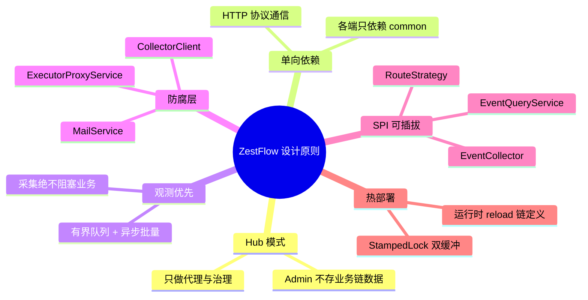

### 1.4 技术栈总览

| 层级 | 技术选型 | 版本 |
|------|---------|------|
| 语言 | Java | 17 |
| 后端框架 | Spring Boot | 3.2.5 |
| ORM | MyBatis-Plus | 3.5.15 |
| 嵌入式 HTTP | Netty | — |
| 前端 | Vue 3 + TS + Element Plus + Vite | 3.4 / 5.x |
| 流程图 | AntV X6 | 2.19 |
| 数据库 | MySQL | 8.x |
| 构建 | Maven 多模块 | — |

---

## 2. 系统上下文（C4 Level 1）

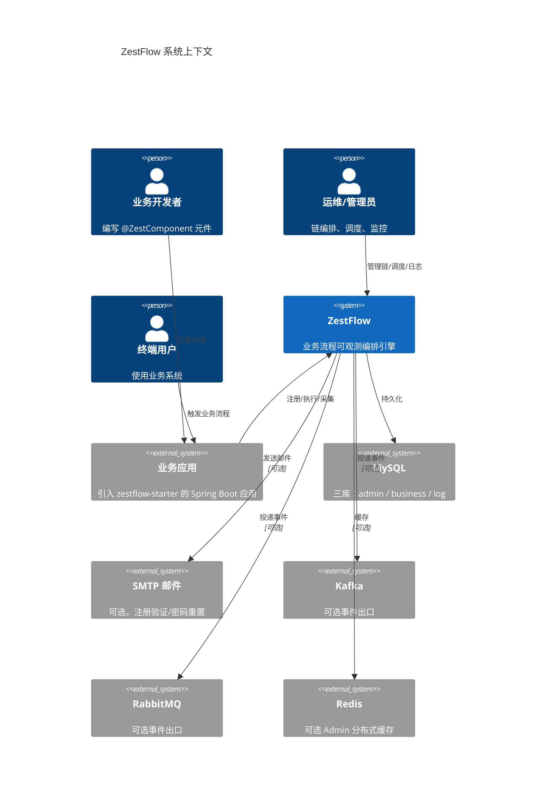

---

## 3. 容器架构（C4 Level 2）

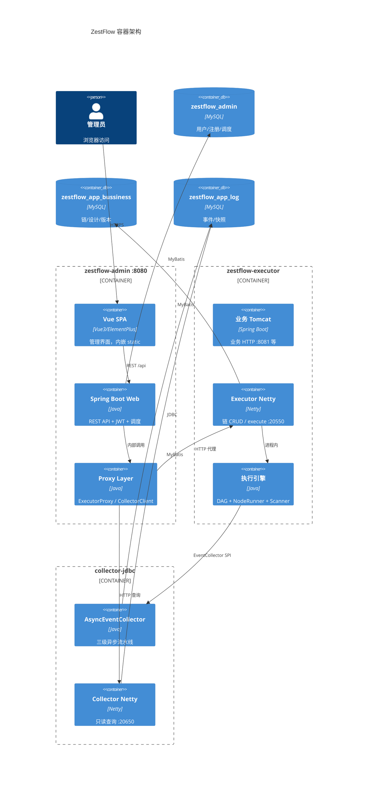

### 3.1 逻辑分层

```
┌─────────────────────────────────────────────────────────────────────────┐
│                           表现层 Presentation                            │
│   zestflow-admin-ui (Vue SPA)  │  Admin REST Controllers                │
├─────────────────────────────────────────────────────────────────────────┤
│                           网关/代理层 Gateway                            │
│   ExecutorProxyService  │  CollectorClient  │  JwtAuthFilter           │
├─────────────────────────────────────────────────────────────────────────┤
│                           应用层 Application                             │
│   RegistryService  │  ScheduleService  │  UserService  │  LogService   │
├─────────────────────────────────────────────────────────────────────────┤
│                           领域/引擎层 Domain                             │
│   ChainExecutionEngine  │  ChainManager  │  ComponentScanner           │
│   DagSorter  │  NodeRunner  │  LifecycleExecutor  │  AsyncEventCollector│
├─────────────────────────────────────────────────────────────────────────┤
│                           基础设施层 Infrastructure                      │
│   Netty Server  │  MyBatis Mapper  │  RestTemplate  │  MailService     │
├─────────────────────────────────────────────────────────────────────────┤
│                           数据层 Data                                    │
│   zestflow_admin  │  zestflow_app_bussiness  │  zestflow_app_log       │
└─────────────────────────────────────────────────────────────────────────┘
```

---

## 4. Maven 模块与子系统全景

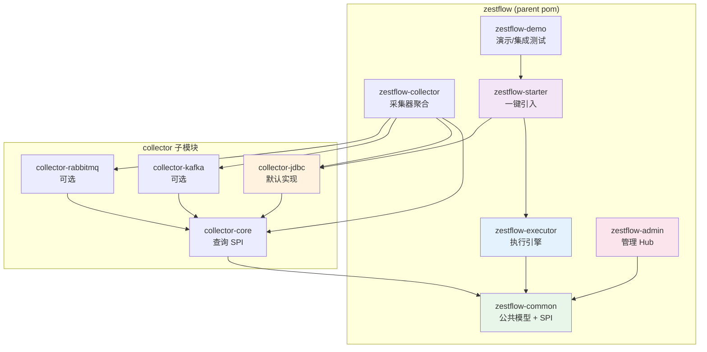

### 4.1 模块职责速查

| 模块 | artifactId | 部署形态 | 核心职责 |
|------|-----------|---------|---------|
| 公共层 | `zestflow-common` | jar（不部署） | DTO、协议、SPI、常量、CodeGenerator |
| 执行器 | `zestflow-executor` | 嵌入业务应用 | DAG 引擎、Netty 端点、注册客户端 |
| 采集核心 | `collector-core` | jar | EventQueryService SPI |
| JDBC 采集 | `collector-jdbc` | 嵌入或独立 | 异步落库 + Netty 查询 API |
| Kafka 采集 | `collector-kafka` | 可选 | Kafka 事件投递 |
| RabbitMQ 采集 | `collector-rabbitmq` | 可选 | RabbitMQ 事件投递 |
| 启动器 | `zestflow-starter` | jar | executor + collector-jdbc 聚合 |
| 管理端 | `zestflow-admin` | 独立 jar | Hub + SPA + 调度 + 注册 |
| 演示应用 | `zestflow-demo` | 独立 jar | 端到端演示与测试 |

### 4.2 依赖约束（强制）

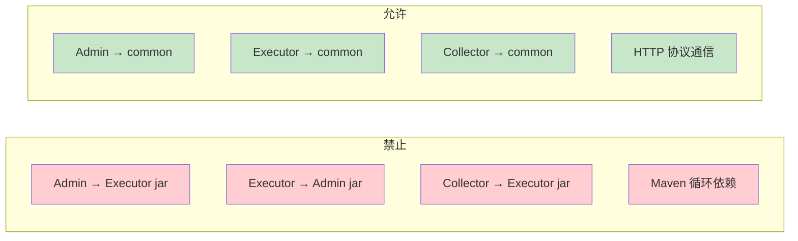

---

## 5. 子系统详细设计

---

### 5.1 zestflow-common

> **定位**：零框架依赖的共享内核，所有模块的「协议层」。

#### 5.1.1 包结构

```
com.zestflow.common/
├── model/
│   ├── dto/          ChainEvent, RegisterDTO, HeartbeatDTO, ChainExecuteRequestDTO ...
│   ├── event/        ChainEventType, PublishEventDTO
│   └── ComponentType   元件类型枚举
├── protocol/         EventQuery, ExecutionTrace, PageResult
├── spi/              EventCollector
├── constant/         RegistryConstants, ChainConstants
├── exception/        BaseException, UnauthorizedException ...
└── util/             CodeGenerator
```

#### 5.1.2 ChainEvent 事件模型

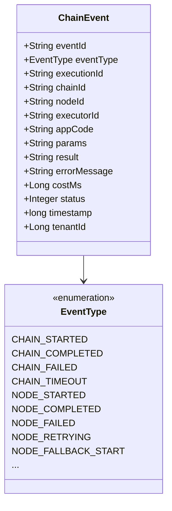

#### 5.1.3 CodeGenerator 编码规则

| 实体 | 前缀 | 格式 | 示例 |
|------|------|------|------|
| 设计 Design | `DSN` | `{PREFIX}{yyyyMMdd}{6位序号}` | `DSN20260602000001` |
| 链 Chain | `CHN` | 同上 | `CHN20260602000001` |

- 纯内存 `ConcurrentHashMap` + `AtomicInteger`，线程安全
- 按前缀独立序号，每日重置
- JVM 启动随机偏移（0~899）防重启碰撞

---

### 5.2 zestflow-executor

> **定位**：编排执行引擎，嵌入业务 Spring Boot 应用，对标 LiteFlow + xxl-job 执行器。

#### 5.2.1 子系统组件图

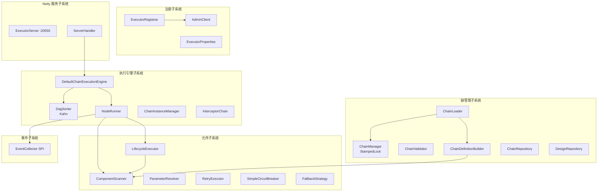

#### 5.2.2 元件注解体系

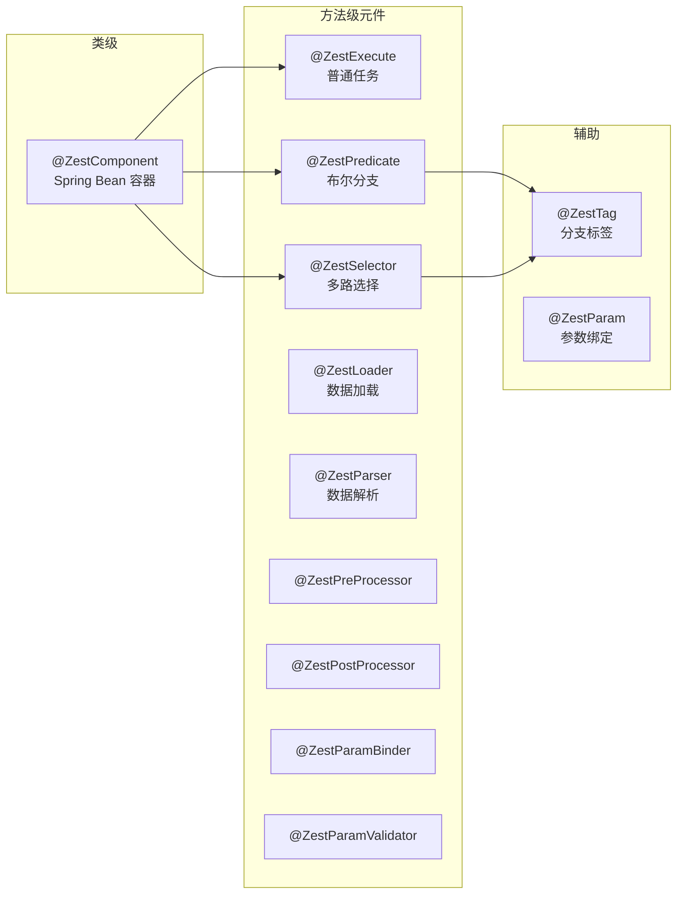

**注册规则**（ComponentScanner）：

1. 注解 `value()` 非空 → 作为元件 ID（executeId）
2. 为空 → 默认 `类简单名.方法名`
3. 重复 ID 后扫描覆盖并 WARN

#### 5.2.3 ChainManager 热更新模型

对标 **Nacos 配置中心双缓冲**：

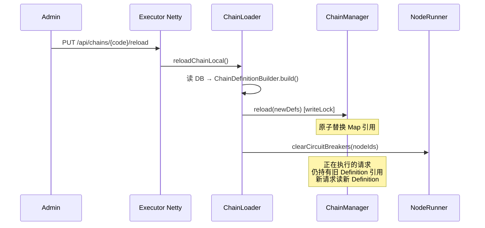

**读路径**：`tryOptimisticRead()` → 验证 stamp → 失败降级 `readLock()`  
**写路径**：`writeLock()` → 替换 `volatile Map` 引用

#### 5.2.4 链执行状态机

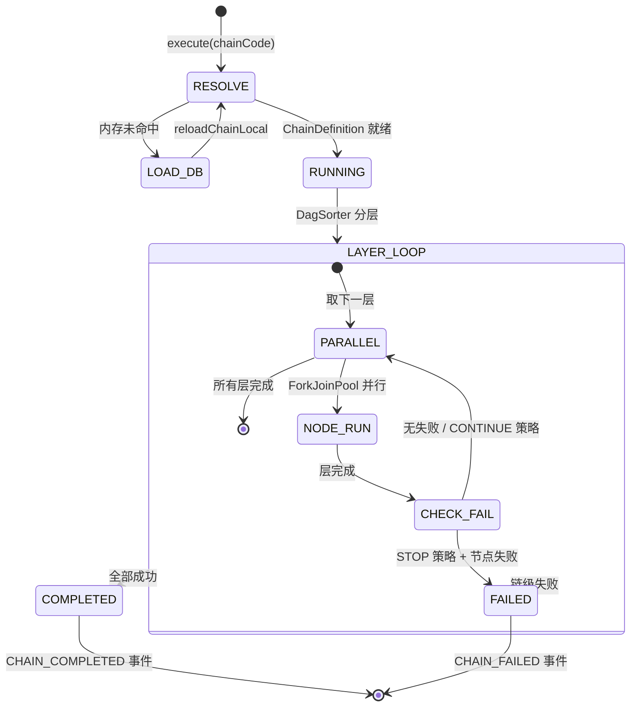

#### 5.2.5 单节点执行管线

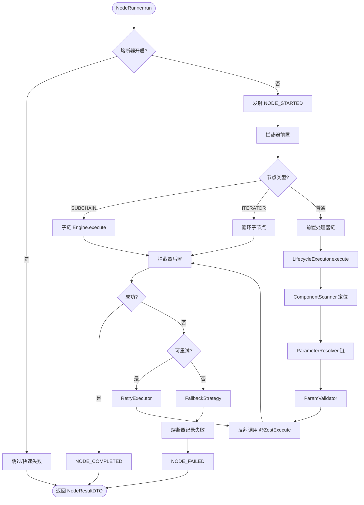

#### 5.2.6 DAG 排序（DagSorter）

- **算法**：Kahn BFS，每轮入度为 0 的节点归为同一层
- **并行**：同层节点由 `ForkJoinPool(min(CPU×2, 16))` 并行执行
- **条件边**：`ChainEdge.condition` 通过 ScriptEngine 求值（如 `params.approved == 'true'`）
- **环路检测**：无入度为 0 节点时 WARN

#### 5.2.7 Executor Netty API

| 方法 | 路径 | 说明 |
|:----:|------|------|
| GET | `/health` | 健康检查 |
| POST | `/execute` | 链执行入口 |
| GET/POST/PUT/DELETE | `/api/chains/**` | 链 CRUD、发布、reload |
| GET/POST/PUT/DELETE | `/api/designs/**` | 设计 CRUD、图保存 |
| GET | `/api/components/**` | 元件列表/统计 |
| POST | `/api/chains/sync` | 链数据同步（免 JWT） |

可选鉴权：请求头 `X-Access-Token`（`/health` 除外）。

#### 5.2.8 注册子系统（对标 xxl-job）

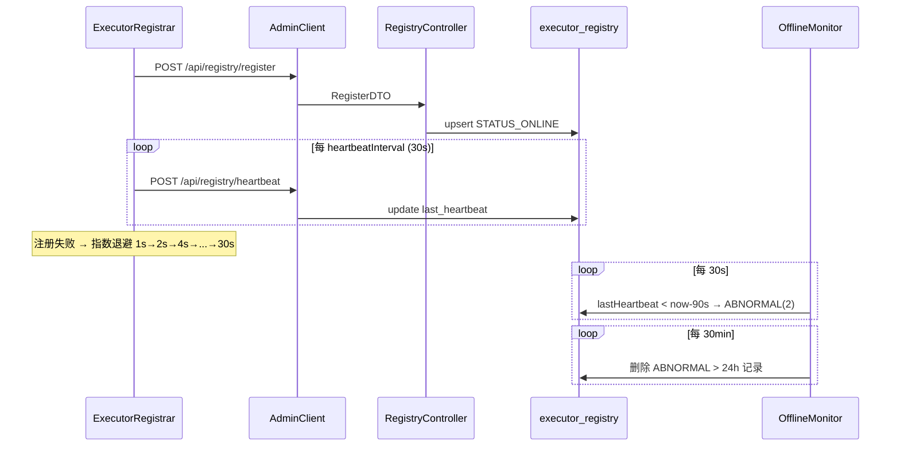

**三态模型**：

| 值 | 常量 | 含义 |
|:--:|------|------|
| 1 | `STATUS_ONLINE` | 在线 |
| 0 | `STATUS_OFFLINE` | 主动下线 |
| 2 | `STATUS_ABNORMAL` | 心跳超时 |

**executorId 格式**：`{appCode}@{host}:{port}`

#### 5.2.9 链状态生命周期

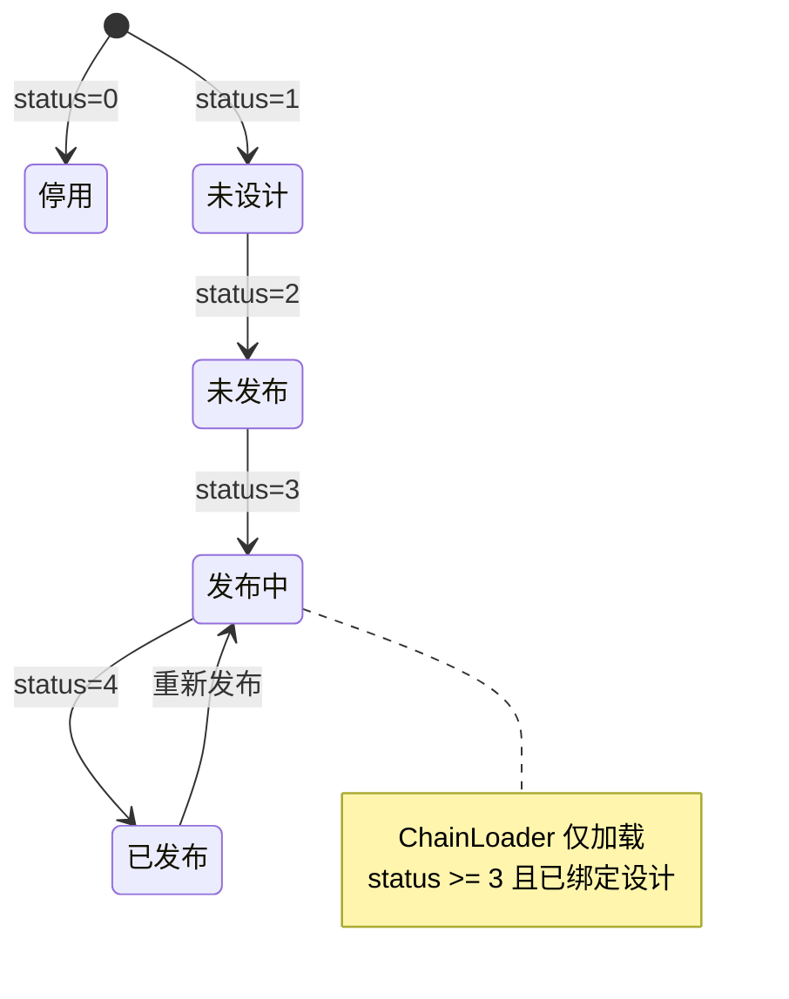

#### 5.2.10 自动配置 Bean 清单（ExecutorAutoConfig）

| Bean | 职责 |
|------|------|
| `ExecutorServer` | Netty 生命周期 initMethod=start |
| `ExecutorRegistrar` | 注册 + 心跳 |
| `AdminClient` | Admin HTTP 客户端 |
| `ComponentScanner` | 元件扫描 |
| `ChainManager` | 链定义内存注册表 |
| `ChainLoader` | 启动加载 + 热 reload |
| `DefaultChainExecutionEngine` | 执行引擎 |
| `NodeRunner` | 单节点管线 |
| `DagSorter` | 拓扑排序 |
| `LifecycleExecutor` | 反射调用 + 参数注入 |
| `RetryExecutor` | 重试 |
| `InterceptorChain` | 拦截器链 |
| `ExecutionController` | 可选 Tomcat /execute |

---

### 5.3 zestflow-collector

> **定位**：事件采集与查询，**绝不阻塞业务**（最高优先级）。

#### 5.3.1 子模块关系

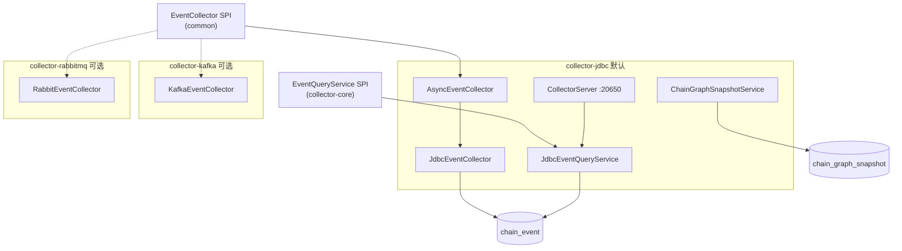

#### 5.3.2 三级异步流水线

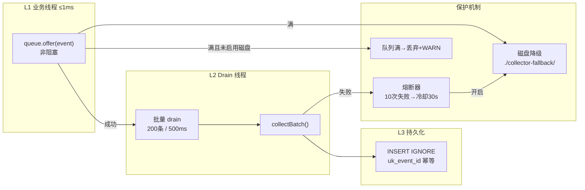

**默认参数**：

| 参数 | 默认值 |
|------|--------|
| `queue-capacity` | 8192 |
| `batch-size` | 200 |
| `batch-max-wait-ms` | 500 |
| `circuit-breaker-threshold` | 10 |
| `circuit-breaker-cooldown-ms` | 30000 |

#### 5.3.3 Collector Netty 查询 API

| 方法 | 路径 | 说明 |
|:----:|------|------|
| GET | `/collector/health` | 健康检查 |
| POST | `/collector/events/query` | 事件分页查询 |
| GET | `/collector/events/{eventId}` | 单事件详情 |
| POST | `/collector/events/stats` | 统计聚合 |
| POST | `/collector/events/executions` | 执行 Trace 列表 |
| GET | `/collector/events/executions/{executionId}` | Trace 详情 |
| POST | `/collector/snapshots` | 保存链图快照 |
| GET | `/collector/snapshots` | 查询快照 |

认证：请求头 `X-Collector-Token`（未配置时不校验）。

#### 5.3.4 采集器注册

与 Executor 对称：`CollectorRegistrar` → `POST /api/registry/collector/register` → `collector_registry` 表。

---

### 5.4 zestflow-starter

> **定位**：业务方一行依赖，零代码集成。

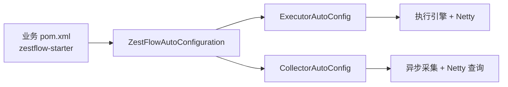

```xml
<dependency>
    <groupId>cn.zestflow.www</groupId>
    <artifactId>zestflow-starter</artifactId>
</dependency>
```

---

### 5.5 zestflow-admin

> **定位**：管理 Hub，连接 Executor / Collector / 前端，**不存储业务链数据**。

#### 5.5.1 Admin 子系统全景

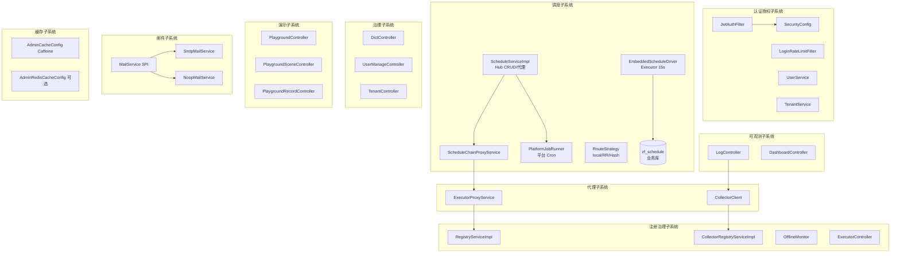

#### 5.5.2 Admin 数据 vs 代理数据

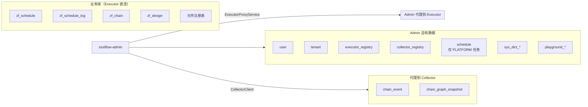

#### 5.5.3 ExecutorProxyService 路由

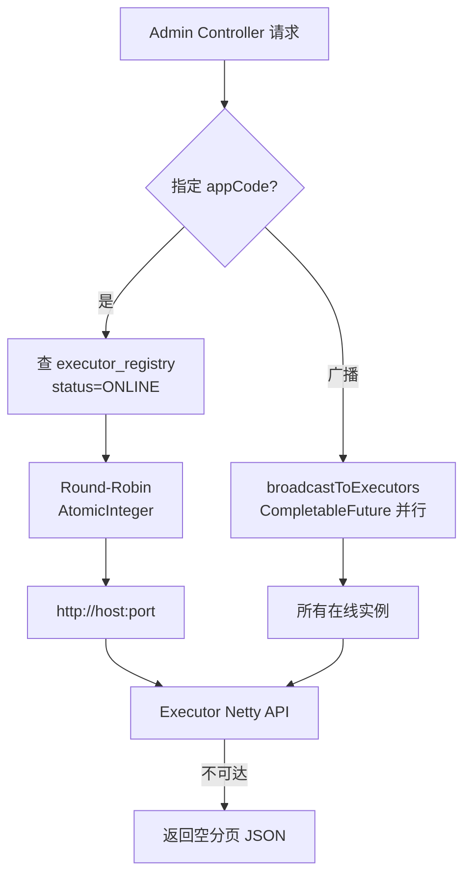

#### 5.5.4 调度子系统

> 完整 ADR 见 [docs/adr/SCHEDULING.md](./adr/SCHEDULING.md)

**职责分离**：

| 类型 | 配置存储 | 触发方 | Admin 角色 |
|------|---------|--------|-----------|
| **CHAIN**（业务链 Cron） | 业务库 `zf_schedule` | Executor `EmbeddedScheduleDriver` | CRUD/查询/手动触发 **HTTP 代理** |
| **PLATFORM**（平台任务） | Admin 库 `schedule` | Admin `PlatformJobRunner` + ShedLock | 本地管理 |

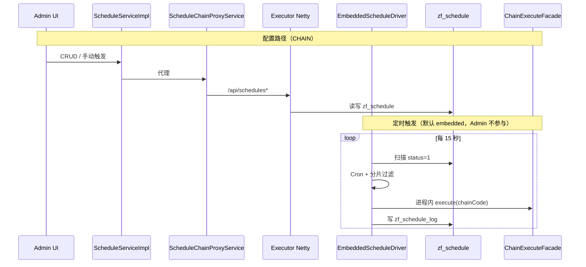

**路由策略**（手动触发 / 非 local Cron 时使用）：

| 策略 | 实现 | 说明 |
|------|------|------|
| `local` | 本实例 | **默认**；Cron 由 Embedded 本地执行 |
| `round_robin` | `RoundRobinStrategy` | AtomicInteger 轮询 |
| `hash` | `HashRouteStrategy` | 按 chainCode 哈希 |
| `random` | `RandomRouteStrategy` | 随机选择 |

**分片**：`zf_schedule.shard_total` + Executor 配置 `shard-index` / `shard-total`。

#### 5.5.5 Admin REST Controller 矩阵

| Controller | 路径前缀 | 职责 |
|------------|---------|------|
| `AuthController` | `/api/auth` | 登录/注册/改密/邮箱验证 |
| `UserManageController` | `/api/users` | 用户 CRUD、重置密码 |
| `TenantController` | `/api/tenants` | 租户 CRUD、切换 |
| `RoleController` | `/api/roles` | 角色列表 |
| `RegistryController` | `/api/registry` | Executor 注册/心跳 |
| `CollectorRegistryController` | `/api/registry/collector` | Collector 注册 |
| `ExecutorController` | `/api/executors` | 执行器/采集器列表 |
| `ChainController` | `/api/chains` | 链 CRUD/发布（代理） |
| `DesignController` | `/api/designs` | 设计 CRUD/图保存（代理） |
| `ComponentController` | `/api/components` | 元件列表（代理） |
| `ScheduleController` | `/api/schedules` | 调度 CRUD/手动触发 |
| `LogController` | `/api/logs` | 事件/Trace/快照（代理 Collector） |
| `DashboardController` | `/api/dashboard` | 统计大盘 |
| `DictTypeController` | `/api/dict-types` | 字典管理 |
| `PlaygroundController` | `/api/playground` | 演示执行 |
| `PlaygroundSceneController` | `/api/playground/scenes` | 场景 CRUD |
| `SystemController` | `/api/system` | 功能开关 |
| `SpaController` | `/`, `/login` ... | SPA History 回退 |

#### 5.5.6 邮件子系统

```mermaid
graph LR
    BIZ[UserService / UserManageService] --> MS[MailService 接口]
    MS --> COND{zestflow.mail.enabled?}
    COND -->|true| SMTP[SmtpMailService<br/>JavaMail + Thymeleaf]
    COND -->|false| NOOP[NoopMailService<br/>仅打日志]
```

| 功能 | 触发 | 模板 |
|------|------|------|
| 注册邮箱验证 | `UserServiceImpl.register()` | verification |
| 忘记密码 | `UserServiceImpl.forgot()` | reset-password |
| 创建用户通知 | `UserManageServiceImpl.createUser()` | welcome |

---

### 5.6 zestflow-admin-ui

> **定位**：Vue 3 单页应用，构建产物内嵌 Admin jar。

#### 5.6.1 前端架构

```mermaid
graph TB
    subgraph Entry
        MAIN[main.ts]
        APP[App.vue<br/>el-config-provider]
    end

    subgraph Core
        ROUTER[router/index.ts<br/>导航守卫]
        PINIA[stores/<br/>user / tenant / app]
        I18N[i18n/<br/>zh-CN + en]
        API[api/<br/>18 模块 Axios]
    end

    subgraph Layout
        AL[AppLayout.vue]
        AS[AppSidebar.vue]
        AH[AppHeader.vue]
    end

    subgraph Views
        DASH[Dashboard]
        CHAIN[Chains ×3]
        DESIGN[DesignList + Editor]
        LOG[Logs + X6 执行图]
        SCHED[Schedules]
        EXEC[Executors / Collectors]
        SET[Settings ×4]
        PG[Playground ×3]
        AUTH[Login/Register/Forgot]
    end

    MAIN --> APP
    APP --> ROUTER
    ROUTER --> AL
    AL --> Views
    Views --> API
    API --> BACKEND[Admin :8080 /api]
```

#### 5.6.2 路由地图

```mermaid
graph TD
    subgraph Public["公开路由"]
        L["/login"]
        R["/register"]
        F["/forgot"]
        RP["/reset-password"]
        VE["/verify-email"]
    end

    subgraph Auth["需登录"]
        FP["/force-password"]
        subgraph Layout["AppLayout"]
            D["/dashboard"]
            CH["/chains"]
            CHC["/chains/create"]
            CHD["/chains/:id"]
            DL["/design"]
            DE["/design/:id  X6编辑器"]
            SC["/schedules"]
            LG["/logs  X6执行图"]
            EX["/executors"]
            CO["/collectors"]
            ST["/settings/*"]
            PG1["/playground"]
            PG2["/playground/scenes"]
            PG3["/playground/records"]
        end
    end

    Public --> Auth
```

**路由 Meta**：

| 标志 | 含义 |
|------|------|
| `requiresAuth: false` | 公开页面 |
| `requiresExecutor: true` | 无在线 Executor 时显示 NoAppEmpty |
| `hideTitle: true` | 全屏模式（设计编辑器、Playground） |

#### 5.6.3 设计编辑器（AntV X6）

```mermaid
graph LR
    subgraph 节点类型
        START["flow-start<br/>开始 绿"]
        END["flow-end<br/>结束 灰"]
        TASK["flow-task<br/>执行器 蓝"]
        COND["flow-condition<br/>条件 橙菱形"]
        MULTI["flow-multicondition<br/>多条件 紫六边形"]
        LOAD["flow-loader 青"]
        PARSE["flow-parser 粉"]
        SCRIPT["flow-script 紫"]
        SUB["flow-subchain 青"]
        ITER["flow-iterator 橙虚线"]
    end

    subgraph 插件
        HIST[History 撤销重做]
        CLIP[Clipboard 复制粘贴]
        SNAP[Snapline 对齐]
        MINI[MiniMap 缩略图]
        KEY[Keyboard 快捷键]
        EXP[Export PNG]
    end

    subgraph 持久化
        JSON["graph.toJSON()"]
        SAVE["designApi.saveGraph()"]
        CHDATA["chain_data 衍生"]
    end

    节点类型 --> JSON
    JSON --> SAVE
    SAVE --> CHDATA
```

**文件**：`src/views/design/DesignEditorPage.vue`（~2200 行单文件实现）

#### 5.6.4 构建与部署集成

```mermaid
flowchart LR
    DEV["pnpm dev :8001"] -->|proxy /api| ADMIN_DEV["Admin :8080"]
    BUILD["pnpm build"] --> STATIC["zestflow-admin/src/main/resources/static/"]
    STATIC --> JAR["Admin 单 jar 部署"]
    JAR --> SPA["SpaController → index.html"]
```

#### 5.6.5 HTTP 客户端规范

|  Concern  | 实现 |
|-----------|------|
| Base URL | `/api` |
| 认证 | `Authorization: Bearer {token}` |
| 租户 | `X-Tenant-Id` |
| 语言 | `Accept-Language` |
| 响应 | 解包 `{ code: 200, data }` |
| 401 | 清 token → 跳转 `/login` |

---

### 5.7 zestflow-demo

> **定位**：端到端演示应用，模拟业务方集成。

```mermaid
graph TB
    TA[DemoApplication :8081]
    TA --> STARTER[zestflow-starter]
    TA --> DEMO["@ZestComponent 演示<br/>OrderHandler / PaymentHandler ..."]
    TA --> CTRL["Demo Controllers<br/>OrderController / WorkflowController"]
    TA --> E2E["ZestFlowE2ETest<br/>10 场景"]
    TA --> STRESS["ConcurrentStressTest"]
```

**验证路径**：

```
POST /api/orders/handleApplyAfterSale
  → chain_event 表: app_code 非空, params/result 有值, cost_ms > 0
```

---

## 6. 核心业务流程

### 6.1 链从设计到执行（端到端）

```mermaid
sequenceDiagram
    autonumber
    participant UI as Admin UI
    participant AD as Admin
    participant EX as Executor
    participant CO as Collector
    participant DB as MySQL

    rect rgb(240, 248, 255)
        Note over UI,DB: 设计阶段
        UI->>AD: 保存设计 graph_data
        AD->>EX: POST /api/designs (proxy)
        EX->>DB: INSERT zf_design
        UI->>AD: 创建链 + 绑定设计
        AD->>EX: POST /api/chains (proxy)
        EX->>DB: INSERT zf_chain + binding
    end

    rect rgb(255, 248, 240)
        Note over UI,DB: 发布阶段
        UI->>AD: 发布链
        AD->>EX: broadcast PUT /reload (全实例)
        EX->>EX: ChainLoader → ChainManager
        EX->>DB: INSERT zf_chain_version 快照
        EX->>CO: POST /collector/snapshots
    end

    rect rgb(240, 255, 240)
        Note over UI,DB: 执行阶段
        UI->>AD: 手动触发 / 定时调度
        AD->>EX: POST /execute
        EX->>EX: Engine → NodeRunner → @ZestExecute
        EX->>CO: ChainEvent (SPI 异步)
        CO->>DB: INSERT chain_event
        UI->>AD: 查询日志
        AD->>CO: POST /collector/events/query
        CO-->>UI: Trace + 执行图着色数据
    end
```

### 6.2 事件 Trace 聚合

```mermaid
graph TD
    EXEC["一次 execute()"] --> EID["executionId = UUID"]
    EID --> E1["CHAIN_STARTED"]
    EID --> E2["NODE_STARTED ×N"]
    EID --> E3["NODE_COMPLETED ×N"]
    EID --> E4["CHAIN_COMPLETED"]

    E1 & E2 & E3 & E4 --> QUERY["JdbcEventQueryService<br/>按 executionId 聚合"]
    QUERY --> TRACE["ExecutionTrace"]
    TRACE --> UI["LogsPage 表格 + X6 执行图"]
    SNAP["chain_graph_snapshot"] --> UI
```

### 6.3 多实例部署数据流

```mermaid
graph TB
    subgraph Admin
        A[zestflow-admin]
    end

    subgraph App1["应用 A (appCode=order-service)"]
        E1A[Executor 实例 1]
        E2A[Executor 实例 2]
    end

    subgraph App2["应用 B (appCode=payment-service)"]
        E1B[Executor 实例 1]
    end

    subgraph Shared
        MYSQL[(MySQL 共享)]
        COLL[Collector]
    end

    A -->|round-robin| E1A
    A -->|round-robin| E2A
    A -->|broadcast reload| E1A
    A -->|broadcast reload| E2A
    A --> E1B

    E1A & E2A & E1B --> MYSQL
    E1A & E2A & E1B -->|EventCollector| COLL
    A --> COLL
```

---

## 7. 数据架构

### 7.1 三库 ER 概览

```mermaid
erDiagram
    %% zestflow_admin
    tenant ||--o{ user_tenant : has
    user ||--o{ user_tenant : belongs
    user ||--o{ user_app_role : has

    executor_registry }o--|| module : "optional module_id"
    collector_registry ||--|| collector : registers

    schedule ||--o{ schedule_log : triggers

    %% zestflow_app_bussiness
    zf_design ||--o{ zf_design_binding : binds
    zf_chain ||--o{ zf_design_binding : binds
    zf_chain ||--o{ zf_chain_version : versions

    %% zestflow_app_log
    chain_event {
        varchar event_id UK
        varchar event_type
        varchar chain_id
        varchar node_id
        varchar executor_id
        varchar app_code
        text params
        text result
        bigint cost_ms
        bigint timestamp
    }

    chain_graph_snapshot {
        varchar chain_code
        mediumtext graph_data
        varchar created_at
    }
```

### 7.2 表清单

#### zestflow_admin

| 表 | 用途 |
|----|------|
| `tenant` | 租户 |
| `user` / `user_tenant` | 用户与租户关联 |
| `role` / `user_app_role` | 应用级 RBAC |
| `executor_registry` | 执行器注册表 |
| `collector_registry` | 采集器注册表 |
| `schedule` / `schedule_log` | 定时调度 |
| `sys_dict_type` / `sys_dict_data` | 字典 |
| `playground_scene` / `playground_record` | 演示系统 |
| `tenant_ip_mapping` | 演示环境 IP→租户 |

#### zestflow_app_bussiness

| 表 | 用途 |
|----|------|
| `zf_chain` | 链元数据（code PK） |
| `zf_design` | 设计（graph_data + chain_data） |
| `zf_design_binding` | 设计↔链绑定 |
| `zf_chain_version` | 发布版本快照 |

#### zestflow_app_log

| 表 | 用途 |
|----|------|
| `chain_event` | 链执行事件（uk_event_id 幂等） |
| `chain_graph_snapshot` | 链图快照（日志页执行图） |

### 7.3 审计与多租户字段（所有业务表）

```sql
-- 审计
created_by, updated_by, created_at, updated_at, is_deleted

-- 隔离
tenant_id BIGINT DEFAULT 1
app_code  VARCHAR(50)
```

### 7.4 链状态枚举

| status | 含义 | 运行时加载 |
|:------:|------|:----------:|
| 0 | 停用 | ✗ |
| 1 | 未设计 | ✗ |
| 2 | 未发布 | ✗ |
| 3 | 发布中 | ✓ |
| 4 | 已发布 | ✓ |

---

## 8. 通信协议与 API 矩阵

### 8.1 通信拓扑

```mermaid
graph LR
    subgraph 协议
        H1["HTTP REST<br/>Admin ↔ 浏览器"]
        H2["HTTP REST<br/>Admin ↔ Executor Netty"]
        H3["HTTP REST<br/>Admin ↔ Collector Netty"]
        H4["HTTP REST<br/>Executor ↔ Admin 注册"]
        SPI["Java SPI<br/>Engine ↔ EventCollector"]
    end
```

### 8.2 Admin → Executor 代理 API

| 业务 | Admin 路径 | Executor 路径 |
|------|-----------|--------------|
| 链列表 | `GET /api/chains` | `GET /api/chains` |
| 链发布 | `POST /api/chains/{code}/publish` | `PUT /api/chains/{code}/reload` |
| 设计保存 | `PUT /api/designs/{code}/graph` | `PUT /api/designs/{code}/graph` |
| 元件列表 | `GET /api/components` | `GET /api/components` |
| 链执行 | 调度内部 | `POST /execute` |

### 8.3 Admin → Collector 查询 API

| Admin 路径 | Collector 路径 |
|-----------|---------------|
| `POST /api/logs/events/query` | `POST /collector/events/query` |
| `GET /api/logs/events/{id}` | `GET /collector/events/{id}` |
| `POST /api/logs/executions/query` | `POST /collector/events/executions` |
| `GET /api/logs/snapshots` | `GET /collector/snapshots` |

### 8.4 注册协议 DTO

```mermaid
classDiagram
    class RegisterDTO {
        +String executorId
        +String host
        +int port
        +String moduleCode
        +String moduleName
        +List~ComponentDTO~ components
    }

    class HeartbeatDTO {
        +String executorId
    }

    class ChainExecuteRequestDTO {
        +String chainCode
        +Map params
        +String updatedBy
    }

    class ChainExecuteResultDTO {
        +boolean success
        +String chainCode
        +String executionId
        +Map result
        +List~NodeResultDTO~ nodeResults
        +long costMs
        +String errorMessage
    }
```

---

## 9. 安全架构

### 9.1 认证流程

```mermaid
sequenceDiagram
    participant B as Browser
    participant F as Vue SPA
    participant A as Admin API
    participant DB as user 表

    B->>F: 输入用户名密码
    F->>A: POST /api/auth/login
    A->>DB: 校验 BCrypt
    A-->>F: JWT + userInfo + tenants
    F->>F: localStorage.token + Pinia

    loop 后续请求
        F->>A: Authorization: Bearer + X-Tenant-Id
        A->>A: JwtAuthFilter 解析
    end

    A-->>F: 401 → 清 token → /login
```

### 9.2 授权矩阵

| 路径模式 | 认证 |
|---------|------|
| `/api/auth/**` | 公开 |
| `POST/DELETE /api/registry/**` | 公开（机器注册） |
| `/api/playground/**` | JWT + 应用级 RBAC（与链/设计一致） |
| `POST /api/chains/sync` | 公开 |
| `/api/**` 其他 | JWT 必须 |
| 静态资源 + SPA | 公开（前端守卫） |

### 9.3 安全机制清单

| 机制 | 实现 |
|------|------|
| 密码存储 | BCrypt |
| 会话 | 无状态 JWT |
| 强制改密 | `must_change_password=1` → `/force-password` |
| 登录限流 | `LoginRateLimitFilter` |
| Executor 内网鉴权 | 可选 `X-Access-Token` |
| Collector 鉴权 | 可选 `X-Collector-Token` |
| 操作审计 | `updatedBy` 透传至 Executor |

### 9.4 多租户

```mermaid
flowchart LR
    LOGIN[登录响应 tenants] --> STORE[Pinia tenant store]
    STORE --> HEADER["X-Tenant-Id Header"]
    HEADER --> ADMIN[Admin Service]
    ADMIN --> CTX[TenantAppContext]
    CTX --> FILL["MetaObjectHandler<br/>自动填充 tenant_id"]
```

---

## 10. 部署架构

### 10.1 推荐部署拓扑

```
                    ┌─────────────────┐
                    │   Nginx (可选)   │
                    │  :443 → :8080   │
                    └────────┬────────┘
                             │
              ┌──────────────┴──────────────┐
              │   zestflow-admin.jar        │
              │   :8080 (Tomcat + SPA)      │
              └──────────────┬──────────────┘
                             │
         ┌───────────────────┼───────────────────┐
         │                   │                   │
         ▼                   ▼                   ▼
┌─────────────────┐ ┌─────────────────┐ ┌─────────────────┐
│ 业务应用 A       │ │ 业务应用 B       │ │ MySQL           │
│ Tomcat :8081    │ │ Tomcat :9090    │ │ :3306           │
│ Netty  :20550   │ │ Netty  :20550   │ │ 三库            │
│ + starter       │ │ + starter       │ │                 │
│ (Executor+Coll) │ │ (Executor+Coll) │ │                 │
└─────────────────┘ └─────────────────┘ └─────────────────┘
```

### 10.2 部署模式对比

| 模式 | 说明 | 适用场景 |
|------|------|---------|
| **嵌入式** | starter 集成在业务 jar 内 | 默认推荐，运维简单 |
| **Admin 独立** | 单 jar 含 SPA | 管理中心 |
| **Collector 独立** | 仅 collector-jdbc 单独部署 | 大日志量、独立扩缩容 |

### 10.3 进程与端口

| 进程 | 默认端口 | 配置项 |
|------|:--------:|--------|
| Admin Tomcat | 8080 | `server.port` |
| 前端开发 Vite | 8001 | vite.config.ts |
| 业务 Tomcat（test） | 8081 | `server.port` |
| Executor Netty | 20550 | `zestflow.executor.port` |
| Collector Netty | 20650 | `zestflow.collector.registry.port` |

### 10.4 启动顺序

```mermaid
flowchart TD
    S1["1. MySQL 初始化<br/>init.sql + initData.sql"] --> S2["2. 启动 Admin :8080"]
    S2 --> S3["3. 启动业务应用<br/>(含 starter)"]
    S3 --> S4["4. Executor 自动注册"]
    S3 --> S5["5. Collector 自动注册"]
    S4 --> S6["6. ChainLoader 加载已发布链"]
    S6 --> READY["系统就绪"]
```

---

## 11. 配置参考

### 11.1 Executor `zestflow.executor.*`

| 属性 | 默认值 | 说明 |
|------|--------|------|
| `app-code` | spring.application.name | 应用编码 |
| `admin-addresses` | http://localhost:8080 | 多 Admin 逗号分隔 |
| `port` | 20550 | Netty 端口 |
| `host` | 自动探测内网 IPv4 | |
| `heartbeat-interval` | 30 | 秒 |
| `access-token` | 空 | Netty 可选鉴权 |
| `execute-endpoint-enabled` | false | Tomcat /execute |
| `event.queue-capacity` | 8192 | |
| `event.batch-size` | 200 | |
| `event.circuit-breaker-threshold` | 10 | |

### 11.2 Collector `zestflow.collector.*`

| 属性 | 默认值 | 说明 |
|------|--------|------|
| `registry.port` | 20650 | Netty 查询端口 |
| `jdbc.async.queue-capacity` | 8192 | |
| `jdbc.async.batch-size` | 200 | |
| `access-token` | 空 | 查询 API 鉴权 |

### 11.3 Admin `zestflow.admin.*` / `zestflow.*`

| 属性 | 默认值 | 说明 |
|------|--------|------|
| `jwt.secret` | 开发默认值 | **生产必须覆盖** |
| `jwt.expiration` | 86400000 | 毫秒 |
| `admin.protocol` | http | 访问 Executor |
| `admin.deploy-mode` | standalone | 运行时状态：standalone=内存 / cluster=Redis |
| `admin.cache.type` | caffeine | 权限缓存：simple / caffeine / redis（与 deploy-mode 独立） |
| `collector.api-url` | http://localhost:20650 | Collector 兜底 |
| `mail.enabled` | false | 邮件开关 |

### 11.4 配置同步规范

修改 `zestflow.executor.*` 须同步：

- `zestflow-executor/src/main/resources/application.yml`
- `zestflow-demo/src/main/resources/application.yml`
- `zestflow-demo/src/main/resources/application-prod.example.yml`
- `zestflow-demo/src/test/resources/application-test.yml`

修改 `zestflow.admin.*` 须同步：

- `zestflow-admin/src/main/resources/application.yml`
- `zestflow-admin/src/main/resources/application-prod.example.yml`

---

## 12. 扩展点与 SPI

```mermaid
graph TB
    subgraph 写入 SPI
        EC["EventCollector"]
        EC --> JDBC["JdbcEventCollector"]
        EC --> KAFKA["KafkaEventCollector"]
        EC --> RMQ["RabbitEventCollector"]
        EC --> CUSTOM_W["自定义实现"]
    end

    subgraph 读取 SPI
        EQ["EventQueryService"]
        EQ --> JQS["JdbcEventQueryService"]
        EQ --> CUSTOM_R["自定义实现"]
    end

    subgraph 执行扩展
        PR["ParameterResolver"]
        PV["@ZestParamValidator"]
        FB["FallbackStrategy"]
        IC["Interceptor"]
        RS["RouteStrategy"]
    end

    subgraph 基础设施扩展
        MS["MailService"]
        CACHE["CacheManager<br/>Caffeine / Redis"]
    end
```

| 扩展点 | 接口 | 默认 | 激活条件 |
|--------|------|------|---------|
| 事件采集 | `EventCollector` | Jdbc + Async 装饰 | starter 引入 |
| 事件查询 | `EventQueryService` | JdbcEventQueryService | collector-jdbc |
| 参数解析 | `ParameterResolver` | ZestParam / ContextType | 自动注册 |
| 降级 | `FallbackStrategy` | Default（仅日志） | `@Bean` 替换 |
| 路由 | `RouteStrategy` | RoundRobin | schedule.route_strategy |
| 邮件 | `MailService` | Noop / Smtp | mail.enabled |
| 缓存 | CacheManager | Caffeine | cache.type=redis；单机 standalone 无需 Redis |
| 运行时状态 | AdminRuntimeStateStore | 内存 | deploy-mode=cluster 时用 Redis |

---

## 13. 非功能需求与容量

### 13.1 可靠性

```mermaid
graph LR
    subgraph Executor
        R1["注册指数退避<br/>无限重试"]
        R2["StampedLock 热更新<br/>不中断执行"]
        R3["熔断器 per node"]
    end

    subgraph Collector
        C1["有界队列<br/>不阻塞业务"]
        C2["INSERT IGNORE 幂等"]
        C3["磁盘降级可选"]
    end

    subgraph Admin
        A1["Executor 不可达<br/>返回空数据"]
        A2["OfflineMonitor<br/>90s 离线检测"]
    end
```

### 13.2 高可用分析

| 组件 | Admin 挂掉 | 说明 |
|------|-----------|------|
| 已发布链执行 | **不受影响** | Executor 运行时决策不依赖 Admin |
| 链发布/查日志 | **不可用** | 需 Admin 恢复 |
| Admin 集群 | 无状态（JWT + 共享 MySQL） | 需分布式调度锁 |

### 13.3 容量估算

| 指标 | 估算 |
|------|------|
| 单 Admin 支撑 Executor 实例 | 250+（50 应用 × 5 实例） |
| CodeGenerator 吞吐 | 16 万+/秒 |
| 事件队列默认容量 | 8192 条/实例 |
| 全局单点 | MySQL |

### 13.4 测试覆盖

| 模块 | 测试文件 | 重点 |
|------|---------|------|
| executor | ~15 | Engine、DAG、NodeRunner、Retry |
| collector-jdbc | 4 | Netty 路由 32 用例、查询 20 用例 |
| admin | ~20 | Registry、Proxy、Schedule |
| zestflow-demo | 3 | E2E 10 场景、并发压测 |

---

## 14. 演进路线

### 14.1 已实现 ✓

- [x] Executor 自动注册 + 心跳 + 三态离线检测
- [x] Collector 注册 + 三级异步流水线
- [x] DAG 执行（并行层、重试、熔断）
- [x] 方法级元件注解 + 参数注入
- [x] Admin 代理链/设计/元件（零业务数据）
- [x] 链发布广播 + StampedLock 热 reload
- [x] 事件采集 + Trace 查询 + X6 执行图
- [x] Cron 调度 + 路由策略
- [x] JWT 认证 + 多租户 + 强制改密
- [x] X6 可视化设计编辑器
- [x] Playground 演示系统
- [x] 邮件集成（可选 Noop）

### 14.2 待演进 ○

```mermaid
timeline
    title ZestFlow 演进路线
    section 近期
        Flyway 版本化迁移 : init.sql → V{n}__*.sql
        SpEL/Groovy 条件路由 : 替代简单 ScriptEngine
        Fallback 策略丰富化 : 返回值/异常映射
    section 中期
        WebSocket 实时执行状态 : 日志页/live dashboard
        Admin 调度分布式锁 : Redis / DB 锁
        Executor ServerHandler 集成测试
    section 远期
        Admin 集群高可用 : 无状态 + 负载均衡
        gRPC 传输层 : 替代 HTTP（防腐层预留）
        多 Collector 后端 : ES / ClickHouse
```

### 14.3 已知限制

| 限制 | 现状 |
|------|------|
| Admin 单点 | 单进程，重启期间不可发布 |
| 调度锁 | 无分布式锁，Admin 集群需额外方案 |
| 条件表达式 | ScriptEngine 简单表达式 |
| Fallback | 默认仅打日志 |
| Flyway | classpath 有，默认 disabled |
| WebSocket | 未实现 |

---

## 附录 A：端口一览

| 服务 | 端口 | 协议 | 说明 |
|------|:----:|:----:|------|
| Admin | 8080 | HTTP | 管理 + SPA |
| Vite Dev | 8001 | HTTP | 前端开发 |
| 业务 Tomcat (test) | 8081 | HTTP | 演示 API |
| Executor Netty | 20550 | HTTP | 链 CRUD / execute |
| Collector Netty | 20650 | HTTP | 事件查询 |
| MySQL | 3306 | TCP | 三库 |

---

## 附录 B：包命名规范

```
com.zestflow.{模块}.{分层}

common.model / common.spi / common.protocol
admin.controller / admin.service / admin.client / admin.config
executor.engine / executor.chain / executor.registry / executor.server
executor.scanner / executor.lifecycle / executor.interceptor
collector.jdbc.collector / collector.jdbc.server / collector.spi
```

| 类型 | 命名 | 示例 |
|------|------|------|
| 接口 | 名词 | `EventCollector` |
| 实现 | 接口 + 技术后缀 | `JdbcEventCollector` |
| DTO | 名词 + DTO | `ChainExecuteRequestDTO` |
| PO | 名词 + PO | `ChainPO` |
| 异常 | 名词 + Exception | `ChainTimeoutException` |

---

## 附录 C：本地开发速查

```bash
# 1. 数据库：执行三份 init.sql + initData.sql

# 2. 编译
mvn install -pl zestflow-executor -am -DskipTests
mvn package -pl zestflow-demo -am -DskipTests

# 3. 启动 Admin (:8080) + DemoApplication (:8081)

# 4. 前端开发
cd zestflow-admin-ui && pnpm dev    # :8001

# 5. 前端改动后必须 build 进 Admin jar
pnpm build

# 6. 验证
# POST http://localhost:8081/api/orders/handleApplyAfterSale
# 检查 zestflow_app_log.chain_event
```

---

<p align="center">
  <strong>ZestFlow</strong> — 让每一条业务流程可见、可控、可演进<br/>
  <sub>文档随代码演进更新 · 如有疑问请查阅 <code>CLAUDE.md</code> 协作规范</sub>
</p>
