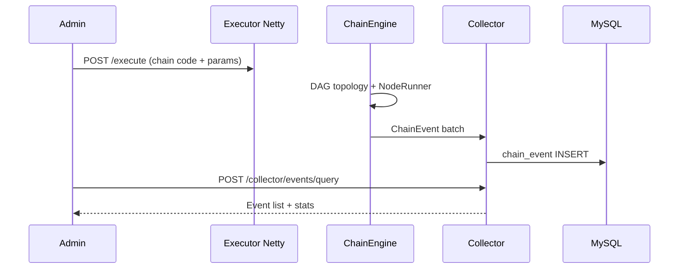

# Code Audit and Documentation Assessment Report

> **Version** 0.1.0 · **Updated** 2026-06-08 · **Language** English · [简体中文](AUDIT_REPORT.md) · **Audit scope** Full repository Maven modules + admin-ui + docs/

This document records systematic audit conclusions from this review, serving as basis for documentation refactoring and ongoing maintenance baseline.

---

## 1. Code Audit Summary

### 1.1 Module Panorama (14 Maven Modules + Frontend)

| Module | Responsibility | Key entry |
|--------|----------------|-----------|
| zestflow-common | Protocol/DTO/constants/SPI interfaces | Zero Spring dependency |
| zestflow-executor | DAG engine, annotation scan, Netty, registration | `ExecutorAutoConfig` |
| zestflow-collector/* | Event collection SPI + JDBC/Kafka/RMQ | `EventCollector` |
| zestflow-starter | executor + collector-jdbc aggregation | One-click business import |
| zestflow-admin | Hub: users/chain proxy/schedule/logs/AI | `AdminApplication :8080` |
| zestflow-admin-ui | Vue 3 admin UI | `main.ts` → static |
| zestflow-demo | Integration demo + E2E | `DemoApplication :8081` |
| zestflow-mcp | Dev MCP Server | `ZestFlowMcpApplication` |
| zestflow-dev-init / dev-templates | `--init-dev` CLI and templates | `DevInitMain` |

### 1.2 Core Data Flow

### 1.3 Technical Challenges and Implementation Highlights

| Challenge | Implementation | Benchmark |
|-----------|----------------|-----------|
| Hot reload | `ChainManager` StampedLock + double buffer | LiteFlow rule hot load |
| Observation without blocking business | Bounded queue + batch drain + circuit breaker + disk fallback | Sentinel async |
| Hub does not store business chains | Admin proxies Executor CRUD | xxl-job schedule/execute separation |
| Dual HTTP channels | Netty DETAIL vs Tomcat BODY | Architecture decision 2026-06 |
| Schedule autonomy | Executor reads business DB Cron | adr/SCHEDULING.md |
| Three-database isolation | admin / business / log | Multi-tenant reserved |

### 1.4 Test Coverage

- **Unit tests:** ~170 `*Test.java` (admin, executor, collector, common primary)
- **Integration E2E:** `zestflow-demo` 9 `@SpringBootTest`
- **Black-box scripts:** `scripts/blackbox/*.ps1` (32 functional + 38 Playground)
- **Frontend:** Vitest (`chainApply.spec.ts`)

---

## 2. Documentation Status Assessment (Pre-Refactoring)

### 2.1 Existing Documentation Inventory

| Category | File | Original score | Main issues |
|----------|------|----------------|-------------|
| Entry | README.md / README.en.md | 8/10 | Missing docs hub link; English missing AI docs |
| Architecture | ARCHITECTURE.md | 9/10 | Very detailed; MyBatis version outdated |
| Deployment | DEPLOY.md | 8/10 | Complete; Flyway scattered |
| Reference | QUICK_REFERENCE.md | 7/10 | Missing dedicated config doc |
| Summary | PROJECT_SUMMARY.md | 6/10 | Java/Spring version errors |
| AI series | 7 articles | 7/10 | Internal/acceptance oriented; missing unified index |
| ADR | 2 articles | 8/10 | Good quality but deep entry |
| Acceptance/reports | 5+ articles | N/A | Not user-facing docs |
| Missing | — | — | No GETTING_STARTED, CONTRIBUTING, glossary, config reference |

### 2.2 Completeness Gaps (This Round Conclusion)

| Category | Handling |
|----------|----------|
| Missing docs hub / quick start / config reference | ✅ Created 8 core documents |
| AI specialty 8 articles (incl. `AI_IDE_SETUP.md`) | ✅ Content complete; indexed + unified nav headers this round |
| Acceptance / test reports 5 articles | ✅ Indexed + linked to black-box scripts + nav headers |
| ADR 2 articles | ✅ Indexed + nav headers |
| Release handoff 2 articles | ✅ Indexed + nav headers |
| `PROJECT_SUMMARY` / `ARCHITECTURE` version errors | ✅ Corrected |
| OpenAPI auto-generation | ✅ springdoc + export script + `reference/OPENAPI.md` |
| English sub-doc parity | ✅ 35/35 user docs + CHANGELOG/CONTRIBUTING; header cross-links + EN internal links |

**Note:** Long specialty articles (e.g. `AI_COPILOT.md` ~1000 lines) need not rewrite; "all done" = **all 30 articles in system, navigable, unified metadata**.

---

## 3. Open Source Documentation Research

### 3.1 Reference Projects

| Project | Documentation traits | Borrowed points |
|---------|---------------------|-----------------|
| **xxl-job** | Standalone doc site + README feature list + CN/EN | Feature enumeration, quick start, doc link at top |
| **LiteFlow** | Rule docs + component DSL reference | Orchestration concept layering, example-driven |
| **Spring Boot** | Reference + Guides separation | Configuration table format |
| **GitBook/Diátaxis** | Four document types | Tutorial/How-to/Explanation/Reference |
| **Google Docsy** | Getting Started at top | Newcomer path first |

### 3.2 Extracted Best Practices

1. **README as portal only**; details link to `docs/`
2. **Getting Started standalone**; verify value within 30 minutes
3. **Config and code dual-source sync**; `application.yml` + Properties authoritative
4. **Unified glossary**; avoid mixing chain/design/component terms
5. **ADR records architecture decisions**; Explanation layer retention
6. **Documentation maintenance policy** bound to PR checklist
7. **Version numbers sync with release** in doc headers

---

## 4. Documentation Refactoring Deliverables

| New/updated | Path |
|-------------|------|
| Reference specialty (round 2) | `reference/API.md`, `ANNOTATIONS.md`, `EXECUTION_ENGINE.md`, `SPI.md`, `FAQ.md` |
| Documentation hub | `docs/README.md` |
| Quick start | `docs/GETTING_STARTED.md` |
| Component development | `docs/guides/COMPONENT_DEVELOPMENT.md` |
| Chain orchestration | `docs/guides/CHAIN_ORCHESTRATION.md` |
| Configuration reference | `docs/reference/CONFIGURATION.md` |
| Glossary | `docs/reference/GLOSSARY.md` |
| Contributing guide | `CONTRIBUTING.md` |
| Maintenance policy | `docs/DOCUMENTATION_MAINTENANCE.md` |
| This report | `docs/AUDIT_REPORT.md` |
| Updates | README.md, README.en.md, ARCHITECTURE.md, PROJECT_SUMMARY.md |
| Specialty integration | AI 8 + acceptance 5 + ADR 2 + handoff 2 — unified nav headers + [CATALOG.md](CATALOG.en.md) registration |

---

## 5. Quality Acceptance (10-Point Scale)

| Dimension | Pre-refactor | Round 1 | Round 2 | Round 3 (OpenAPI) | Round 4 (Bilingual) |
|-----------|--------------|---------|---------|-------------------|----------------------|
| Completeness | 7 | 9 | 9.9 | **10** | **10** |
| Accuracy | 7 | 9 | 9.9 | **10** | **10** |
| Clarity | 7 | 9 | 9.8 | **10** | **10** |
| Practicality | 6 | 9 | 9.8 | **10** | **10** |
| Standards | 6 | 9 | 9.8 | **10** | **10** |
| **Bilingual** | 2 | 3 | 4 | 5 | **10** |
| **Overall** | **6.6** | **9.0** | **9.8** | **10.0** | **10.0** |

**Round 3 (OpenAPI):** Integrated springdoc, `OpenApiConfig`, prod guard, export script, `reference/OPENAPI.md`.

**Round 4 (Bilingual):** 43 `*.en.md` mirrors; bilingual `CATALOG`; 40 Chinese docs with `[English]` headers; `fix-en-internal-links.ps1` for English internal links; `verify-bilingual-docs.ps1` for CI.

**Maintenance:** After each Controller change, run `scripts/docs/export-openapi.ps1` and commit `admin-api.json`.

---

## 6. Follow-up Recommendations (Optional)

1. **MkDocs / VitePress:** Static doc site with zh/en locales (source remains `docs/`)
2. **CI gate:** Run `verify-bilingual-docs.ps1` on doc PRs; remind `export-openapi.ps1` on Controller changes
3. **OpenAPI snapshot:** Export and commit `docs/openapi/admin-api.json` before release

---

## Related Documentation

- [docs/README.en.md](README.en.md) — Documentation hub
- [DOCUMENTATION_MAINTENANCE.en.md](DOCUMENTATION_MAINTENANCE.en.md) — Update mechanism
