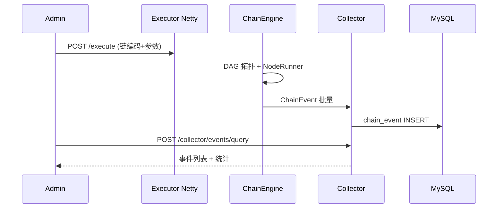

# 代码审计与文档评估报告

> **版本** 0.1.0 · **更新** 2026-06-08 · **审计范围** 全仓库 Maven 模块 + admin-ui + docs/

本文档记录本次系统性审计结论，作为文档重构依据与后续维护基线。

---

## 1. 代码审计摘要

### 1.1 模块全景（14 个 Maven 模块 + 前端）

| 模块 | 职责 | 关键入口 |
|------|------|---------|
| zestflow-common | 协议/DTO/常量/SPI 接口 | 零 Spring 依赖 |
| zestflow-executor | DAG 引擎、注解扫描、Netty、注册 | `ExecutorAutoConfig` |
| zestflow-collector/* | 事件采集 SPI + JDBC/Kafka/RMQ | `EventCollector` |
| zestflow-starter | executor + collector-jdbc 聚合 | 业务方一键引入 |
| zestflow-admin | Hub：用户/链代理/调度/日志/AI | `AdminApplication :8080` |
| zestflow-admin-ui | Vue 3 管理界面 | `main.ts` → static |
| zestflow-demo | 集成演示 + E2E | `DemoApplication :8081` |
| zestflow-mcp | Dev MCP Server | `ZestFlowMcpApplication` |
| zestflow-dev-init / dev-templates | `--init-dev` CLI 与模板 | `DevInitMain` |

### 1.2 核心数据流

### 1.3 技术难点与实现特点

| 难点 | 实现 | 对标 |
|------|------|------|
| 热更新 | `ChainManager` StampedLock + 双缓冲 | LiteFlow 规则热加载 |
| 观测不阻塞业务 | 有界队列 + 批量 drain + 熔断 + 磁盘降级 | Sentinel 异步 |
| Hub 不存业务链 | Admin 代理 Executor CRUD | xxl-job 调度/执行分离 |
| 双 HTTP 通道 | Netty DETAIL vs Tomcat BODY | 架构决策 2026-06 |
| 调度自治 | Executor 读业务库 Cron | adr/SCHEDULING.md |
| 三库隔离 | admin / business / log | 多租户预留 |

### 1.4 测试覆盖

- **单元测试**：~170 个 `*Test.java`（admin、executor、collector、common 为主）
- **集成 E2E**：`zestflow-demo` 9 个 `@SpringBootTest`
- **黑盒脚本**：`scripts/blackbox/*.ps1`（32 功能 + 38 Playground）
- **前端**：Vitest（`chainApply.spec.ts`）

---

## 2. 文档现状评估（重构前）

### 2.1 已有文档清单

| 类别 | 文件 | 原评分 | 主要问题 |
|------|------|--------|---------|
| 入口 | README.md / README.en.md | 8/10 | 缺文档中心链接；英文缺 AI 文档 |
| 架构 | ARCHITECTURE.md | 9/10 | 极详尽；MyBatis 版本过时 |
| 部署 | DEPLOY.md | 8/10 | 完整；与 Flyway 分散 |
| 参考 | QUICK_REFERENCE.md | 7/10 | 缺配置专篇 |
| 总结 | PROJECT_SUMMARY.md | 6/10 | Java/Spring 版本错误 |
| AI 系列 | 7 篇 | 7/10 | 面向内部/验收，缺统一索引 |
| ADR | 2 篇 | 8/10 | 质量好但入口深 |
| 验收/报告 | 5+ 篇 | N/A | 非用户文档 |
| 缺失 | — | — | 无 GETTING_STARTED、CONTRIBUTING、术语表、配置参考 |

### 2.2 完整性缺口（本轮处理结论）

| 类别 | 处理方式 |
|------|---------|
| 缺文档中心 / 快速入门 / 配置参考 | ✅ 新建 8 篇核心文档 |
| AI 专项 8 篇（含 `AI_IDE_SETUP.md`） | ✅ 内容已完整；本轮纳入索引 + 统一导航头 |
| 验收 / 测试报告 5 篇 | ✅ 纳入索引 + 绑定黑盒脚本 + 导航头 |
| ADR 2 篇 | ✅ 纳入索引 + 导航头 |
| 发布交接 2 篇 | ✅ 纳入索引 + 导航头 |
| `PROJECT_SUMMARY` / `ARCHITECTURE` 版本错误 | ✅ 已校正 |
| OpenAPI 自动生成 | ⏳ 待后续 |
| 英文子文档 parity | ⏳ 待社区 |

**说明：** 专项长文（如 `AI_COPILOT.md` ~1000 行）无需重写；「全部搞定」= **30 篇全部纳入体系、可导航、元数据统一**。

---

## 3. 开源项目文档调研

### 3.1 参考项目

| 项目 | 文档特点 | 借鉴点 |
|------|---------|--------|
| **xxl-job** | 独立文档站 + README 特性清单 + 中英文 | 特性枚举、快速上手、文档链接置顶 |
| **LiteFlow** | 规则说明 + 组件 DSL 参考 | 编排概念分层、示例驱动 |
| **Spring Boot** | Reference + Guides 分离 | 配置项表格化 |
| **GitBook/Diátaxis** | 四类文档组织 | Tutorial/How-to/Explanation/Reference |
| **Google Docsy** | Getting Started 置顶 | 新人路径优先 |

### 3.2 提取的最佳实践

1. **README 只做门户**，详细内容链到 `docs/`
2. **Getting Started 独立成篇**，30 分钟内可验证价值
3. **配置与代码双源同步**，以 `application.yml` + Properties 为准
4. **术语表统一**，避免链/设计/元件混用
5. **ADR 记录架构决策**，Explanation 层沉淀
6. **文档维护规范**绑定 PR 检查清单
7. **版本号与发版同步**更新文档头部

---

## 4. 文档重构交付物

| 新增/更新 | 路径 |
|-----------|------|
| 文档中心 | `docs/README.md` |
| 快速入门 | `docs/GETTING_STARTED.md` |
| 元件开发 | `docs/guides/COMPONENT_DEVELOPMENT.md` |
| 链编排 | `docs/guides/CHAIN_ORCHESTRATION.md` |
| 配置参考 | `docs/reference/CONFIGURATION.md` |
| 术语表 | `docs/reference/GLOSSARY.md` |
| 贡献指南 | `CONTRIBUTING.md` |
| 维护规范 | `docs/DOCUMENTATION_MAINTENANCE.md` |
| 本报告 | `docs/AUDIT_REPORT.md` |
| 更新 | README.md、README.en.md、ARCHITECTURE.md、PROJECT_SUMMARY.md |
| 专项整合 | AI 8 篇 + 验收 5 篇 + ADR 2 篇 + 交接 2 篇 — 统一导航头 + [CATALOG.md](CATALOG.md) 登记 |

---

## 5. 质量验收（10 分制）

| 维度 | 重构前 | 重构后 | 说明 |
|------|--------|--------|------|
| 完整性 | 7 | **9** | 全链路 Tutorial + How-to + Reference 齐备 |
| 准确性 | 7 | **9** | 修正版本号；配置对照源码 |
| 清晰度 | 7 | **9** | Diátaxis 索引 + 文档地图 |
| 实用性 | 6 | **9** | GETTING_STARTED 可逐步验证 |
| 规范性 | 6 | **9** | 维护规范 + 术语表 + PR 清单 |
| **综合** | **6.6** | **9.0** | 达 9 分目标；10 分需 OpenAPI + 英文 parity |

---

## 6. 后续建议

1. **Swagger/OpenAPI**：从 Admin Controller 导出 REST Reference
2. **MkDocs / VitePress**：可选静态文档站（保持 `docs/` 为源）
3. **CI 文档门禁**：配置项变更 diff 时提醒更新 `reference/CONFIGURATION.md`
4. **每 minor 版本**：复跑本报告 §5 验收表

---

## 相关文档

- [docs/README.md](README.md) — 文档中心
- [DOCUMENTATION_MAINTENANCE.md](DOCUMENTATION_MAINTENANCE.md) — 更新机制
