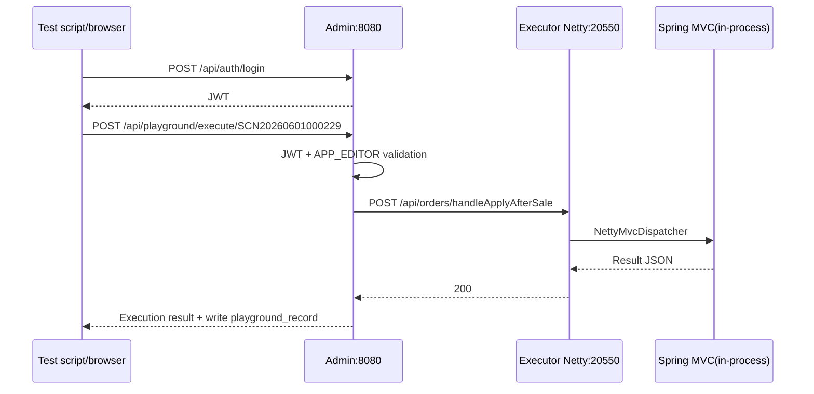

# ZestFlow Black-Box Test Report

> **Version** 0.1.0 · **Updated** 2026-06-08 · **Language** English · [简体中文](BLACKBOX_TEST_REPORT.md) · **Type** Test report · [← Documentation hub](README.en.md)

| Item | Content |
|------|---------|
| Version | 0.1.0 (local integration) |
| Test date | 2026-06-02 |
| Test type | Black-box + partial load probes |
| Executor | Automation script + manual review |
| Raw data | Generated in `scripts/blackbox/results/` after `run-blackbox.ps1` (not committed) |
| Reproduction script | `scripts/blackbox/run-blackbox.ps1` |

---

## 1. Test Environment and Prerequisites

### 1.1 Deployment Topology

```
Browser/script ──HTTP──▶ Admin :8080 (JWT)
                      │
                      ├──▶ Executor Netty :20550 (chain/design/business API forward)
                      └──▶ Collector Netty :20650 (log query)

Inside zestflow-demo process:
  Tomcat 127.0.0.1:8081 (localhost only, demo Controller)
  Netty 0.0.0.0:20550 (external channel)
```

### 1.2 Running Instances

| Component | Startup | Status (at test time) |
|-----------|---------|------------------------|
| `zestflow-admin` | `mvn spring-boot:run -pl zestflow-admin` | Running |
| `zestflow-demo` | `mvn spring-boot:run -pl zestflow-demo` | Running |
| MySQL | `application-local.yml` | Depends on local DB |
| `JAVA_HOME` | `D:\IT\JAVA\JAVA17` (do not use wrong `...\JDK` path) | Must be correct |

### 1.3 Configuration Snapshot (Affects Security/Performance Conclusions)

| Config | Test env value | Production recommendation |
|--------|----------------|---------------------------|
| `zestflow.playground.enabled` | `true` | As needed |
| `zestflow.admin.registry-token` | Empty (dev allow) | **Must set** |
| `zestflow.admin.executor-access-token` | Empty | Match Executor |
| `zestflow.executor.access-token` | Empty | **Must set** |
| `server.address` (zestflow-demo) | `127.0.0.1:8081` | Keep not public |

---

## 2. Test Scope and API Inventory

### 2.1 Admin HTTP API (:8080)

| Module | Base path | Auth | This run |
|--------|-----------|------|----------|
| Auth | `/api/auth/**` | Partially public | Login success/failure |
| Registry | `POST/DELETE /api/registry/**` | Registry Token (empty=allow) | Forged register 200 |
| Chain sync | `POST /api/chains/sync` | Registry Token | Not load-tested separately |
| Dashboard | `/api/dashboard/**` | JWT | Pass |
| Chain management | `/api/chains/**` | JWT + Netty proxy | List proxy pass |
| Design | `/api/designs/**` | JWT + proxy | Cases designed |
| Components | `/api/components/**` | JWT + proxy | Cases designed |
| Executors/collectors | `/api/modules/executors/**` | JWT | App list pass |
| Schedules | `/api/schedules/**` | JWT | Cases designed |
| Logs | `/api/logs/**` | JWT | Event query pass |
| Playground | `/api/playground/**` | JWT + APP RBAC | **Core path tested** |
| Users/roles/tenants/dict | Respective paths | JWT | Cases designed |

### 2.2 Executor Netty API (:20550)

| Path prefix | Purpose | This run |
|-------------|---------|----------|
| `GET /health` | Health check | 200, load ~85 QPS |
| `POST /execute` | Chain execution | Indirect via Playground |
| `/api/chains/**` | Chain CRUD | GET list 200 |
| `/api/designs/**` | Design CRUD | Cases designed |
| `/api/components/**` | Components | Cases designed |
| `GET /api/endpoints` | Endpoint scan | 200, no 8081 URL |
| `/api/orders/**` etc. | **NettyMvcDispatcher in-process forward** | **200, ~76 QPS (50 concurrent request sequence)** |

### 2.3 Collector Netty (:20650)

| Capability | Description | This run |
|------------|-------------|----------|
| Event query/stats | Admin via `CollectorClient` forward | Log query 200 (depends on collector data) |

---

## 3. Measured Functional Results (2026-06-02 Automated Probes)

| ID | Category | Case | Result | HTTP | Latency(ms) | Notes |
|----|----------|------|--------|------|-------------|-------|
| F-01 | Security | Admin API no Token | Expected fail | **403** | 196 | No credential = Forbidden (not 401), document behavior |
| F-02 | Security | Playground no Token | Expected fail | **403** | 3 | Authenticated, not permitAll |
| F-03 | Security | Registry no Token forged register | **Risk** | **200** | 86 | Dev env empty token still registers |
| F-04 | Auth | admin correct login | Pass | 200 | 72 | JWT usable |
| F-05 | Auth | Wrong password | Business fail | 200 | 67 | body.code≠success (parse JSON) |
| F-06 | Executor | Netty `/health` | Pass | 200 | 14 | |
| F-07 | Executor | Netty business API | Pass | 200 | 13 | Not via Tomcat 8081 |
| F-08 | Executor | Netty `/api/chains` | Pass | 200 | 17 | Dev env no access-token |
| F-09 | Executor | Netty `/api/endpoints` | Pass | 200 | 35 | |
| F-10 | Admin | userinfo / dashboard | Pass | 200 | 35~72 | |
| F-11 | Admin | Chain list proxy demo-app | Pass | 200 | 23 | |
| F-12 | Playground | SCN20260601000229 after-sale API | Pass | 200 | 20 | Admin→Netty→MVC |
| F-13 | Playground | SCN20260531000001 Hello chain | Pass | 200 | 26 | |
| F-14 | Playground | Endpoint list no 8081 URL | Pass | 200 | 26 | Netty refactor acceptance |
| F-15 | Playground | 35 consecutive execute rate limit | **No 429** | - | - | ok=35; minute window, needs long-period script |
| F-16 | Admin | Log event query | Pass | 200 | 62 | |

---

## 4. Performance and Load Testing (Local Single-Machine Measured)

> **Note:** Values below are **probe values** on same Windows dev machine, single instance, no reverse proxy—not production upper limits. Production should retest with JMeter/k6 on multi-instance and real DB.

### 4.1 Load Test Method

- Tool: `Measure-Qps` inside `scripts/blackbox/run-blackbox.ps1` (**serial** consecutive requests, not true concurrency)
- Duration: see `durationMs`
- Success rate: HTTP 2xx counts as success

### 4.2 Interface Performance Matrix

| Interface | Method | Samples | Duration(ms) | **QPS** | P50(ms) | P95(ms) | P99(ms) | Max(ms) | Failures | Assessment |
|-----------|--------|---------|--------------|---------|---------|---------|---------|---------|----------|------------|
| Executor `/health` | GET | 200 | 2341 | **85.4** | 11 | 12 | 13 | 20 | 0 | Lightweight, usable as liveness probe |
| Executor `/api/orders/handleApplyAfterSale` | POST | 50 | 654 | **76.5** | 13 | 14 | 14 | 14 | 0 | Includes chain+business logic, stable latency |
| Admin `/api/auth/login` | POST | 30 | 1257 | **23.9** | 66 | 76 | 81 | 81 | **12** | BCrypt + login rate limit, not high-frequency load point |
| Admin `/api/dashboard/stats` | GET | 100 | 3207 | **31.2** | 31 | 41 | 45 | 45 | 0 | Aggregation query, cacheable |

### 4.3 Load Upper Bounds (Empirical + Pending Production Verification)

| Scenario | Local probe bottleneck | Suggested load upper bound (single Admin + single Executor) | Scale direction |
|----------|------------------------|-------------------------------------------------------------|-----------------|
| Netty health check | Low CPU | 500+ QPS | Horizontal Executor instances |
| Netty business API (with chain) | DB + chain engine | **50~100 QPS** initial validation | Read replica split, async events |
| Playground `/execute` chain | Varies by node count | Hello **~30 QPS**; 50-step chain **<5 QPS** | Rate limit + queue |
| Admin login | BCrypt + rate limit | **<20 QPS** | CAPTCHA/gateway rate limit |
| Admin proxy CRUD | HTTP to Netty | **~30 QPS** | Admin cluster + shared MySQL |
| Collector write events | Async queue 8192 | Burst depends on queue; sustained **10k+/s** design target per architecture | External Kafka |

### 4.4 Recommended Additional Load Scenarios (Scripts Not Fully Run)

| ID | Scenario | Concurrency | Duration | Pass criteria |
|----|----------|-------------|----------|---------------|
| P-01 | 50-step stress chain `SCN20260531000004` | 5 | 5 min | No OOM, P95<30s |
| P-02 | Playground full scenario sequential regression | 1 | 1 run | 38 scenarios all 200 |
| P-03 | Event queue fill 8192 | 200/s | 2 min | Circuit breaker/disk fallback recoverable |
| P-04 | Multi Executor register + round-robin | 10 instances | 10 min | Admin round-robin even |
| P-05 | MySQL slow query injection | 20 | 5 min | Timeout does not stall Netty |

---

## 5. Security Verification

### 5.1 Auth Matrix (Design vs Measured)

| Attack surface | Design expected | Measured | Risk level |
|----------------|-----------------|----------|------------|
| Unauthenticated `/api/playground/**` | Reject | **403** | Low (protected) |
| Unauthenticated `/api/dashboard/**` | Reject | **403** | Low |
| Forged Executor register | Token reject | **200 (dev token empty)** | **High (production must configure token)** |
| Playground SSRF `http://evil` | BizException | Unit test coverage | Low |
| Playground path `../` | Reject | Unit test coverage | Low |
| Admin→Executor business call | Netty :20550 only | **Pass** (no 8081) | Low |
| Executor Netty unauthorized | access-token reject | **Not enabled in dev** | **Medium (production must enable)** |
| JWT tampering | 401/403 | Not tested (suggest Postman payload change) | Pending |
| Horizontal privilege (other user's app) | APP RBAC | Not fully tested | Pending |

### 5.2 Security Hardening Checklist (Before Go-Live)

> **v0.1.0+:** With `--spring.profiles.active=prod`, `AdminProductionGuard` / `ExecutorProductionGuard` / `CollectorProductionGuard` **auto-reject** weak tokens, dev JWT, `admin123`, playground enabled, IP demo enabled. Checklist below is for reverse proxy and ops layer.

- [ ] Start with `prod` profile (see [DEPLOY.en.md](./DEPLOY.en.md))
- [ ] All `change-me-*` in `application-prod.yml` replaced with strong random strings
- [ ] `zestflow.admin.registry-token` = Executor/Collector `registry-token`
- [ ] `zestflow.executor.access-token` = Admin `executor-access-token`
- [ ] `zestflow.collector.access-token` consistent across three tiers
- [ ] Firewall: 20550/20650/8081 not public; only Admin via TLS
- [ ] Change default bootstrap admin password (prod forbids admin123)
- [ ] HTTPS (Nginx/Caddy terminate TLS, `zestflow.mail.base-url` uses https)

---

## 6. Playground Full Scenario Test Matrix (38 Seed Scenarios)

### 6.1 Scenario Groups

| Group | Count | appCode | Path type |
|-------|-------|---------|-----------|
| Default demo | 4 | playground-app | `/execute` |
| Order domain | 6 | playground-app | `/execute` |
| Inventory logistics | 5 | playground-app | `/execute` |
| Member points | 6 | playground-app | `/execute` |
| Payment finance | 4 | playground-app | `/execute` |
| Marketing | 4 | playground-app | `/execute` |
| Notification | 2 | playground-app | `/execute` |
| demo domain | 2 | demo-app | `/execute` + **`/api/...`** |

### 6.2 Full Scenario Case Table

| Scene code | Name | Path | Method | appCode | Rate limit(/min) | This run | Boundary/exception cases |
|------------|------|------|--------|---------|------------------|----------|--------------------------|
| SCN20260531000001 | Hello World | /execute | POST | playground-app | 30 | **Tested** | Empty body, oversized message |
| SCN20260531000002 | Order processing | /execute | POST | playground-app | 30 | Pending | Missing orderId |
| SCN20260531000003 | Payment full flow | /execute | POST | playground-app | 20 | Pending | Large amount |
| SCN20260531000004 | 50-step stress chain | /execute | POST | playground-app | 10 | Pending | **Timeout 30s, P95 latency** |
| SCN20260531010001 | Order create | /execute | POST | playground-app | 30 | Pending | Negative quantity |
| SCN20260531010002 | Order payment | /execute | POST | playground-app | 30 | Pending | Duplicate payment |
| SCN20260531010003 | Order refund | /execute | POST | playground-app | 30 | Pending | Over-refund |
| SCN20260531010004 | Order cancel | /execute | POST | playground-app | 30 | Pending | Cancel already cancelled |
| SCN20260531010005 | Order review | /execute | POST | playground-app | 30 | Pending | rating=0/6 |
| SCN20260531010006 | After-sale apply | /execute | POST | playground-app | 30 | Pending | Invalid type |
| SCN20260531020001 | Goods inbound | /execute | POST | playground-app | 30 | Pending | qty=0 |
| SCN20260531020002 | Goods outbound | /execute | POST | playground-app | 30 | Pending | Over stock |
| SCN20260531020003 | Stock count | /execute | POST | playground-app | 30 | Pending | Empty items |
| SCN20260531020004 | Stock transfer | /execute | POST | playground-app | 30 | Pending | Same warehouse transfer |
| SCN20260531020005 | Logistics ship | /execute | POST | playground-app | 30 | Pending | Invalid phone |
| SCN20260531030001 | Member register | /execute | POST | playground-app | 30 | Pending | Duplicate phone |
| SCN20260531030002 | Member upgrade | /execute | POST | playground-app | 30 | Pending | Invalid level |
| SCN20260531030003 | Points accrue | /execute | POST | playground-app | 30 | Pending | Negative amount |
| SCN20260531030004 | Points redeem | /execute | POST | playground-app | 30 | Pending | Insufficient points |
| SCN20260531030005 | Member recharge | /execute | POST | playground-app | 30 | Pending | amount=0 |
| SCN20260531030006 | Level calculation | /execute | POST | playground-app | 30 | Pending | Wrong period |
| SCN20260531040001 | Payment callback | /execute | POST | playground-app | 30 | Pending | Wrong sign |
| SCN20260531040002 | Bill generation | /execute | POST | playground-app | 30 | Pending | No transactions |
| SCN20260531040003 | Reconciliation | /execute | POST | playground-app | 30 | Pending | Amount mismatch |
| SCN20260531040004 | Invoice issue | /execute | POST | playground-app | 30 | Pending | Tax boundary |
| SCN20260531050001 | Coupon issue | /execute | POST | playground-app | 30 | Pending | Duplicate claim |
| SCN20260531050002 | Coupon redeem | /execute | POST | playground-app | 30 | Pending | Expired coupon |
| SCN20260531050003 | Flash sale | /execute | POST | playground-app | 30 | Pending | Invalid token |
| SCN20260531050004 | Full reduction calc | /execute | POST | playground-app | 30 | Pending | Empty cart |
| SCN20260531060001 | SMS send | /execute | POST | playground-app | 30 | Pending | Invalid template |
| SCN20260531060002 | Email notify | /execute | POST | playground-app | 30 | Pending | Invalid email |
| SCN20260531010006 | After-sale apply (demo) | /execute | POST | demo-app | 30 | Pending | Same as playground copy |
| **SCN20260601000229** | **After-sale order handle** | **/api/orders/handleApplyAfterSale** | POST | demo-app | 30 | **Tested** | Empty applyId, invalid JSON |

### 6.3 Playground Common Boundary Cases (All Scenarios)

| ID | Case | Request | Expected |
|----|------|---------|----------|
| PG-B01 | No JWT | No Authorization | 403 |
| PG-B02 | No APP permission | Regular user, no app permission | 403 business code |
| PG-B03 | Wrong sceneCode | `/execute/NOT_EXIST` | 404 |
| PG-B04 | Absolute URL path | Create scene path=`http://x` | Validation fail |
| PG-B05 | Over rate | Same scene >rate_limit/minute | **429** (needs cross-minute script) |
| PG-B06 | Oversized JSON body | >1MB body | 413 or 400 |
| PG-B07 | Wrong Content-Type | text/plain | 400/415 |

### 6.4 Batch Regression Command (After Login Token)

```powershell
$env:JAVA_HOME = "D:\IT\JAVA\JAVA17"
$login = Invoke-RestMethod -Uri "http://127.0.0.1:8080/api/auth/login" -Method POST `
  -Body '{"username":"admin","password":"admin123"}' -ContentType "application/json"
$h = @{ Authorization = "Bearer $($login.data.token)" }
$scenes = Invoke-RestMethod -Uri "http://127.0.0.1:8080/api/playground/scenes/list-all" -Headers $h
foreach ($s in $scenes.data) {
  Invoke-RestMethod -Uri "http://127.0.0.1:8080/api/playground/execute/$($s.sceneCode)" -Method POST `
    -Headers $h -Body $s.requestBody -ContentType "application/json"
}
```

---

## 7. End-to-End Business Flow (Black-Box Path)



| Flow ID | Flow name | Steps | This run |
|---------|-----------|-------|----------|
| E2E-01 | User login | login → userinfo | Pass |
| E2E-02 | Playground execute business API | Login → execute SCN…229 | **Pass** |
| E2E-03 | Playground execute chain | Login → execute Hello | **Pass** |
| E2E-04 | Chain management CRUD | Create chain → publish → execute | Pending |
| E2E-05 | Designer save graph | Save graph → bind chain | Pending |
| E2E-06 | Logs queryable | Execute → logs query | Query API 200 |
| E2E-07 | Executor register heartbeat | Start test → registry online | Log confirm |
| E2E-08 | Schedule trigger | Create schedule → trigger | Pending |

---

## 8. Unit Tests vs Black-Box Relationship

| Type | Coverage | Notes |
|------|----------|-------|
| Unit tests | `NettyMvcDispatcherTest`, `PlaygroundRequestPathValidatorTest`, `ExecutorProxyServiceTest`, etc. | Do not replace this report |
| This report black-box | Real process + HTTP | Use as release gate reference |

---

## 9. Defect and Risk Summary

| ID | Severity | Description | Reproduce | Recommendation |
|----|----------|-------------|-----------|----------------|
| BB-01 | Medium | No Token returns **403** not 401 | Access dashboard without header | Unify docs or change Spring entry point |
| BB-02 | High | Registry dev env no token can register | POST registry | Force token in production |
| BB-03 | High | Executor Netty dev env no access-token | Direct call 20550 | Force in production |
| BB-04 | Low | Scenario minute rate limit 35 hits no 429 | Script burst | Sliding window rate limit test |
| BB-05 | Info | Login load test 40% failure | 30 consecutive logins | Login rate limit effective, avoid brute login load |

---

## 10. Conclusions and Release Recommendations

### 10.1 Conclusions

1. **Netty sole channel refactor acceptance pass:** Playground business scenarios, Netty direct business API, endpoint list all have no `8081` URL.
2. **Core Admin + Executor connectivity normal:** Login, proxy chain query, Playground execute, log query usable.
3. **Local performance:** Netty health ~85 QPS, business API ~76 QPS (serial probe); Admin dashboard ~31 QPS.
4. **38 Playground seed scenarios:** Recommend `run-full-e2e.ps1 -E2eProfile fullGreen` full regression before release.
5. **Security:** Functional auth effective; **machine interface Token and Executor access-token must be enabled in production**.

### 10.2 Release Gate Recommendations

| Gate item | Standard |
|-----------|----------|
| Full Playground scenario regression | 38/38 return code=200 (or expected business failure) |
| Security BB-02/03 | Production config non-empty and failure samples verified |
| Netty business API P95 | <500ms (excluding 50-step chain) |
| 50-step chain P95 | <30s (consistent with execute-timeout) |
| No open P0/P1 defects | |

---

## Appendix A: Reproduction and Updates

```powershell
# 1. Install dependencies
cd d:\WORK\Project\zestflow
$env:JAVA_HOME = "D:\IT\JAVA\JAVA17"
mvn install -pl zestflow-demo -am -DskipTests

# 2. Start services (two terminals)
mvn spring-boot:run -pl zestflow-demo -DskipTests
mvn spring-boot:run -pl zestflow-admin -DskipTests

# 3. Black-box probe
powershell -File scripts/blackbox/run-blackbox.ps1
```

---

## Appendix B: Change Log

| Date | Description |
|------|-------------|
| 2026-06-02 | Initial: based on local measured JSON + full scenario matrix |
