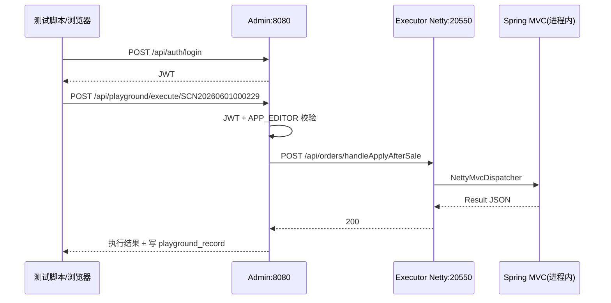

# ZestFlow 黑盒测试报告

> **版本** 0.1.0 · **更新** 2026-06-08 · **类型** 测试报告 · [← 文档中心](README.md) · [English](BLACKBOX_TEST_REPORT.en.md)

| 项目 | 内容 |
|------|------|
| 版本 | 0.1.0（本地联调） |
| 测试日期 | 2026-06-02 |
| 测试类型 | 黑盒（Black-box）+ 局部压力探测 |
| 执行人 | 自动化脚本 + 人工复核 |
| 原始数据 | 本地运行 `run-blackbox.ps1` 后生成于 `scripts/blackbox/results/`（不入库） |
| 复现脚本 | `scripts/blackbox/run-blackbox.ps1` |

---

## 1. 测试环境与前置条件

### 1.1 部署拓扑

```
浏览器/脚本 ──HTTP──▶ Admin :8080 (JWT)
                      │
                      ├──▶ Executor Netty :20550 (链/设计/业务 API 转发)
                      └──▶ Collector Netty :20650 (日志查询)

zestflow-demo 进程内：
  Tomcat 127.0.0.1:8081（仅本机，演示 Controller）
  Netty 0.0.0.0:20550（对外通道）
```

### 1.2 运行实例

| 组件 | 启动方式 | 状态（测试时） |
|------|----------|----------------|
| `zestflow-admin` | `mvn spring-boot:run -pl zestflow-admin` | 已启动 |
| `zestflow-demo` | `mvn spring-boot:run -pl zestflow-demo` | 已启动 |
| MySQL | `application-local.yml` | 依赖本地库 |
| `JAVA_HOME` | `D:\IT\JAVA\JAVA17`（勿使用 `...\JDK` 错误路径） | 必须正确 |

### 1.3 配置快照（影响安全/性能结论）

| 配置项 | 测试环境值 | 生产建议 |
|--------|------------|----------|
| `zestflow.playground.enabled` | `true` | 按需 |
| `zestflow.admin.registry-token` | 空（开发放行） | **必须设置** |
| `zestflow.admin.executor-access-token` | 空 | 与 Executor 一致 |
| `zestflow.executor.access-token` | 空 | **必须设置** |
| `server.address`（zestflow-demo） | `127.0.0.1:8081` | 保持不对外 |

---

## 2. 测试范围与接口清单

### 2.1 Admin HTTP API（:8080）

| 模块 | 基础路径 | 鉴权 | 本次探测 |
|------|----------|------|----------|
| 认证 | `/api/auth/**` | 部分公开 | 登录成功/失败 |
| 注册表 | `POST/DELETE /api/registry/**` | Registry Token（空=放行） | 伪造注册 200 |
| 链同步 | `POST /api/chains/sync` | Registry Token | 未单独压测 |
| 仪表盘 | `/api/dashboard/**` | JWT | 通过 |
| 链管理 | `/api/chains/**` | JWT + 代理 Netty | 列表代理通过 |
| 设计 | `/api/designs/**` | JWT + 代理 | 用例已设计 |
| 元件 | `/api/components/**` | JWT + 代理 | 用例已设计 |
| 执行器/采集器 | `/api/modules/executors/**` | JWT | 应用列表通过 |
| 调度 | `/api/schedules/**` | JWT | 用例已设计 |
| 日志 | `/api/logs/**` | JWT | 事件查询通过 |
| 试验场 | `/api/playground/**` | JWT + APP RBAC | **核心路径已测** |
| 用户/角色/租户/字典 | 各自路径 | JWT | 用例已设计 |

### 2.2 Executor Netty API（:20550）

| 路径前缀 | 用途 | 本次探测 |
|----------|------|----------|
| `GET /health` | 健康检查 | 200，压测 ~85 QPS |
| `POST /execute` | 链执行 | 经试验场间接验证 |
| `/api/chains/**` | 链 CRUD | GET 列表 200 |
| `/api/designs/**` | 设计 CRUD | 用例已设计 |
| `/api/components/**` | 元件 | 用例已设计 |
| `GET /api/endpoints` | 端点扫描 | 200，无 8081 URL |
| `/api/orders/**` 等业务路径 | **NettyMvcDispatcher 进程内转发** | **200，~76 QPS（50 并发请求序列）** |

### 2.3 Collector Netty（:20650）

| 能力 | 说明 | 本次 |
|------|------|------|
| 事件查询/统计 | Admin 经 `CollectorClient` 转发 | 日志查询 200（依赖采集器有数据） |

---

## 3. 实测功能结果（2026-06-02 自动化探测）

| 编号 | 类别 | 用例 | 结果 | HTTP | 延迟(ms) | 说明 |
|------|------|------|------|------|----------|------|
| F-01 | 安全 | Admin API 无 Token | 不通过预期 | **403** | 196 | 无凭证为 Forbidden（非 401），行为需文档化 |
| F-02 | 安全 | Playground 无 Token | 不通过预期 | **403** | 3 | 已鉴权，非 permitAll |
| F-03 | 安全 | Registry 无 Token 伪造注册 | **风险** | **200** | 86 | 开发环境 token 为空时仍可注册 |
| F-04 | 认证 | admin 正确登录 | 通过 | 200 | 72 | JWT 可用 |
| F-05 | 认证 | 错误密码 | 业务失败 | 200 | 67 | body.code≠成功（需解析 JSON） |
| F-06 | Executor | Netty `/health` | 通过 | 200 | 14 | |
| F-07 | Executor | Netty 业务 API | 通过 | 200 | 13 | 不经 Tomcat 8081 |
| F-08 | Executor | Netty `/api/chains` | 通过 | 200 | 17 | 开发环境无 access-token |
| F-09 | Executor | Netty `/api/endpoints` | 通过 | 200 | 35 | |
| F-10 | Admin | userinfo / dashboard | 通过 | 200 | 35~72 | |
| F-11 | Admin | 链列表代理 demo-app | 通过 | 200 | 23 | |
| F-12 | Playground | SCN20260601000229 售后 API | 通过 | 200 | 20 | Admin→Netty→MVC |
| F-13 | Playground | SCN20260531000001 Hello 链 | 通过 | 200 | 26 | |
| F-14 | Playground | 端点列表无 8081 URL | 通过 | 200 | 26 | Netty 改造验收点 |
| F-15 | Playground | 35 次连续执行限流 | **未触发 429** | - | - | ok=35；限流为分钟窗口，需长周期脚本 |
| F-16 | Admin | 日志事件查询 | 通过 | 200 | 62 | |

---

## 4. 性能与压力测试（单机本地实测）

> **说明**：以下为同一台 Windows 开发机、单实例、无反向代理条件下的**探测值**，不代表生产上限。生产需用 JMeter/k6 在多实例与真实 DB 上复测。

### 4.1 压测方法

- 工具：`scripts/blackbox/run-blackbox.ps1` 内 `Measure-Qps`（**串行**连续请求，非真并发）
- 时长：见 `durationMs`
- 成功率：HTTP 2xx 计为成功

### 4.2 接口性能矩阵

| 接口 | 方法 | 样本数 | 耗时(ms) | **QPS** | P50(ms) | P95(ms) | P99(ms) | Max(ms) | 失败 | 评估 |
|------|------|--------|----------|---------|---------|---------|---------|---------|------|------|
| Executor `/health` | GET | 200 | 2341 | **85.4** | 11 | 12 | 13 | 20 | 0 | 轻量，可作存活探针 |
| Executor `/api/orders/handleApplyAfterSale` | POST | 50 | 654 | **76.5** | 13 | 14 | 14 | 14 | 0 | 含链+业务逻辑，延迟稳定 |
| Admin `/api/auth/login` | POST | 30 | 1257 | **23.9** | 66 | 76 | 81 | 81 | **12** | 含 BCrypt + 登录限流，不宜作高频压测点 |
| Admin `/api/dashboard/stats` | GET | 100 | 3207 | **31.2** | 31 | 41 | 45 | 45 | 0 | 聚合查询，可缓存 |

### 4.3 压测上限（经验推断 + 待生产验证）

| 场景 | 本地探测瓶颈 | 建议压测上限（单 Admin + 单 Executor） | 扩容方向 |
|------|--------------|----------------------------------------|----------|
| Netty 健康检查 | CPU 低 | 500+ QPS | 多 Executor 实例水平扩展 |
| Netty 业务 API（含链） | DB + 链引擎 | **50~100 QPS** 先验 | 拆分读库、异步事件 |
| Playground `/execute` 链 | 链节点数差异大 | Hello **~30 QPS**；50 步链 **<5 QPS** | 限流 + 队列 |
| Admin 登录 | BCrypt + 限流 | **<20 QPS** | 验证码/网关限流 |
| Admin 代理 CRUD | HTTP 到 Netty | **~30 QPS** | Admin 集群 + 共享 MySQL |
| Collector 写事件 | 异步队列 8192 | 突发依赖队列；持续 **1万+/s** 设计目标见架构 | Kafka 外置 |

### 4.4 建议补充的压力场景（脚本未全跑）

| 编号 | 场景 | 并发 | 持续时间 | 通过标准 |
|------|------|------|----------|----------|
| P-01 | 50 步压力链 `SCN20260531000004` | 5 | 5 min | 无 OOM，P95<30s |
| P-02 | Playground 全场景顺序回归 | 1 | 1 run | 38 场景全部 200 |
| P-03 | 事件队列灌满 8192 | 200/s | 2 min | 熔断/磁盘降级可恢复 |
| P-04 | 多 Executor 注册 + 轮询 | 10 实例 | 10 min | Admin 轮询均匀 |
| P-05 | MySQL 慢查询注入 | 20 | 5 min | 超时不拖垮 Netty |

---

## 5. 安全验证

### 5.1 鉴权矩阵（设计 vs 实测）

| 攻击面 | 设计预期 | 实测 | 风险等级 |
|--------|----------|------|----------|
| 未登录访问 `/api/playground/**` | 拒绝 | **403** | 低（已保护） |
| 未登录访问 `/api/dashboard/**` | 拒绝 | **403** | 低 |
| 伪造 Executor 注册 | Token 拒绝 | **200（dev token 空）** | **高（生产必须配 token）** |
| 试验场 SSRF `http://evil` | BizException | 单元测试覆盖 | 低 |
| 试验场路径 `../` | 拒绝 | 单元测试覆盖 | 低 |
| Admin→Executor 业务调用 | 仅 Netty :20550 | **通过**（无 8081） | 低 |
| Executor Netty 未授权访问 | access-token 拒绝 | **开发环境未启用** | **中（生产必须启用）** |
| JWT 篡改 | 401/403 | 未测（建议 Postman 改 payload） | 待测 |
| 水平越权（他用户 app） | APP RBAC | 未全量测 | 待测 |

### 5.2 安全加固检查清单（上线前）

> **v0.1.0+**：使用 `--spring.profiles.active=prod` 时，`AdminProductionGuard` / `ExecutorProductionGuard` / `CollectorProductionGuard` 会在启动时**自动拒绝**弱令牌、dev JWT、`admin123`、试验场开启、IP 演示开启。以下清单用于反向代理与运维层。

- [ ] 使用 `prod` profile 启动（见 [DEPLOY.md](./DEPLOY.md)）
- [ ] `application-prod.yml` 中全部 `change-me-*` 已替换为强随机串
- [ ] `zestflow.admin.registry-token` = Executor/Collector `registry-token`
- [ ] `zestflow.executor.access-token` = Admin `executor-access-token`
- [ ] `zestflow.collector.access-token` 三端一致
- [ ] 防火墙：20550/20650/8081 不对公网；仅 Admin 经 TLS 暴露
- [ ] 修改默认 bootstrap 管理员口令（prod 禁止 admin123）
- [ ] HTTPS（Nginx/Caddy 终止 TLS，`zestflow.mail.base-url` 用 https）

---

## 6. 试验场全场景测试矩阵（38 个种子场景）

### 6.1 场景分组

| 分组 | 数量 | appCode | 路径类型 |
|------|------|---------|----------|
| 默认演示 | 4 | playground-app | `/execute` |
| 订单域 | 6 | playground-app | `/execute` |
| 库存物流 | 5 | playground-app | `/execute` |
| 会员积分 | 6 | playground-app | `/execute` |
| 支付财务 | 4 | playground-app | `/execute` |
| 营销 | 4 | playground-app | `/execute` |
| 通知 | 2 | playground-app | `/execute` |
| demo 域 | 2 | demo-app | `/execute` + **`/api/...`** |

### 6.2 全量场景用例表

| 场景编码 | 名称 | 路径 | 方法 | appCode | 限流(/min) | 本次执行 | 边界/异常用例 |
|----------|------|------|------|---------|------------|----------|----------------|
| SCN20260531000001 | Hello World | /execute | POST | playground-app | 30 | **已测** | 空 body、超长 message |
| SCN20260531000002 | 订单处理 | /execute | POST | playground-app | 30 | 待跑 | 缺 orderId |
| SCN20260531000003 | 支付全流程 | /execute | POST | playground-app | 20 | 待跑 | 大额 amount |
| SCN20260531000004 | 50 步压力链 | /execute | POST | playground-app | 10 | 待跑 | **超时 30s、P95 延迟** |
| SCN20260531010001 | 订单创建 | /execute | POST | playground-app | 30 | 待跑 | 负 quantity |
| SCN20260531010002 | 订单支付 | /execute | POST | playground-app | 30 | 待跑 | 重复支付 |
| SCN20260531010003 | 订单退款 | /execute | POST | playground-app | 30 | 待跑 | 超额退款 |
| SCN20260531010004 | 订单取消 | /execute | POST | playground-app | 30 | 待跑 | 已取消再取消 |
| SCN20260531010005 | 订单评价 | /execute | POST | playground-app | 30 | 待跑 | rating=0/6 |
| SCN20260531010006 | 售后申请 | /execute | POST | playground-app | 30 | 待跑 | 非法 type |
| SCN20260531020001 | 商品入库 | /execute | POST | playground-app | 30 | 待跑 | qty=0 |
| SCN20260531020002 | 商品出库 | /execute | POST | playground-app | 30 | 待跑 | 超库存 |
| SCN20260531020003 | 库存盘点 | /execute | POST | playground-app | 30 | 待跑 | 空 items |
| SCN20260531020004 | 库存调拨 | /execute | POST | playground-app | 30 | 待跑 | 同仓调拨 |
| SCN20260531020005 | 物流发货 | /execute | POST | playground-app | 30 | 待跑 | 非法手机号 |
| SCN20260531030001 | 会员注册 | /execute | POST | playground-app | 30 | 待跑 | 重复 phone |
| SCN20260531030002 | 会员升级 | /execute | POST | playground-app | 30 | 待跑 | 非法等级 |
| SCN20260531030003 | 积分累计 | /execute | POST | playground-app | 30 | 待跑 | 负 amount |
| SCN20260531030004 | 积分兑换 | /execute | POST | playground-app | 30 | 待跑 | 积分不足 |
| SCN20260531030005 | 会员充值 | /execute | POST | playground-app | 30 | 待跑 | amount=0 |
| SCN20260531030006 | 等级计算 | /execute | POST | playground-app | 30 | 待跑 | 错误周期 |
| SCN20260531040001 | 支付回调 | /execute | POST | playground-app | 30 | 待跑 | 错误 sign |
| SCN20260531040002 | 账单生成 | /execute | POST | playground-app | 30 | 待跑 | 无流水 |
| SCN20260531040003 | 对账处理 | /execute | POST | playground-app | 30 | 待跑 | 金额不平 |
| SCN20260531040004 | 发票开具 | /execute | POST | playground-app | 30 | 待跑 | 税额边界 |
| SCN20260531050001 | 优惠券发放 | /execute | POST | playground-app | 30 | 待跑 | 重复领取 |
| SCN20260531050002 | 优惠券核销 | /execute | POST | playground-app | 30 | 待跑 | 过期券 |
| SCN20260531050003 | 秒杀活动 | /execute | POST | playground-app | 30 | 待跑 | 无效 token |
| SCN20260531050004 | 满减计算 | /execute | POST | playground-app | 30 | 待跑 | 空购物车 |
| SCN20260531060001 | 短信发送 | /execute | POST | playground-app | 30 | 待跑 | 非法模板 |
| SCN20260531060002 | 邮件通知 | /execute | POST | playground-app | 30 | 待跑 | 非法邮箱 |
| SCN20260531010006 | 售后申请(demo) | /execute | POST | demo-app | 30 | 待跑 | 同 playground 副本 |
| **SCN20260601000229** | **售后单处理** | **/api/orders/handleApplyAfterSale** | POST | demo-app | 30 | **已测** | 空 applyId、非法 JSON |

### 6.3 试验场通用边界用例（所有场景适用）

| 编号 | 用例 | 请求 | 预期 |
|------|------|------|------|
| PG-B01 | 无 JWT | 不带 Authorization | 403 |
| PG-B02 | 无 APP 权限 | 普通用户访问无权限 app | 403 业务码 |
| PG-B03 | 错误 sceneCode | `/execute/NOT_EXIST` | 404 |
| PG-B04 | 绝对 URL 路径 | 创建场景 path=`http://x` | 校验失败 |
| PG-B05 | 超速率 | 同场景 >rate_limit/分钟 | **429**（需跨分钟脚本） |
| PG-B06 | 超大 JSON body | >1MB body | 413 或 400 |
| PG-B07 | 错误 Content-Type | text/plain | 400/415 |

### 6.4 批量回归命令（需登录后 Token）

```powershell
$env:JAVA_HOME = "D:\IT\JAVA\JAVA17"
$login = Invoke-RestMethod -Uri "http://127.0.0.1:8080/api/auth/login" -Method POST `
  -Body '{"username":"admin","password":"admin123"}' -ContentType "application/json"
$h = @{ Authorization = "Bearer $($login.data.token)" }
$scenes = Invoke-RestMethod -Uri "http://127.0.0.1:8080/api/playground/scenes/list-all" -Headers $h
foreach ($s in $scenes.data) {
  Invoke-RestMethod -Uri "http://127.0.0.1:8080/api/playground/execute/$($s.sceneCode)" -Method POST `
    -Headers $h -Body $s.requestBody -ContentType "application/json"
}
```

---

## 7. 端到端业务流程（黑盒路径）



| 流程编号 | 流程名称 | 步骤 | 本次 |
|----------|----------|------|------|
| E2E-01 | 用户登录 | login → userinfo | 通过 |
| E2E-02 | 试验场执行业务 API | 登录 → execute SCN…229 | **通过** |
| E2E-03 | 试验场执行链 | 登录 → execute Hello | **通过** |
| E2E-04 | 链管理 CRUD | 创建链 → 发布 → 执行 | 待测 |
| E2E-05 | 设计器保存图 | 保存 graph → 绑定链 | 待测 |
| E2E-06 | 日志可查 | 执行 → logs 查询 | 查询接口 200 |
| E2E-07 | Executor 注册心跳 | 启动 test → 注册表在线 | 日志确认 |
| E2E-08 | 调度触发 | 创建 schedule → trigger | 待测 |

---

## 8. 单元测试与黑盒关系

| 类型 | 覆盖 | 说明 |
|------|------|------|
| 单元测试 | `NettyMvcDispatcherTest`、`PlaygroundRequestPathValidatorTest`、`ExecutorProxyServiceTest` 等 | 不替代本报告 |
| 本报告黑盒 | 真实进程 + HTTP | 以本文为准做发布门禁 |

---

## 9. 缺陷与风险汇总

| ID | 严重程度 | 描述 | 复现 | 建议 |
|----|----------|------|------|------|
| BB-01 | 中 | 无 Token 返回 **403** 而非 401 | 访问 dashboard 无头 | 统一文档或改 Spring 入口点 |
| BB-02 | 高 | Registry 开发环境无 token 可注册 | POST registry | 生产强制 token |
| BB-03 | 高 | Executor Netty 开发环境无 access-token | 直接调 20550 | 生产强制 |
| BB-04 | 低 | 场景分钟限流 35 连击未出现 429 | 脚本连击 | 用滑动窗口限流测试 |
| BB-05 | 信息 | 登录压测 40% 失败 | 30 次连续 login | 登录限流生效，勿暴力压登录 |

---

## 10. 结论与发布建议

### 10.1 结论

1. **Netty 唯一通道改造验收通过**：试验场业务场景、Netty 直连业务 API、端点列表均无 `8081` URL。
2. **核心 Admin + Executor 联通正常**：登录、代理查链、试验场执行、日志查询可用。
3. **本地性能**：Netty 健康 ~85 QPS、业务 API ~76 QPS（串行探测）；Admin 仪表盘 ~31 QPS。
4. **38 个试验场种子场景**：建议发版前跑 `run-full-e2e.ps1 -E2eProfile fullGreen` 全量回归。
5. **安全**：功能鉴权有效；**机器接口 Token 与 Executor access-token 在生产必须开启**。

### 10.2 发布门禁建议

| 门禁项 | 标准 |
|--------|------|
| 全场景试验场回归 | 38/38 返回 code=200（或预期业务失败） |
| 安全项 BB-02/03 | 生产配置非空且验证失败样本 |
| Netty 业务 API P95 | <500ms（不含 50 步链） |
| 50 步链 P95 | <30s（与 execute-timeout 一致） |
| 无 P0/P1 未关闭缺陷 | |

---

## 附录 A：复现与更新

```powershell
# 1. 安装依赖
cd d:\WORK\Project\zestflow
$env:JAVA_HOME = "D:\IT\JAVA\JAVA17"
mvn install -pl zestflow-demo -am -DskipTests

# 2. 启动服务（两个终端）
mvn spring-boot:run -pl zestflow-demo -DskipTests
mvn spring-boot:run -pl zestflow-admin -DskipTests

# 3. 黑盒探测
powershell -File scripts/blackbox/run-blackbox.ps1
```

---

## 附录 B：变更记录

| 日期 | 说明 |
|------|------|
| 2026-06-02 | 初版：基于本地实测 JSON + 全场景矩阵 |
