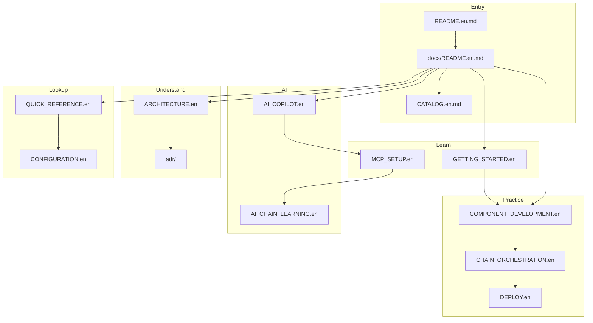

# ZestFlow Documentation Hub

> **Version** 0.1.0 · **Updated** 2026-06-08 · **Language** English · [简体中文](README.md) · **Full catalog** [CATALOG.en.md](CATALOG.en.md) · **Maintenance policy** [DOCUMENTATION_MAINTENANCE.en.md](DOCUMENTATION_MAINTENANCE.en.md)

Welcome to the official ZestFlow documentation (**35** articles — see the [full catalog](CATALOG.en.md)). Content is organized using the [Diátaxis](https://diataxis.fr/) framework. Every user-facing article has a Chinese counterpart (`*.md`) and an English mirror (`*.en.md`).

---

## Quick navigation

| I want to… | Start here |
|------------|------------|
| Understand the project in 5 minutes | [Root README](../README.en.md) |
| Run locally and execute my first chain | [GETTING_STARTED.en.md](GETTING_STARTED.en.md) |
| Understand the overall architecture | [ARCHITECTURE.en.md](ARCHITECTURE.en.md) |
| Write components / build chains / deploy | **How-to guides** below |
| Look up configuration / annotations / terms | **Reference** below |
| Integrate AI / MCP | **AI documentation** below |
| Release / acceptance / testing | **Release & acceptance** below |
| Contribute code or docs | [CONTRIBUTING.en.md](../CONTRIBUTING.en.md) |

---

## Tutorials (learning-oriented)

| Document | Description |
|----------|-------------|
| [GETTING_STARTED.en.md](GETTING_STARTED.en.md) | Local setup → Admin/Demo → first Playground run |
| [MCP_SETUP.en.md](MCP_SETUP.en.md) | Dev MCP install, `--init-dev`, Cursor configuration |
| [AI_IDE_SETUP.en.md](AI_IDE_SETUP.en.md) | Cursor / Claude / VS Code / Windsurf MCP setup comparison |

---

## How-to guides (task-oriented)

| Document | Description |
|----------|-------------|
| [guides/COMPONENT_DEVELOPMENT.en.md](guides/COMPONENT_DEVELOPMENT.en.md) | `@ZestComponent` component development |
| [guides/CHAIN_ORCHESTRATION.en.md](guides/CHAIN_ORCHESTRATION.en.md) | Visual designer: build, publish, schedule |
| [DEPLOY.en.md](DEPLOY.en.md) | Public / production deployment, secrets, ports |
| [FLYWAY_POLICY.en.md](FLYWAY_POLICY.en.md) | Flyway policy and rebaseline |
| [AI_COPILOT_OPS.en.md](AI_COPILOT_OPS.en.md) | AI presets, RAG, operations configuration |

---

## Explanation (understanding-oriented)

| Document | Description |
|----------|-------------|
| [ARCHITECTURE.en.md](ARCHITECTURE.en.md) | C4 architecture, modules, data flow, API matrix, SPI |
| [PROJECT_SUMMARY.en.md](PROJECT_SUMMARY.en.md) | Execution engine and component type system |
| [adr/SCHEDULING.en.md](adr/SCHEDULING.en.md) | Scheduling architecture (Executor-autonomous Cron) |
| [adr/SCHEDULING_SPI_XXLJOB.en.md](adr/SCHEDULING_SPI_XXLJOB.en.md) | xxl-job scheduling SPI |
| [AI_COPILOT.en.md](AI_COPILOT.en.md) | Admin orchestration Copilot full design |
| [AI_DEV_COPILOT_FINAL_SOLUTION.en.md](AI_DEV_COPILOT_FINAL_SOLUTION.en.md) | Dev MCP final architecture |
| [AI_DEV_COPILOT_ACADEMIC_SUMMARY.en.md](AI_DEV_COPILOT_ACADEMIC_SUMMARY.en.md) | Dev AI system academic background |
| [AI_CHAIN_LEARNING.en.md](AI_CHAIN_LEARNING.en.md) | Chain-first learning and RAG layering |

---

## Reference (information-oriented)

API, annotation, and configuration docs maintained in sync with source code.

| Document | Description |
|----------|-------------|
| [QUICK_REFERENCE.en.md](QUICK_REFERENCE.en.md) | Cheat sheet (summary + links to dedicated pages) |
| [reference/API.en.md](reference/API.en.md) | Admin REST + Netty endpoints, parameters, responses |
| [reference/OPENAPI.en.md](reference/OPENAPI.en.md) | OpenAPI 3 / Swagger UI / static export |
| [openapi/admin-api.json](openapi/admin-api.json) | Machine-readable Admin API spec snapshot |
| [reference/ANNOTATIONS.en.md](reference/ANNOTATIONS.en.md) | All annotation attributes and examples |
| [reference/EXECUTION_ENGINE.en.md](reference/EXECUTION_ENGINE.en.md) | ChainExecutionEngine programming API |
| [reference/SPI.en.md](reference/SPI.en.md) | EventCollector, ScheduleDriver extensions |
| [reference/CONFIGURATION.en.md](reference/CONFIGURATION.en.md) | `zestflow.*` configuration properties |
| [reference/FAQ.en.md](reference/FAQ.en.md) | Frequently asked questions |
| [reference/GLOSSARY.en.md](reference/GLOSSARY.en.md) | Terminology glossary |
| [openapi/README.en.md](openapi/README.en.md) | Spec snapshot directory |
| [CHANGELOG.en.md](../CHANGELOG.en.md) | Version history |

---

## AI documentation (full stack)

Admin orchestration Copilot + IDE Dev MCP + chain learning — **8** articles:

```text
AI_COPILOT.en.md (master design)
    ├── AI_COPILOT_OPS.en.md (operations)
    ├── MCP_SETUP.en.md (MCP install)
    ├── AI_IDE_SETUP.en.md (IDE comparison)
    ├── AI_DEV_COPILOT_FINAL_SOLUTION.en.md (MCP architecture)
    ├── AI_DEV_COPILOT_ACADEMIC_SUMMARY.en.md (background)
    ├── AI_CHAIN_LEARNING.en.md (learning / RAG)
    ├── AI_COPILOT_ACCEPTANCE.en.md (acceptance)
    └── HANDOFF-AI-EXECUTOR.en.md (cross-machine handoff)
```

| Document | When to read |
|----------|--------------|
| [AI_COPILOT.en.md](AI_COPILOT.en.md) | Understand dual Copilot model, APIs, frontend entry points |
| [MCP_SETUP.en.md](MCP_SETUP.en.md) | Install zestflow-mcp to `~/.zestflow/tools/` |
| [AI_IDE_SETUP.en.md](AI_IDE_SETUP.en.md) | Cursor / Claude / VS Code configuration comparison |
| [AI_CHAIN_LEARNING.en.md](AI_CHAIN_LEARNING.en.md) | Executor knowledge base and pattern distillation |
| [HANDOFF-AI-EXECUTOR.en.md](HANDOFF-AI-EXECUTOR.en.md) | Continue AI-related development on a new machine |

---

## Release, handoff & meta documentation

| Document | Description |
|----------|-------------|
| [RELEASE_READINESS.en.md](RELEASE_READINESS.en.md) | Three-tier pre-release gate scripts |
| [PUBLISH_HANDOFF.en.md](PUBLISH_HANDOFF.en.md) | Maven Central release handoff |
| [AUDIT_REPORT.en.md](AUDIT_REPORT.en.md) | Code audit and documentation quality report |
| [DOCUMENTATION_MAINTENANCE.en.md](DOCUMENTATION_MAINTENANCE.en.md) | Documentation update policy |
| [CATALOG.en.md](CATALOG.en.md) | **Complete index of all 35 documents (bilingual)** |

---

## Testing & acceptance

| Document | Description | Script |
|----------|-------------|--------|
| [FULL_E2E_TEST_REPORT.en.md](FULL_E2E_TEST_REPORT.en.md) | Full E2E test report | `run-full-e2e.ps1` |
| [BLACKBOX_TEST_REPORT.en.md](BLACKBOX_TEST_REPORT.en.md) | Black-box smoke test report | `run-blackbox.ps1` |
| [acceptance/AI_EXECUTOR_V2_ACCEPTANCE.en.md](acceptance/AI_EXECUTOR_V2_ACCEPTANCE.en.md) | Executor AI v2 | — |
| [acceptance/SCHEDULING_SLA_REGISTRY_ACCEPTANCE.en.md](acceptance/SCHEDULING_SLA_REGISTRY_ACCEPTANCE.en.md) | Scheduling / SLA / registry | `run-scheduling-registry-sla-e2e.ps1` |
| [AI_COPILOT_ACCEPTANCE.en.md](AI_COPILOT_ACCEPTANCE.en.md) | AI Copilot full flow | `run-ai-copilot-acceptance.ps1` |

---

## Documentation map



---

## Documentation quality commitment

| Dimension | Standard |
|-----------|----------|
| **Completeness** | All 35 articles listed in [CATALOG.en.md](CATALOG.en.md); Reference pages aligned with source |
| **Bilingual** | Every user doc has `*.md` (zh-CN) + `*.en.md` (en) with cross-links in the header |
| **Accuracy** | Configuration synced with code; long-form docs reviewed against implementation |
| **Clarity** | Diátaxis classification + AI reading paths |
| **Practicality** | Acceptance docs bound to `scripts/blackbox/` scripts |
| **Consistency** | [DOCUMENTATION_MAINTENANCE.en.md](DOCUMENTATION_MAINTENANCE.en.md) PR checklist |

Found an issue? Open a [Gitee Issue](https://gitee.com/zestcc/zestflow/issues) with the `documentation` label.
