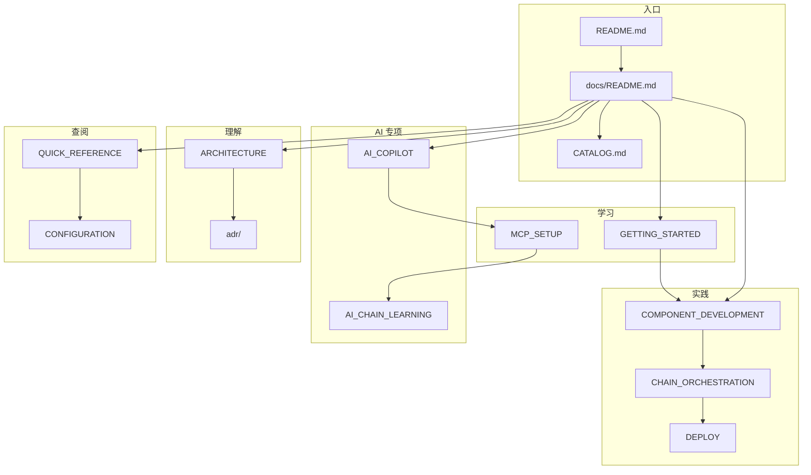

# ZestFlow 文档中心

> **版本** 0.1.0 · **更新** 2026-06-08 · **完整清单** [CATALOG.md](CATALOG.md) · **维护规范** [DOCUMENTATION_MAINTENANCE.md](DOCUMENTATION_MAINTENANCE.md)

欢迎查阅 ZestFlow 官方文档（共 **30** 篇，见 [完整清单](CATALOG.md)）。采用 [Diátaxis](https://diataxis.fr/) 框架组织。

---

## 快速导航

| 我想… | 从这里开始 |
|-------|-----------|
| 5 分钟了解项目 | [根目录 README](../README.md) |
| 本地跑起来并执行第一条链 | [GETTING_STARTED.md](GETTING_STARTED.md) |
| 理解整体架构 | [ARCHITECTURE.md](ARCHITECTURE.md) |
| 写元件 / 建链 / 部署 | 下方 **How-to 指南** |
| 查配置项 / 注解 / 术语 | 下方 **Reference 参考** |
| 接入 AI / MCP | 下方 **AI 专项文档** |
| 发版 / 验收 / 测试 | 下方 **发布与验收** |
| 贡献代码或文档 | [CONTRIBUTING.md](../CONTRIBUTING.md) |

---

## Tutorials（教程 · 学习导向）

| 文档 | 说明 |
|------|------|
| [GETTING_STARTED.md](GETTING_STARTED.md) | 本地环境 → Admin/Demo → Playground 首跑 |
| [MCP_SETUP.md](MCP_SETUP.md) | Dev MCP 安装、`--init-dev`、Cursor 配置 |
| [AI_IDE_SETUP.md](AI_IDE_SETUP.md) | Cursor / Claude / VS Code 等全 IDE 接入对照 |
| [AI_IDE_SETUP.md](AI_IDE_SETUP.md) | Cursor / Claude / VS Code / Windsurf 全场景 MCP |

---

## How-to Guides（指南 · 任务导向）

| 文档 | 说明 |
|------|------|
| [guides/COMPONENT_DEVELOPMENT.md](guides/COMPONENT_DEVELOPMENT.md) | `@ZestComponent` 元件开发 |
| [guides/CHAIN_ORCHESTRATION.md](guides/CHAIN_ORCHESTRATION.md) | 设计器建链、发布、调度 |
| [DEPLOY.md](DEPLOY.md) | 公网 / 生产部署、密钥与端口 |
| [FLYWAY_POLICY.md](FLYWAY_POLICY.md) | Flyway 策略与 Rebaseline |
| [AI_COPILOT_OPS.md](AI_COPILOT_OPS.md) | AI 预设、RAG、运维配置 |

---

## Explanation（解释 · 理解导向）

| 文档 | 说明 |
|------|------|
| [ARCHITECTURE.md](ARCHITECTURE.md) | C4 架构、模块、数据流、API 矩阵、SPI |
| [PROJECT_SUMMARY.md](PROJECT_SUMMARY.md) | 执行引擎与元件类型体系 |
| [adr/SCHEDULING.md](adr/SCHEDULING.md) | 调度架构（Executor 自治 Cron） |
| [adr/SCHEDULING_SPI_XXLJOB.md](adr/SCHEDULING_SPI_XXLJOB.md) | xxl-job 调度 SPI |
| [AI_COPILOT.md](AI_COPILOT.md) | Admin 编排 Copilot 完整方案 |
| [AI_DEV_COPILOT_FINAL_SOLUTION.md](AI_DEV_COPILOT_FINAL_SOLUTION.md) | Dev MCP 最终架构方案 |
| [AI_DEV_COPILOT_ACADEMIC_SUMMARY.md](AI_DEV_COPILOT_ACADEMIC_SUMMARY.md) | Dev AI 体系学术背景 |
| [AI_CHAIN_LEARNING.md](AI_CHAIN_LEARNING.md) | Chain-first 学习与 RAG 分层 |

---

## Reference（参考 · 查阅导向）

| 文档 | 说明 |
|------|------|
| [QUICK_REFERENCE.md](QUICK_REFERENCE.md) | 注解、常量、核心 API |
| [reference/CONFIGURATION.md](reference/CONFIGURATION.md) | `zestflow.*` 配置项 |
| [reference/GLOSSARY.md](reference/GLOSSARY.md) | 术语表（中英文） |
| [CHANGELOG.md](../CHANGELOG.md) | 版本变更 |

---

## AI 专项文档（完整链路）

Admin 编排 Copilot + IDE Dev MCP + 链学习，共 **8** 篇：

```text
AI_COPILOT.md（主方案）
    ├── AI_COPILOT_OPS.md（运维）
    ├── MCP_SETUP.md（MCP 安装）
    ├── AI_IDE_SETUP.md（全 IDE 对照）
    ├── AI_DEV_COPILOT_FINAL_SOLUTION.md（MCP 架构）
    ├── AI_DEV_COPILOT_ACADEMIC_SUMMARY.md（背景）
    ├── AI_CHAIN_LEARNING.md（学习/RAG）
    ├── AI_COPILOT_ACCEPTANCE.md（验收）
    └── HANDOFF-AI-EXECUTOR.md（跨机交接）
```

| 文档 | 何时阅读 |
|------|---------|
| [AI_COPILOT.md](AI_COPILOT.md) | 了解双 Copilot 模型、API、前端入口 |
| [MCP_SETUP.md](MCP_SETUP.md) | 安装 zestflow-mcp 到 `~/.zestflow/tools/` |
| [AI_IDE_SETUP.md](AI_IDE_SETUP.md) | Cursor / Claude / VS Code 等配置对照 |
| [AI_IDE_SETUP.md](AI_IDE_SETUP.md) | Claude Code / Desktop / Windsurf / VS Code 接入 |
| [AI_CHAIN_LEARNING.md](AI_CHAIN_LEARNING.md) | Executor 知识库与 patterns 蒸馏 |
| [HANDOFF-AI-EXECUTOR.md](HANDOFF-AI-EXECUTOR.md) | 换机器继续 AI 相关开发 |

---

## 发布、交接与元文档

| 文档 | 说明 |
|------|------|
| [RELEASE_READINESS.md](RELEASE_READINESS.md) | 发布前三层门禁脚本 |
| [PUBLISH_HANDOFF.md](PUBLISH_HANDOFF.md) | Maven Central 发版交接 |
| [AUDIT_REPORT.md](AUDIT_REPORT.md) | 代码审计与文档质量报告 |
| [DOCUMENTATION_MAINTENANCE.md](DOCUMENTATION_MAINTENANCE.md) | 文档更新机制 |
| [CATALOG.md](CATALOG.md) | **全部 30 篇文档索引** |

---

## 测试与验收

| 文档 | 说明 | 脚本 |
|------|------|------|
| [FULL_E2E_TEST_REPORT.md](FULL_E2E_TEST_REPORT.md) | 全流程 E2E 报告 | `run-full-e2e.ps1` |
| [BLACKBOX_TEST_REPORT.md](BLACKBOX_TEST_REPORT.md) | 黑盒冒烟报告 | `run-blackbox.ps1` |
| [acceptance/AI_EXECUTOR_V2_ACCEPTANCE.md](acceptance/AI_EXECUTOR_V2_ACCEPTANCE.md) | Executor AI v2 | — |
| [acceptance/SCHEDULING_SLA_REGISTRY_ACCEPTANCE.md](acceptance/SCHEDULING_SLA_REGISTRY_ACCEPTANCE.md) | 调度/SLA/注册 | `run-scheduling-registry-sla-e2e.ps1` |
| [AI_COPILOT_ACCEPTANCE.md](AI_COPILOT_ACCEPTANCE.md) | AI Copilot 全流程 | `run-ai-copilot-acceptance.ps1` |

---

## 文档地图



---

## 文档质量承诺

| 维度 | 标准 |
|------|------|
| **完整性** | 30 篇全部纳入 [CATALOG.md](CATALOG.md)；含 AI / 验收 / ADR 专项 |
| **准确性** | 配置与代码同步；专项长文以代码实现为准定期复核 |
| **清晰度** | Diátaxis 分类 + AI 阅读路径 |
| **实用性** | 验收文档绑定 `scripts/blackbox/` 脚本 |
| **规范性** | [DOCUMENTATION_MAINTENANCE.md](DOCUMENTATION_MAINTENANCE.md) PR 清单 |

发现问题？ [Gitee Issues](https://gitee.com/zestcc/zestflow/issues) 标注 `documentation`。
