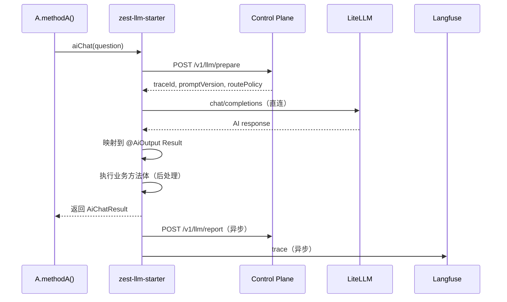
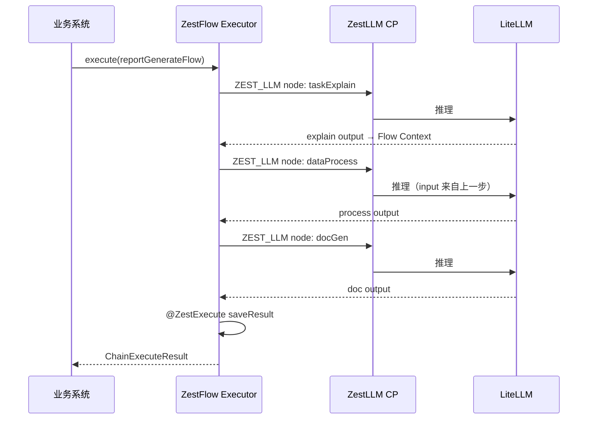

# ZestLLM 系统设计文档

> **版本** 0.1.0-draft · **更新** 2026-06-09 · **状态** 设计草案  
> **生态** [ZestFlow](../ARCHITECTURE.md) · [zest.wang](https://www.zest.wang)  
> **许可证** Apache License 2.0（与 ZestFlow 一致）

---

## 目录

- [1. 概述](#1-概述)
- [2. 设计目标与边界](#2-设计目标与边界)
- [3. 与 ZestFlow 的关系](#3-与-zestflow-的关系)
- [4. 总体架构](#4-总体架构)
- [5. 开源技术选型与许可证](#5-开源技术选型与许可证)
- [6. 核心概念与对象模型](#6-核心概念与对象模型)
- [7. 运行时流程](#7-运行时流程)
- [8. 模块设计](#8-模块设计)
- [9. API 设计](#9-api-设计)
- [10. 数据模型](#10-数据模型)
- [11. Trace 与可观测性](#11-trace-与可观测性)
- [12. 性能与扩展性](#12-性能与扩展性)
- [13. 安全与治理](#13-安全与治理)
- [14. 部署架构](#14-部署架构)
- [15. MVP 路线图](#15-mvp-路线图)
- [16. 风险与演进](#16-风险与演进)
- [附录 A：竞品与借鉴](#附录-a竞品与借鉴)
- [附录 B：ZestFlow AI 节点配置示例](#附录-bzestflow-ai-节点配置示例)

---

## 1. 概述

### 1.1 产品定位

**ZestLLM** 是 Zest 生态中的 **AI 作业调度与治理平台**（LLM Control Plane），对标 XXL-Job 的「注册 + 调度 + 治理」心智，但面向 AI 调用场景：

- 业务通过 `@ZestLLM(code)` 声明 AI 作业
- Control Plane 统一管理 Prompt 版本、模型路由、配额、审计、成本
- 简单任务：单 AI 同步调用
- 复杂任务：接入 **ZestFlow** 编排多个 AI 节点（多 AI 协调）

> **不是** 业务 LLM 应用平台，**不是** 自研大模型，**不是** 通用 Agent/RAG 产品。

### 1.2 一句话架构原则

```text
治理中心化，执行分布式。
```

- **Control Plane**：轻量、无状态、管规则与审计
- **Execution Plane**：LiteLLM 集群 + 业务侧 Agent，承担推理流量

### 1.3 目标用户

| 角色 | 诉求 |
|------|------|
| 业务开发者 | 像调本地方法一样调 AI，不写 Prompt、不碰 API Key |
| 平台管理员 | 统一 Prompt 发布、模型路由、成本与审计 |
| 架构师 | 简单任务单 AI，复杂任务 Flow + 多 AI，Trace 贯通 |

---

## 2. 设计目标与边界

### 2.1 设计目标

1. **统一接入**：所有 AI 调用受平台治理（鉴权、配额、审计）
2. **业务低侵入**：`@ZestLLM` + `@AiInput` / `@AiOutput`，与 `@ZestExecute` 心智一致
3. **可运营**：Prompt 版本化、灰度、回滚，不改业务代码
4. **可扩展**：推理流量不经 Control Plane 中转，避免单点瓶颈
5. **生态整合**：与 ZestFlow 原生集成，共用 Trace 与 Hub 治理模型
6. **开源友好**：主项目 Apache-2.0，依赖项均选用 OSI 认可、商业友好的许可证

### 2.2 职责边界

| 组件 | 负责 | 不负责 |
|------|------|--------|
| **ZestLLM** | 单 AI 作业执行、Prompt/模型治理、成本审计 | 复杂 DAG 编排 |
| **ZestFlow** | 业务 DAG 编排、分支、调度、节点 Trace | Prompt 版本、模型路由 |
| **LiteLLM** | 多模型 API 统一、fallback、限流 | 企业租户治理 |
| **Langfuse** | Trace、Prompt 实验、评估数据 | 业务逻辑 |

### 2.3 明确不做（v0.x）

- 自研推理引擎 / 大模型训练
- 通用 RAG 知识库产品
- 审批流 BPMN（交给 Flowable/Camunda 或 ZestFlow 扩展）
- Admin Copilot 类 LLM 生成（ZestFlow Admin 已有，不重复）

---

## 3. 与 ZestFlow 的关系

### 3.1 生态分层

```text
┌─────────────────────────────────────────────────────────┐
│                    Zest Admin（未来可统一）               │
│   ZestFlow 链设计器  │  ZestLLM Prompt/模型治理  │  监控   │
└────────────────────────────┬────────────────────────────┘
                             │
          ┌──────────────────┴──────────────────┐
          ▼                                      ▼
   ZestFlow Hub                           ZestLLM Control Plane
   （业务编排 + 调度）                      （AI 作业治理）
          │                                      │
          └──────────────┬───────────────────────┘
                         ▼
              业务 Spring Boot 应用
         @ZestExecute（业务节点）+ @ZestLLM（AI 节点）
                         │
                         ▼
                  LiteLLM 集群（推理）
```

### 3.2 两种调用模式

#### 模式 A：简单任务（单 AI）

业务直接调用 `@ZestLLM` 方法，不经过 ZestFlow 链：

```java
@ZestLLM(code = "aiChat", timeoutMs = 30000, retry = 1)
public AiChatResult aiChat(@AiInput("question") String question,
                           @AiOutput AiChatResult result) {
    // AI 初值已由框架填入；业务在此做二次加工
    if (result.getConfidence() < 0.8) {
        result.setNeedManualReview(true);
    }
    return result;
}
```

```java
// A 方法
public OrderView methodA(Long orderId, String question) {
    AiChatResult ai = orderAiFacade.aiChat(question);
    return OrderView.from(orderId, ai);
}
```

#### 模式 B：复杂任务（多 AI 协调）

由 ZestFlow 编排多个 **ZEST_LLM** 节点，每个节点调用一个 `code`：

```text
Flow: reportGenerateFlow
  Step1 → ZEST_LLM(code=taskExplain)
  Step2 → ZEST_LLM(code=dataProcess)
  Step3 → ZEST_LLM(code=imageGen)      [条件分支]
  Step4 → ZEST_LLM(code=docGen)
  Step5 → @ZestExecute(saveResult)
```

业务侧只触发 Flow：

```java
chainClient.execute("reportGenerateFlow", params);
```

### 3.3 与 ZestFlow 现有 AI 能力的关系

ZestFlow 当前 Admin Copilot / Executor AI 主要用于 **链设计辅助与 RAG 知识库**（见 [HANDOFF-AI-EXECUTOR.md](../HANDOFF-AI-EXECUTOR.md)）。ZestLLM 与之互补：

| 能力 | ZestFlow AI（现有） | ZestLLM（新建） |
|------|---------------------|-----------------|
| 用途 | Admin 生链、诊断、RAG | 业务运行时 AI 调用治理 |
| 调用方 | Admin / MCP / Copilot | 业务 `@ZestLLM` / Flow AI 节点 |
| Prompt 管理 | Admin AI 模板 | 中心化 Prompt Registry + 版本发布 |
| 模型路由 | Admin Provider 配置 | 按 code/策略路由 + fallback |

**原则：Copilot 的 LLM 与业务 LLM 共用 Provider 配置，但执行链路分离。**

---

## 4. 总体架构

### 4.1 C4 容器图

```text
┌─────────────── 业务应用（Spring Boot） ───────────────┐
│  @ZestLLM / @ZestExecute                               │
│  zest-llm-agent（本地缓存 Prompt/Policy）               │
│  zestflow-starter（Flow 编排，可选）                      │
└────────────┬───────────────────────────┬───────────────┘
             │ ① prepare（轻）            │ Flow 执行
             ▼                           ▼
┌────────────────────────┐    ┌─────────────────────────┐
│  ZestLLM Control Plane │    │  ZestFlow Admin/Executor │
│  - 鉴权/配额            │    │  - DAG 编排              │
│  - Prompt Registry     │    │  - ZEST_LLM 节点执行器    │
│  - 路由策略             │    │  - chain_event Trace     │
│  - Execution 登记       │    └─────────────────────────┘
└────────────┬───────────┘
             │ ② 异步 report
             │
   ┌─────────┴─────────┐
   ▼                   ▼
LiteLLM Proxy      Langfuse
（③ 推理，重流量）   （Trace/成本/评估）
   │
   ▼
OpenAI / Claude / DeepSeek / Ollama / 通义 / …
```

### 4.2 三段式调用（避免 Control Plane 成为瓶颈）

| 阶段 | 路径 | 载荷 | 说明 |
|------|------|------|------|
| **prepare** | 业务 Agent → Control Plane | 轻（code + inputs 摘要） | 返回 traceId、promptVersion、routePolicy |
| **execute** | 业务 Agent → LiteLLM | 重（完整 prompt + 流式响应） | 实际推理，不经过 CP 中转 |
| **report** | 业务 Agent → Control Plane（异步） | 中（output + token + cost） | 审计落库，可 MQ 削峰 |

> MVP（v0.1）可简化为 `invoke` 单接口（CP 转发 LiteLLM）；v0.2 必须拆为三段式。

---

## 5. 开源技术选型与许可证

### 5.1 选型原则

1. 优先 **Apache-2.0 / MIT / BSD** 许可证
2. 避免 **AGPL / SSPL** 等传染性或商业限制许可证（除非仅作可选插件并文档明示）
3. 可替换：所有底座组件通过 Adapter 接口可切换
4. 与 ZestFlow 技术栈一致：Java 17、Spring Boot 3.2.x、MyBatis-Plus

### 5.2 推荐开源栈

| 层级 | 组件 | 版本建议 | 许可证 | 用途 |
|------|------|----------|--------|------|
| 主项目 | ZestLLM | — | **Apache-2.0** | Control Plane + Starter |
| 语言/框架 | Java + Spring Boot | 17 / 3.2.5 | Apache-2.0 | 与 ZestFlow 一致 |
| 模型网关 | **LiteLLM Proxy** | latest stable | **MIT** | 多模型统一 API、fallback |
| 观测评估 | **Langfuse** | self-host latest | **MIT** | Trace、Prompt 实验、成本 |
| 数据库 | **PostgreSQL** | 15+ | PostgreSQL License | 元数据、Execution 记录 |
| 缓存 | **Valkey**（推荐）或 Redis | 7+ | BSD-3 / 见注 | Prompt/Policy 缓存 |
| 消息（可选） | **Apache Kafka** | 3.7+ | Apache-2.0 | 异步 report 削峰 |
| 表达式 | **Aviator** | 5.4.x | Apache-2.0 | 路由策略、条件（ZestFlow 已用） |
| API 文档 | springdoc-openapi | 2.6.x | Apache-2.0 | OpenAPI |
| 容器 | Docker Compose / Helm | — | Apache-2.0 | 部署 |

> **Redis 许可证说明**：Redis 7.4+ 采用 RSALv2/SSPLv1 双许可。若需严格 OSI 兼容，推荐使用 **Valkey**（Redis fork，BSD-3-Clause）作为缓存替代。

### 5.3 可选组件（按需）

| 组件 | 许可证 | 场景 |
|------|--------|------|
| Spring AI | Apache-2.0 | Java 侧 ChatClient 封装（可选，非必须） |
| OneAPI | MIT | LiteLLM 替代网关 |
| Ollama | MIT | 本地模型推理 |
| OpenTelemetry | Apache-2.0 | 统一 Trace 导出（可与 Langfuse 并存） |

### 5.4 明确不引入

| 组件 | 原因 |
|------|------|
| AGPL 系 LLM 平台 | 传染性许可证，与 Apache-2.0 生态冲突 |
| 商业闭源网关 | 不符合开源要求 |
| SSPL 数据库（如 MongoDB 旧版） | 许可证限制 |

### 5.5 许可证合规清单

- [ ] 根目录 `LICENSE`（Apache-2.0）
- [ ] `NOTICE` 文件列出第三方依赖
- [ ] `docs/THIRD_PARTY_LICENSES.md` 完整许可证清单
- [ ] Docker 镜像分层标注各组件许可证
- [ ] README 明确「底座可替换」与默认组合

---

## 6. 核心概念与对象模型

### 6.1 概念定义

| 概念 | 说明 | 对标 |
|------|------|------|
| **AiJob** | 对外暴露的 AI 作业，由 `code` 标识 | XXL-Job Handler 名 |
| **PromptVersion** | Prompt 模板版本（DRAFT/PUBLISHED/DEPRECATED） | 配置中心版本 |
| **ModelRoute** | 模型路由策略（quality_first / cost_first + fallback） | 网关路由 |
| **Execution** | 一次 AI 调用记录（含 traceId、token、cost） | XXL-Job 调度日志 |
| **App** | 业务应用（order-service） | XXL-Job 执行器 AppName |
| **Tenant** | 租户/部门 | 多租户隔离 |

### 6.2 注解语义

```java
@ZestLLM(code = "aiChat", mode = InvokeMode.SYNC, timeoutMs = 30000, retry = 1)
public AiChatResult aiChat(
    @AiInput("question") String question,   // → Prompt 变量
    @AiContext("orderId") Long orderId,     // → 业务上下文（可选，不进 Prompt）
    @AiOutput AiChatResult result           // ← AI 初值 + 业务扩展字段
) {
    // 业务后处理钩子（post-process hook）
    return result;
}
```

**字段约定：**

- **AI 映射字段**（answer、confidence、tags）：由 Control Plane outputSchema 自动填入
- **业务扩展字段**（bizId、needManualReview）：由方法体写入
- 建议 AI 字段只读，业务字段用 `biz*` 前缀或独立 DTO 分区

### 6.3 Result 字段分区

```java
public class AiChatResult {
    // --- AI 映射区（Control Plane outputSchema） ---
    private String answer;
    private Double confidence;
    private List<String> tags;

    // --- 业务扩展区（方法体写入） ---
    private Long bizOrderId;
    private Boolean needManualReview;
    private String bizSource;
}
```

---

## 7. 运行时流程

### 7.1 同步单 AI（模式 A）



### 7.2 多 AI 协调（模式 B，经 ZestFlow）



### 7.3 Flow 上下文传递

ZestFlow 节点间通过 **Flow Context** 传参，AI 节点配置：

```yaml
nodeType: ZEST_LLM
code: dataProcess
inputs:
  question: "${flow.input.question}"
  explainSummary: "${nodes.taskExplain.output.summary}"
outputs:
  bindTo: "${flow.context.processedData}"
```

---

## 8. 模块设计

### 8.1 Maven 模块结构（建议）

```text
zest-llm/                              # 根 POM，Apache-2.0
├── zest-llm-common/                   # DTO、枚举、错误码
├── zest-llm-control-plane/            # Control Plane 服务
│   ├── api/                           # REST Controller
│   ├── core/                          # 领域服务
│   └── infra/                         # DB、LiteLLM/Langfuse Adapter
├── zest-llm-agent/                    # 业务侧轻量 Agent（缓存 + 直连 LiteLLM）
├── zest-llm-starter/                  # Spring Boot Starter
│   ├── annotations/                   # @ZestLLM @AiInput @AiOutput
│   ├── aop/                           # 拦截器
│   └── autoconfigure/
├── zest-llm-flow-adapter/             # ZestFlow ZEST_LLM 节点执行器
├── zest-llm-demo/
└── deploy/
    ├── docker-compose.yml
    └── helm/                          # 可选
```

### 8.2 模块职责

| 模块 | 职责 |
|------|------|
| `zest-llm-common` | 跨模块 DTO、错误码、Trace 上下文 |
| `zest-llm-control-plane` | 治理 API、Prompt Registry、Execution 存储 |
| `zest-llm-agent` | 本地 Prompt/Policy 缓存；prepare → execute → report |
| `zest-llm-starter` | `@ZestLLM` AOP、方法注册、Result 映射 |
| `zest-llm-flow-adapter` | 实现 ZestFlow SPI，注册 `ZEST_LLM` 节点类型 |

### 8.3 Adapter 接口（可插拔）

```java
public interface ModelGatewayAdapter {
    ChatResponse chat(ChatRequest request);
    HealthStatus health();
}

public interface ObservabilityAdapter {
    void trace(TraceEvent event);
}

public interface PromptRenderer {
    String render(PromptTemplate template, Map<String, Object> variables);
}
```

默认实现：

- `ModelGatewayAdapter` → `LiteLLMGatewayAdapter`
- `ObservabilityAdapter` → `LangfuseObservabilityAdapter`

---

## 9. API 设计

### 9.1 Control Plane API（MVP）

| 方法 | 路径 | 说明 |
|------|------|------|
| POST | `/v1/llm/prepare` | 鉴权 + 获取 promptVersion + routePolicy + traceId |
| POST | `/v1/llm/report` | 异步上报 execution 结果 |
| POST | `/v1/llm/invoke` | **MVP 简化版**：prepare + execute + report 合一 |
| POST | `/v1/registry/methods` | Starter 启动注册 `@ZestLLM` 元数据 |
| GET | `/v1/tasks/{code}` | 查询 AiJob 定义 |
| POST | `/v1/prompts/{code}/publish` | 发布 Prompt 版本 |
| GET | `/v1/executions/{traceId}` | 查询执行记录 |

### 9.2 prepare 请求/响应

**Request**

```json
{
  "appKey": "order-service",
  "code": "aiChat",
  "bizId": "order-1001",
  "inputs": {
    "question": "这个订单为什么延迟？"
  },
  "context": {
    "tenantId": "t001",
    "userId": "u123"
  },
  "options": {
    "timeoutMs": 30000,
    "retry": 1
  }
}
```

**Response**

```json
{
  "traceId": "tr_abc123",
  "code": "aiChat",
  "promptVersion": "v3",
  "renderedPrompt": "...",
  "routePolicy": {
    "primaryModel": "deepseek/deepseek-chat",
    "fallbackModel": "openai/gpt-4o-mini",
    "policy": "cost_first"
  },
  "outputSchema": { "type": "object", "properties": { "answer": { "type": "string" } } }
}
```

### 9.3 report 请求

```json
{
  "traceId": "tr_abc123",
  "status": "SUCCESS",
  "model": "deepseek/deepseek-chat",
  "output": {
    "answer": "由于仓库缺货导致延迟",
    "confidence": 0.91
  },
  "metrics": {
    "latencyMs": 842,
    "promptTokens": 120,
    "completionTokens": 45,
    "cost": 0.0021
  },
  "flowExecutionId": "fe_1001",
  "flowNodeId": "nodeExplain"
}
```

### 9.4 错误码

| 错误码 | 说明 | 业务处理 |
|--------|------|----------|
| `AUTH_FAILED` | 鉴权失败 | 拒绝 |
| `QUOTA_EXCEEDED` | 配额超限 | 降级或排队 |
| `PROMPT_NOT_FOUND` | code 无发布版本 | 告警 |
| `MODEL_TIMEOUT` | 模型超时 | 重试/fallback |
| `OUTPUT_SCHEMA_MISMATCH` | 输出不符合 schema | 重试或人工 |
| `POLICY_DENIED` | 合规策略拒绝 | 拒绝 |

---

## 10. 数据模型

### 10.1 核心表

#### `llm_tenant`

| 字段 | 类型 | 说明 |
|------|------|------|
| id | BIGINT PK | |
| tenant_code | VARCHAR(64) UNIQUE | |
| tenant_name | VARCHAR(128) | |
| status | TINYINT | 1=启用 |

#### `llm_app`

| 字段 | 类型 | 说明 |
|------|------|------|
| id | BIGINT PK | |
| tenant_id | BIGINT FK | |
| app_key | VARCHAR(64) UNIQUE | order-service |
| app_name | VARCHAR(128) | |
| app_token_hash | VARCHAR(256) | |
| status | TINYINT | |

#### `llm_ai_task_def`

| 字段 | 类型 | 说明 |
|------|------|------|
| id | BIGINT PK | |
| app_id | BIGINT FK | |
| code | VARCHAR(64) | aiChat |
| description | VARCHAR(512) | |
| input_schema | JSON | |
| output_schema | JSON | |
| status | TINYINT | |
| UNIQUE(app_id, code) | | |

#### `llm_prompt_version`

| 字段 | 类型 | 说明 |
|------|------|------|
| id | BIGINT PK | |
| task_def_id | BIGINT FK | |
| version | VARCHAR(32) | v1, v2, v3 |
| template | TEXT | Handlebars/Mustache |
| variables | JSON | |
| output_schema | JSON | |
| status | ENUM | DRAFT/PUBLISHED/DEPRECATED |
| published_at | DATETIME | |

#### `llm_model_route`

| 字段 | 类型 | 说明 |
|------|------|------|
| id | BIGINT PK | |
| task_def_id | BIGINT FK | |
| policy | VARCHAR(32) | cost_first / quality_first |
| primary_model | VARCHAR(128) | |
| fallback_model | VARCHAR(128) | |
| timeout_ms | INT | |
| retry | INT | |

#### `llm_execution`

| 字段 | 类型 | 说明 |
|------|------|------|
| id | BIGINT PK | |
| trace_id | VARCHAR(64) UNIQUE | |
| app_id | BIGINT FK | |
| code | VARCHAR(64) | |
| prompt_version | VARCHAR(32) | |
| model | VARCHAR(128) | |
| status | ENUM | PENDING/SUCCESS/FAILED |
| input_json | JSON | |
| output_json | JSON | |
| error_code | VARCHAR(64) | |
| latency_ms | INT | |
| prompt_tokens | INT | |
| completion_tokens | INT | |
| cost | DECIMAL(10,6) | |
| flow_execution_id | VARCHAR(64) | ZestFlow 关联 |
| flow_node_id | VARCHAR(64) | |
| created_at | DATETIME | |

#### `llm_method_registry`

| 字段 | 类型 | 说明 |
|------|------|------|
| id | BIGINT PK | |
| app_id | BIGINT FK | |
| code | VARCHAR(64) | |
| method_signature | VARCHAR(256) | |
| input_fields | JSON | |
| output_class | VARCHAR(256) | |
| last_seen_at | DATETIME | |

#### `llm_app_quota`

| 字段 | 类型 | 说明 |
|------|------|------|
| id | BIGINT PK | |
| app_id | BIGINT FK | |
| daily_token_limit | BIGINT | |
| qps_limit | INT | |

---

## 11. Trace 与可观测性

### 11.1 Trace ID 体系

```text
flowExecutionId = fe_1001          （ZestFlow 链执行，可选）
  ├─ nodeExplain  → llmTraceId = tr_2001
  ├─ nodeProcess  → llmTraceId = tr_2002
  ├─ nodeDraw     → llmTraceId = tr_2003
  └─ nodeDoc      → llmTraceId = tr_2004
```

### 11.2 观测分工

| 数据 | 存储 | 用途 |
|------|------|------|
| Execution 明细 | PostgreSQL（ZestLLM） | 治理、成本、审计 |
| Trace 链路 | Langfuse | 技术排障、Prompt 实验 |
| 链节点事件 | chain_event（ZestFlow） | 业务编排 Trace |

### 11.3 贯通规则

- ZestFlow `ZEST_LLM` 节点执行时，必须透传 `flowExecutionId` + `flowNodeId`
- ZestLLM report 时写入关联字段
- Admin 可通过 `flowExecutionId` 联查所有 AI 步骤

---

## 12. 性能与扩展性

### 12.1 压力分析与对策

| 风险 | 对策 |
|------|------|
| 所有推理过 CP | 三段式：prepare/report 走 CP，execute 直连 LiteLLM |
| CP 成为 QPS 瓶颈 | 无状态水平扩展 + Prompt/Policy 边缘缓存 |
| 流式响应占满线程 | 流式直连 LiteLLM，不经过 CP |
| 审计写入慢 | report 异步化（MQ + 批量落库） |
| 单模型吞吐不足 | LiteLLM 多实例 + 路由分流 |

### 12.2 缓存策略

```text
zest-llm-agent 本地缓存：
  key = appKey + code + promptVersion
  TTL = 5min（可配置）
  失效 = Control Plane 推送 / 版本号轮询
```

### 12.3 容量参考（初估）

| 组件 | 单实例能力 | 扩展方式 |
|------|-----------|----------|
| Control Plane | 1000+ prepare QPS（不含推理） | 水平扩展 |
| LiteLLM | 取决于模型供应商 | 多实例 + 负载均衡 |
| Agent | 随业务 JVM 扩展 | 每业务实例内置 |

### 12.4 降级策略

1. CP 不可用 + 本地缓存有效 → 允许执行 + 后补 report
2. 主模型超时 → fallback 模型
3. fallback 失败 → 返回 `MODEL_TIMEOUT`，业务决定重试

---

## 13. 安全与治理

### 13.1 鉴权

- 业务 App 通过 `appKey` + `appToken`（Bearer）鉴权
- Token 仅存 hash，不明文落库
- 可选对接 OAuth2/OIDC（v0.3）

### 13.2 配额

- 按 App 限 QPS、日 Token 上限
- 超限返回 `QUOTA_EXCEEDED`

### 13.3 审计

- 所有 prepare/report 写 audit_log
- 输入输出可按策略脱敏（手机号、身份证等）

### 13.4 Prompt 发布

```text
DRAFT → 审核（可选）→ PUBLISHED → DEPRECATED
```

- 同一 code 仅一个 PUBLISHED 版本
- 回滚 = 重新 publish 旧版本

---

## 14. 部署架构

### 14.1 最小部署（docker-compose）

```text
services:
  postgres:       # ZestLLM 元数据
  valkey:         # 缓存
  litellm:        # 模型网关
  langfuse:       # 观测（含 postgres + clickhouse）
  zest-llm-cp:    # Control Plane
```

### 14.2 生产部署

```text
                    ┌─ zest-llm-cp × N（无状态）
                    │
  业务应用 × M ─────┼─ litellm × N（推理）
  （含 agent）       │
                    └─ langfuse（self-host）
                    
  ZestFlow Admin/Executor（已有，可选同集群）
```

### 14.3 配置示例

**业务 application.yml**

```yaml
zest:
  llm:
    enabled: true
    control-plane-url: http://zest-llm-cp:8088
    app-key: order-service
    auth-token: ${ZEST_LLM_APP_TOKEN}
    agent:
      enabled: true
      cache-ttl: 300s
    litellm-url: http://litellm:4000
```

---

## 15. MVP 路线图

### 15.1 v0.1 — 单 AI 同步（3~4 周）

| 任务 | 交付 |
|------|------|
| Control Plane `/v1/llm/invoke` | 打通 LiteLLM |
| `@ZestLLM` + AOP | 同步调用 + Result 映射 |
| Prompt 手工配置 | aiChat v1 |
| Execution 落库 | traceId 可查 |
| Demo | methodA → aiChat → return |

### 15.2 v0.2 — 三段式 + ZestFlow 集成（4~6 周）

| 任务 | 交付 |
|------|------|
| prepare / execute / report | CP 薄层化 |
| zest-llm-agent | 本地缓存 |
| ZEST_LLM 节点 | Flow 4 步 AI Demo |
| Trace 贯通 | flowExecutionId 关联 |
| Langfuse 接入 | 异步上报 |

### 15.3 v0.3 — 治理增强（4 周）

| 任务 | 交付 |
|------|------|
| Prompt 发布/回滚 | Admin API |
| 配额/限流 | 按 App |
| 成本看板 | 按 code/model |
| 模型分级策略 | cost_first / quality_first |

### 15.4 验收 KPI

| 指标 | 目标 |
|------|------|
| 业务接入时长 | ≤ 0.5 天 |
| Prompt 变更 | 不发业务版 |
| 调用可追溯 | 100% 有 traceId |
| CP P95（不含推理） | < 50ms |
| fallback 成功率 | > 95% |

---

## 16. 风险与演进

### 16.1 风险

| 风险 | 缓解 |
|------|------|
| 与 Spring AI 功能重叠 | 定位治理层，不竞争 SDK |
| CP 单点 | 三段式 + 无状态扩展 |
| LiteLLM 上游变更 | Adapter 抽象 |
| 输出 schema 不稳定 | 校验 + 重试 + 人工队列 |

### 16.2 演进方向

- **v1.0**：Admin UI（Prompt 管理、Execution 查询、成本看板）
- **v1.x**：与 Zest Admin 控制台统一
- **v2.0**：可选蒸馏插件（从 Langfuse 拉高频样本 → 小模型替代）

---

## 附录 A：竞品与借鉴

| 方案 | 借鉴 | ZestLLM 差异 |
|------|------|-------------|
| **LiteLLM** | 模型网关、fallback | + 企业治理 + Java 注解 |
| **Langfuse** | Trace、Prompt 实验 | + 运行时调度 + Flow 集成 |
| **Spring AI** | ChatClient | + Control Plane + 多 AI 编排 |
| **XXL-Job** | 注册/调度/治理心智 | 面向 AI 而非 Cron |
| **ZestFlow** | DAG、Trace、@ZestExecute | AI 原子能力下沉为 ZestLLM |

---

## 附录 B：ZestFlow AI 节点配置示例

### B.1 四步报告生成链

```json
{
  "chainCode": "reportGenerateFlow",
  "nodes": [
    {
      "id": "taskExplain",
      "type": "ZEST_LLM",
      "config": {
        "code": "taskExplain",
        "inputs": {
          "question": "${flow.input.question}"
        },
        "modelPolicy": "cost_first"
      }
    },
    {
      "id": "dataProcess",
      "type": "ZEST_LLM",
      "config": {
        "code": "dataProcess",
        "inputs": {
          "question": "${flow.input.question}",
          "explainSummary": "${nodes.taskExplain.output.summary}"
        }
      }
    },
    {
      "id": "imageGen",
      "type": "ZEST_LLM",
      "config": {
        "code": "imageGen",
        "when": "${nodes.dataProcess.output.needChart == true}",
        "inputs": {
          "chartSpec": "${nodes.dataProcess.output.chartSpec}"
        }
      }
    },
    {
      "id": "docGen",
      "type": "ZEST_LLM",
      "config": {
        "code": "docGen",
        "modelPolicy": "quality_first",
        "inputs": {
          "processedData": "${nodes.dataProcess.output.data}",
          "chartUrl": "${nodes.imageGen.output.url}"
        }
      }
    },
    {
      "id": "saveResult",
      "type": "EXECUTE",
      "config": {
        "componentCode": "saveReportResult"
      }
    }
  ]
}
```

### B.2 ZestFlow SPI 扩展点（建议）

在 `zestflow-executor` 增加节点类型注册：

```java
public interface ChainNodeExecutor {
    String nodeType();  // "ZEST_LLM"
    NodeResult execute(NodeContext context);
}
```

`zest-llm-flow-adapter` 实现该 SPI，内部调用 ZestLLM Control Plane。

---

## 变更记录

| 版本 | 日期 | 说明 |
|------|------|------|
| 0.1.0-draft | 2026-06-09 | 初稿：架构、开源选型、API、MVP 路线 |

---

> **下一步**：创建 `zest-llm` 仓库 → 实现 v0.1 `/v1/llm/invoke` + `@ZestLLM` Starter → Demo 联调。
